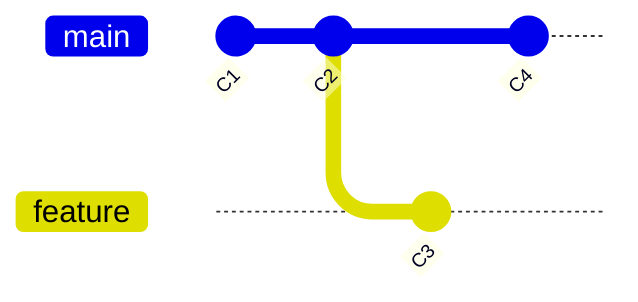

# Branch, Checkout, Switch — Pointers to Commits

> Roadmap: `0.2.1` · Node: `0.2` — Git: branches and collaboration · Depth: **deep**

## Learning Objectives

After this lesson you will be able to:

- Define a **branch** as a mutable ref pointing to a commit tip, not a folder of files.
- Explain how **branch creation** differs from copying files or duplicating history.
- Distinguish **`git checkout`**, **`git switch`**, and **`git restore`** by responsibility.
- Trace what happens to **HEAD**, the **index**, and the **working tree** during branch operations.
- Describe **detached HEAD** as a direct commit checkout and explain how to recover safely.
- Compare **branch**, **tag**, and **remote-tracking ref** as different ref namespaces.
- Predict the graph state after common branch workflows using the object/ref model from `0.1.4`.

---

## Why This Matters

In the Git basics node (`0.1.x`) you learned that a repository stores **immutable commit objects** linked in a graph, and that **refs** — tiny files under `.git/refs/` — give human-readable names to commit tips. **HEAD** (`0.1.4`) is the symbolic pointer that tells Git which ref (usually a branch) defines your current context. Commits are permanent journal entries; refs are movable bookmarks.

That model explains local history, but real teams do not work on a single linear line. Alice fixes a login bug while Bob refactors the API. Both need isolated workspaces that share a common ancestor without blocking each other. **Branches** are Git's mechanism for that isolation. They are not copies of the project folder on disk — they are **41-byte pointer files** that say "the tip of `feature/login` is commit `abc123`."

Without understanding branches as pointers, everyday commands feel magical. Why does `git checkout other-branch` rewrite files in your IDE? Why can two branches share ninety percent of their commits? Why is creating a branch instant even in a ten-year-old monorepo? Why does "detached HEAD" sound scary but sometimes appear during code review? The answers all live in the ref layer you met in `0.1.4`, extended with checkout mechanics.

Middle developers branch dozens of times per week. They create feature branches from `main`, switch context between bugfix and feature work, and recover from checking out an old commit for debugging. Getting branch semantics wrong leads to commits on the wrong line of history, lost work in detached HEAD, or confusion when a "deleted branch" still leaves commits reachable via reflog. This lesson makes branch operations predictable mechanics, not folklore.

---

## Core Concepts

### A Branch Is a Ref, Not a Directory

When newcomers hear "create a branch," they sometimes imagine Git copying the entire project into a new folder — like `feature/` beside `main/` on disk. That mental model is wrong and harmful. A **branch** is a **ref**: a file at `.git/refs/heads/<name>` containing one line — the forty-character hash of the **tip commit** on that branch.

In lesson `0.1.4` you saw that `refs/heads/main` might contain `a1b2c3d4...`. Creating `feature/login` with `git branch feature/login` (or `git switch -c feature/login`) writes `.git/refs/heads/feature/login` with the **same hash** as your current HEAD commit at that moment. No blobs are duplicated. No trees are cloned. Every commit reachable from `main` is also reachable from `feature/login` until the branches diverge with new commits.

```
         C1 ← C2 ← C3 ← C4
                    ↑     ↑
                  main   feature/login
                  (both point here right after branch creation)
```

After Alice commits twice on `feature/login` and Bob commits once on `main`, the graph forks. Each branch ref moves independently when a new commit is made **while that branch is checked out** (or when you explicitly move the ref with reset — a later topic). The commits themselves remain immutable; only the pointer files change.

This is why branching is cheap: O(1) file write, not O(n) copy of repository size. It is also why **deleting a branch** (`git branch -d feature/login`) removes a name, not necessarily the commits — they may remain reachable from other refs or reflog until garbage collection.

### HEAD Ties Your Working Context to a Ref

**HEAD** sits one level above branch refs. In the normal case, `.git/HEAD` contains `ref: refs/heads/main`. Git resolves: HEAD → `refs/heads/main` → commit hash → tree → working tree files.

When you **commit**, Git creates a new commit object whose **parent** is the commit HEAD currently resolves to, then **updates the branch ref** that HEAD points through. HEAD itself usually stays `ref: refs/heads/main`; the branch file's hash changes. That chain — from `0.1.4` — is the entire mechanism of "saving work on a branch."

When you **switch branches**, Git must align three things: HEAD (which ref you are on), the **index** (staging area), and the **working tree** (files on disk) with the snapshot of the target branch's tip commit. If you have uncommitted changes that would be overwritten, Git stops and asks you to commit, stash, or discard first — protecting you from silent data loss.

### Checkout vs Switch vs Restore

Historically, **`git checkout`** did too many jobs: switch branches, restore files, create branches, and enter detached HEAD. Git 2.23 (2019) split responsibilities:

- **`git switch`** — change which branch (or commit) HEAD attaches to; create branches with `-c`.
- **`git restore`** — move files between working tree and index (unstage, discard edits); does not change branches.
- **`git checkout`** — still works everywhere for backward compatibility; same underlying machinery.

For new workflows, prefer **`git switch`** for branches and **`git restore`** for file state. Your muscle memory from older tutorials using `git checkout` remains valid — but knowing the split clarifies what each operation touches.

Switching branches updates HEAD's symbolic ref, replaces tracked files in the working tree with content from the target commit's tree, and rebuilds the index to match. Untracked files are generally left alone unless they would be overwritten by a tracked file appearing from the other branch — another safety check.

### Creating and Listing Branches

**Create without switching:** `git branch feature/x` writes the ref at the current HEAD commit. Your working tree stays on whatever branch you were already on.

**Create and switch:** `git switch -c feature/x` (or `git checkout -b feature/x`) creates the ref and moves HEAD to it in one step.

**List branches:** `git branch` shows local refs under `refs/heads/`. The current branch is marked with `*`. `git branch -a` includes remote-tracking refs (`refs/remotes/origin/...`) — the subject of `0.2.6`.

**Rename and delete:** `git branch -m old new` renames the ref file. `git branch -d name` deletes only if merged (safe delete); `-D` forces deletion of the ref regardless — commits may linger in the object store until unreachable.

Each operation is ref manipulation plus, when switching, working tree synchronization — not file-system folder management.

### Detached HEAD: Checkout on a Commit, Not a Branch

If HEAD contains a **raw commit hash** instead of `ref: refs/heads/...`, you are in **detached HEAD** state. You checked out a specific snapshot — perhaps an old release tag, a commit hash from `git log`, or a remote PR head — without a branch name at that position.

You can read files, run tests, and even make commits. But new commits are not reachable from any branch name. Switch back to `main` with `git switch main` and those orphan commits exist only in the object database until **reflog** entries expire (typically 90 days default) unless you save them:

```bash
git switch -c rescue-branch    # create branch at current detached commit
# or
git branch rescue-branch       # then switch away
```

Detached HEAD is not corruption — it is an honest label for "HEAD points directly at a commit." CI systems and `git bisect` use it routinely. The danger is **forgetting to name your work** before leaving.

### Branch Names, Tags, and Remote Tracking

All are **refs**, different namespaces:

| Namespace | Path | Typical use |
|-----------|------|-------------|
| Local branch | `refs/heads/main` | Mutable; moves on commit |
| Tag | `refs/tags/v1.0.0` | Usually immutable release marker |
| Remote-tracking | `refs/remotes/origin/main` | Local cache of remote tip after fetch |

Local branches are **yours to move**. Remote-tracking branches are **updated by fetch/pull**, not by your local commits directly (push updates the remote server, then fetch updates your tracking ref). Tags point at commits (or tag objects) and conventionally do not move. Understanding namespaces prevents confusion like "I committed but `origin/main` didn't move" — you updated `refs/heads/main`, not `refs/remotes/origin/main`.

---

## Under the Hood

### What Happens on `git switch feature/login`

Assume you are on `main` at commit C4, working tree clean, and `feature/login` points at C2.

1. Git reads `refs/heads/feature/login` → hash C2.
2. Git compares C4's tree with C2's tree to determine which paths changed.
3. For each changed tracked path, Git updates working tree files and index entries to match C2's blob hashes.
4. Git writes `ref: refs/heads/feature/login` into `.git/HEAD`.
5. Optional: Git updates `ORIG_HEAD` (previous position) for certain recovery commands.

No commit objects are created or modified. Two ref reads, one HEAD write, and tree checkout operations — the same engine `git checkout` has used for years.

If the working tree has modifications, Git runs **merge machinery** (even though you are not merging branches) to see if changes can carry over cleanly. Conflicts block the switch — you must resolve or stash first.

### Branch Creation Is a Single Ref Write

`git branch feature/new` at commit C4:

```bash
# Equivalent effect:
echo <hash-of-C4> > .git/refs/heads/feature/new
```

HEAD unchanged; working tree unchanged. The new branch exists but you are still "on" `main` until you switch.

`git switch -c feature/new`:

```bash
echo <hash-of-C4> > .git/refs/heads/feature/new
echo "ref: refs/heads/feature/new" > .git/HEAD
# then checkout C4's tree (already current if created from HEAD — minimal work)
```

### Symbolic Ref Resolution Chain

Git resolves refs recursively until it finds a hash:

```
HEAD  →  ref: refs/heads/feature/login
              ↓
refs/heads/feature/login  →  abc1234... (40 chars)
              ↓
commit object abc1234  →  tree, parent(s), metadata
              ↓
tree  →  blobs  →  working tree content
```

Commands like `git rev-parse HEAD` print the fully resolved hash — useful in scripts and debugging.

### Relationship to the Commit Graph (`0.1.5`)

Each branch ref points to one commit. That commit's **parent** chain defines "branch history." Two refs pointing at the same commit mean identical history from that tip backward. Divergence happens when two refs point at different commits that share an ancestor — the graph forks. Branch operations never rewrite existing commit objects; they only move refs or check out existing snapshots. Rewriting history (rebase) creates **new** commits — covered in `0.2.3`.



---

## Syntax / Commands / API

| Task | Modern command | Classic equivalent |
|------|----------------|------------------|
| List local branches | `git branch` | same |
| Create branch | `git branch name` | same |
| Create + switch | `git switch -c name` | `git checkout -b name` |
| Switch branch | `git switch name` | `git checkout name` |
| Switch to previous | `git switch -` | `git checkout -` |
| Delete merged branch | `git branch -d name` | same |
| Force delete ref | `git branch -D name` | same |
| Rename branch | `git branch -m new` | same |
| Show current branch | `git branch --show-current` | — |
| Resolve HEAD to hash | `git rev-parse HEAD` | same |
| Discard file edits | `git restore file` | `git checkout -- file` |
| Unstage file | `git restore --staged file` | `git reset HEAD file` |

**Detached HEAD checkout:**

```bash
git switch --detach v1.2.0      # by tag
git switch --detach abc1234     # by hash
git switch main                 # return to branch
```

---

## Examples

### Example 1: Parallel feature without copying files

You are on `main` at the latest commit. Product asks for a login feature without blocking hotfixes on `main`.

```bash
git switch -c feature/login
# edit AuthService.cs, commit twice
git log --oneline --decorate
# feature/login → two new commits; main still at old tip until merged
```

Before running this, `refs/heads/main` and the new `refs/heads/feature/login` would point at the same hash. After two commits on `feature/login`, only that ref moved forward. `main` stayed put. No duplicate `src/` folder was created — only the ref file and new commit objects.

### Example 2: Safe recovery from detached HEAD

You checked out an old commit to reproduce a bug:

```bash
git switch --detach abc1234
# you fix something experimentally and commit — still detached
git log -1 --oneline   # shows your commit, but no branch name in decorate output
git switch -c fix/repro-bug
# now HEAD → refs/heads/fix/repro-bug → your commit
```

Without `-c`, switching back to `main` would leave your commit reachable only via reflog. Creating the branch attaches a name — standard production safety habit.

### Example 3: Switch blocked by local changes

```bash
# on main, uncommitted edit in Program.cs
git switch feature/other
# error: Your local changes would be overwritten by checkout
git stash push -m "wip"
git switch feature/other
# later: git switch main && git stash pop
```

Git refused to destroy uncommitted work. Stash (`0.1.x` workflows) temporarily saves index and working tree state so the switch can proceed cleanly.

---

## Common Mistakes & Anti-patterns

**Treating branches as directories.** Branches are refs. Folder layout in the working tree is identical regardless of branch — only file *contents* change on switch.

**Committing in detached HEAD without creating a branch.** Easy to lose work when you switch away. Always `git switch -c` if you commit off a branch.

**Using `git checkout` for everything.** Works, but mixing branch switches with file restores in one command increases error rate. Prefer `switch` / `restore`.

**Deleting branches to "free space."** Branch deletion removes a ref, not commits (until gc reclaims unreachable objects). Disk space rarely changes meaningfully.

**Long-lived branches far from `main`.** Not a Git bug — a workflow smell. Huge divergence makes merges painful (`0.2.2`). Integrate often.

**Renaming only on remote or only locally.** After `git branch -m`, coordinate with teammates and update upstream (`0.2.7`) — names are not magic across clones.

---

## Production & Real-World Notes

Teams adopt **branch naming conventions**: `feature/JIRA-123-login`, `fix/payment-null`, `release/2.4`. Git ignores the slashes — they are for humans organizing `git branch` output.

**Protected branches** on GitHub/GitLab prevent force-push to `main`; your local ref can still move — protection is server-side policy.

**Default branch** rename (`master` → `main`) is ref rename plus remote coordination, not history rewrite.

IDEs show "current branch" by reading HEAD — same mechanism as `git branch --show-current`.

In CI, builds often run in **detached HEAD** at a merge commit or tag — normal and expected.

---

## Comparison / Trade-offs

**Branch vs fork (GitHub):** A fork is a separate remote repository; branches are refs inside one repo (or clone). Forking duplicates collaboration boundary, not Git object model.

**Lightweight branch vs stash:** Branches name commits; stash (`0.1.x`) saves uncommitted WIP without a public commit. Use stash for temporary context switch; use branches for shareable work.

**Many small branches vs one long branch:** Small branches simplify review and reduce merge pain; operational overhead grows with branch count. Teams balance with trunk-based or GitFlow variants — process choice, not Git limitation.

---

## Quick Reference

| Concept | One-line definition |
|---------|---------------------|
| Branch | Mutable ref `refs/heads/name` → tip commit |
| HEAD | Current context; usually symbolic ref to a branch |
| `git switch` | Change branch / detach HEAD |
| `git restore` | Restore files; does not switch branches |
| Detached HEAD | HEAD = raw commit hash, not `ref: refs/heads/...` |
| Create branch | Write new ref at current (or specified) commit |

---

## Key Takeaways

- A **branch** is a movable pointer to a commit — not a copy of the repository.
- **Creating** a branch is instant because only a ref file is written; objects are shared.
- **`git switch`** changes HEAD and syncs working tree + index to the target commit's snapshot.
- **Detached HEAD** means checking out a commit directly; create a branch before committing if you want to keep work.
- **HEAD → branch ref → commit → tree → files** is the full resolution chain from `0.1.4`.
- **`git restore`** handles file state; do not mix it up with branch switching.
- Branch **delete** removes a name; commits may survive via other refs or reflog.

---

## Further Reading

- [Git Book — Branches in a Nutshell](https://git-scm.com/book/en/v2/Git-Branching-Branches-in-a-Nutshell)
- [Git switch documentation](https://git-scm.com/docs/git-switch)
- [Git refspec and refs hierarchy](https://git-scm.com/book/en/v2/Git-Internals-Git-References)

---

## Up Next

**`0.2.2`** — merge: fast-forward vs merge commit vs squash. You can point two branch refs at related commits; merge integrates their histories.
