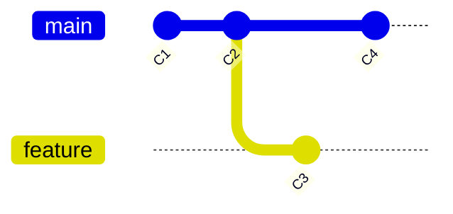

# Branch, checkout, switch — указатели на commits

> Roadmap: `0.2.1` · Node: `0.2` — Git: branches and collaboration · Depth: **глубоко**

## Learning Objectives

После этого урока ты сможешь:

- Определить **branch** как mutable ref на tip commit, а не как папку с файлами.
- Объяснить, чем **создание ветки** отличается от копирования файлов или дублирования history.
- Различить **`git checkout`**, **`git switch`** и **`git restore`** по зоне ответственности.
- Проследить, что происходит с **HEAD**, **index** и **working tree** при операциях с ветками.
- Описать **detached HEAD** как checkout напрямую на commit и безопасно восстановиться.
- Сравнить **branch**, **tag** и **remote-tracking ref** как разные namespaces.
- Предсказать состояние graph после типичных branch-workflow, опираясь на модель objects/refs из `0.1.4`.

---

## Why This Matters

В узле Git basics (`0.1.x`) ты узнал, что репозиторий хранит **immutable commit objects**, связанные в graph, а **refs** — крошечные файлы в `.git/refs/` — дают человекочитаемые имена tip commit'ам. **HEAD** (`0.1.4`) — symbolic pointer, который говорит Git, какой ref (обычно branch) определяет текущий контекст. Commit'ы — неизменяемые записи в журнале; refs — подвижные закладки.

Эта модель объясняет local history, но реальные команды не работают на одной линии. Alice чинит login, Bob рефакторит API — оба нуждаются в изолированных workspace'ах с общим ancestor, не блокируя друг друга. **Branches** — механизм Git для такой изоляции. Это не копии папки проекта на диске — это **41-байтные pointer-файлы**, которые говорят: «tip `feature/login` — commit `abc123`.»

Без понимания веток как указателей повседневные команды кажутся магией. Почему `git checkout other-branch` переписывает файлы в IDE? Почему две ветки делят девяносто процентов commit'ов? Почему создание ветки мгновенно даже в десятилетнем monorepo? Почему «detached HEAD» пугает, но появляется при code review? Ответы — в ref layer из `0.1.4`, расширенном checkout-механикой.

Middle-разработчик создаёт ветки десятки раз в неделю: feature от `main`, переключение между bugfix и feature, checkout старого commit'а для отладки. Ошибки в семантике веток ведут к commit'ам не на той линии history, потере work в detached HEAD или путанице, когда «удалённая ветка» всё ещё оставляет commit'ы в reflog. Этот урок делает branch-операции предсказуемой механикой, а не фольклором.

---

## Core Concepts

### Ветка — это ref, а не директория

Когда новичок слышит «создать ветку», он иногда представляет, что Git копирует весь проект в новую папку — как `feature/` рядом с `main/` на диске. Эта модель неверна и вредна. **Branch** — это **ref**: файл `.git/refs/heads/<name>` с одной строкой — forty-character hash **tip commit** на этой ветке.

В уроке `0.1.4` ты видел, что `refs/heads/main` может содержать `a1b2c3d4...`. Создание `feature/login` через `git branch feature/login` (или `git switch -c feature/login`) записывает `.git/refs/heads/feature/login` с **тем же hash**, что и текущий HEAD commit. Blob'ы не дублируются. Tree не клонируются. Все commit'ы, достижимые из `main`, достижимы и из `feature/login`, пока ветки не разойдутся новыми commit'ами.

```
         C1 ← C2 ← C3 ← C4
                    ↑     ↑
                  main   feature/login
                  (оба указывают сюда сразу после создания)
```

После двух commit'ов Alice на `feature/login` и одного Bob на `main` graph разветвляется. Каждый branch ref двигается независимо при новом commit'е **на checked-out ветке** (или при явном reset — позже). Сами commit'ы immutable; меняются только pointer-файлы.

Поэтому branching дёшев: O(1) запись файла, а не O(n) копия размера репозитория. И поэтому **удаление ветки** (`git branch -d feature/login`) убирает имя, не обязательно commit'ы — они могут оставаться достижимыми через другие refs или reflog до garbage collection.

### HEAD связывает контекст с ref

**HEAD** на уровень выше branch refs. В обычном случае `.git/HEAD` содержит `ref: refs/heads/main`. Git разрешает: HEAD → `refs/heads/main` → commit hash → tree → файлы working tree.

При **commit** Git создаёт новый commit object с **parent** = текущий resolved HEAD, затем **обновляет branch ref**, через который идёт HEAD. HEAD обычно остаётся `ref: refs/heads/main`; hash в файле ветки меняется. Эта цепочка из `0.1.4` — вся механика «сохранения work на ветке».

При **switch веток** Git выравнивает три вещи: HEAD (на каком ref ты), **index** (staging area) и **working tree** (файлы на диске) со snapshot tip commit целевой ветки. Если uncommitted changes будут перезаписаны, Git останавливается — нужно commit, stash или discard.

### Checkout vs Switch vs Restore

Исторически **`git checkout`** делал слишком много: switch веток, restore файлов, создание веток, detached HEAD. Git 2.23 разделил ответственность:

- **`git switch`** — смена branch (или commit), на который указывает HEAD; `-c` для создания.
- **`git restore`** — перемещение файлов между working tree и index; ветки не меняет.
- **`git checkout`** — работает для обратной совместимости; та же внутренняя механика.

Для новых workflow предпочитай **`git switch`** для веток и **`git restore`** для состояния файлов. Muscle memory со старых туториалов с `git checkout` остаётся валидной — но разделение проясняет, что каждая операция трогает.

Switch обновляет symbolic ref HEAD, заменяет tracked files в working tree content из tree целевого commit, перестраивает index. Untracked files обычно не трогаются, если не конфликтуют с tracked file с другой ветки.

### Создание и listing веток

**Создать без switch:** `git branch feature/x` пишет ref на текущий HEAD commit. Working tree остаётся на прежней ветке.

**Создать и переключиться:** `git switch -c feature/x` (или `git checkout -b feature/x`).

**Список:** `git branch` — local refs; `*` — текущая. `git branch -a` включает remote-tracking (`0.2.6`).

**Rename/delete:** `git branch -m`; `-d` — safe delete (merged); `-D` — force.

Каждая операция — манипуляция ref плюс при switch синхронизация working tree — не управление папками в файловой системе.

### Detached HEAD: checkout на commit, не на branch

Если HEAD содержит **raw commit hash** вместо `ref: refs/heads/...` — **detached HEAD**. Ты на конкретном snapshot — старый tag, hash из `git log`, head PR — без branch name в этой точке.

Можно читать, тестировать, даже commit'ить. Но новые commit'ы не достижимы через branch name. Уйдёшь на `main` — orphan commit'ы останутся в object store до истечения **reflog** (обычно ~90 дней), если не сохранить:

```bash
git switch -c rescue-branch
```

Detached HEAD — не corruption, а честная метка «HEAD указывает на commit напрямую». CI и `git bisect` используют это постоянно. Опасность — **забыть назвать work** перед уходом.

### Имена веток, tags, remote tracking

Всё — **refs**, разные namespaces:

| Namespace | Path | Типичное использование |
|-----------|------|------------------------|
| Local branch | `refs/heads/main` | Mutable; двигается при commit |
| Tag | `refs/tags/v1.0.0` | Обычно immutable release marker |
| Remote-tracking | `refs/remotes/origin/main` | Local cache remote tip после fetch |

Local branches — **твои**. Remote-tracking обновляются **fetch/pull**, не local commit'ами напрямую. Tags указывают на commit (или tag object) и conventionally не двигаются.

---

## Under the Hood

### Что происходит при `git switch feature/login`

Ты на `main` в C4, clean tree, `feature/login` → C2.

1. Git читает `refs/heads/feature/login` → hash C2.
2. Сравнивает tree C4 и C2 — какие paths изменились.
3. Для каждого changed tracked path обновляет working tree и index под blob hash'и C2.
4. Пишет `ref: refs/heads/feature/login` в `.git/HEAD`.
5. Опционально обновляет `ORIG_HEAD`.

Commit objects не создаются и не меняются. Два read ref, одна запись HEAD, checkout tree — тот же engine, что у `git checkout`.

При local modifications Git запускает merge machinery (без merge веток), чтобы проверить, можно ли перенести изменения. Conflict блокирует switch — resolve или stash.

### Создание ветки — одна запись ref

`git branch feature/new` на C4:

```bash
echo <hash-C4> > .git/refs/heads/feature/new
```

HEAD и working tree без изменений. Ветка есть, но ты всё ещё «на» `main`, пока не switch.

### Цепочка symbolic ref resolution

```
HEAD  →  ref: refs/heads/feature/login
              ↓
refs/heads/feature/login  →  abc1234...
              ↓
commit abc1234  →  tree, parent(s), metadata
              ↓
tree  →  blobs  →  working tree
```

`git rev-parse HEAD` печатает полностью resolved hash — для scripts и debugging.

### Связь с commit graph (`0.1.5`)

Каждый branch ref указывает на один commit. **Parent** chain определяет history ветки. Два ref на одном commit — идентичная history назад. Расхождение — разные tips с общим ancestor. Branch-операции не переписывают commit objects; только двигают refs или checkout существующих snapshots. Rewrite history (rebase) создаёт **новые** commit'ы — `0.2.3`.



---

## Syntax / Commands / API

| Задача | Современная команда | Классический эквивалент |
|--------|---------------------|-------------------------|
| Список local branches | `git branch` | то же |
| Создать ветку | `git branch name` | то же |
| Создать + switch | `git switch -c name` | `git checkout -b name` |
| Switch ветки | `git switch name` | `git checkout name` |
| На предыдущую | `git switch -` | `git checkout -` |
| Удалить merged | `git branch -d name` | то же |
| Force delete ref | `git branch -D name` | то же |
| Rename | `git branch -m new` | то же |
| Текущая ветка | `git branch --show-current` | — |
| HEAD → hash | `git rev-parse HEAD` | то же |
| Отменить правки файла | `git restore file` | `git checkout -- file` |
| Unstage | `git restore --staged file` | `git reset HEAD file` |

**Detached HEAD:**

```bash
git switch --detach v1.2.0
git switch --detach abc1234
git switch main
```

---

## Examples

### Пример 1: Параллельная feature без копирования файлов

```bash
git switch -c feature/login
# правки AuthService.cs, два commit'а
git log --oneline --decorate
# feature/login → два новых commit'а; main на старом tip
```

До команды оба ref указывали на один hash. После двух commit'ов на `feature/login` сдвинулся только этот ref. Папка `src/` не дублировалась.

### Пример 2: Безопасное восстановление из detached HEAD

```bash
git switch --detach abc1234
# экспериментальный fix и commit — всё ещё detached
git switch -c fix/repro-bug
# HEAD → refs/heads/fix/repro-bug → твой commit
```

Без `-c` уход на `main` оставил бы commit только в reflog.

### Пример 3: Switch заблокирован local changes

```bash
git switch feature/other
# error: local changes would be overwritten
git stash push -m "wip"
git switch feature/other
```

Git защитил uncommitted work. Stash временно сохраняет index и working tree.

---

## Common Mistakes & Anti-patterns

**Ветки как директории.** Ветки — refs. Layout папок одинаков; меняется **content** файлов при switch.

**Commit в detached HEAD без branch.** Легко потерять work. Всегда `git switch -c`.

**Один `git checkout` на всё.** Работает, но путает switch и restore. Предпочитай `switch` / `restore`.

**Удаление веток «ради места».** Удаляется ref, не commit'ы. Место почти не освобождается.

**Долгоживущие ветки далеко от `main`.** Workflow smell — merge больнее (`0.2.2`). Интегрируйся часто.

**Rename только local или только remote.** После `git branch -m` согласуй с командой и upstream (`0.2.7`).

---

## Production & Real-World Notes

**Naming conventions:** `feature/JIRA-123-login`, `fix/payment-null`. Git игнорирует slashes — для людей.

**Protected branches** на GitHub блокируют force-push в `main` — policy на сервере.

**Default branch rename** (`master` → `main`) — rename ref + координация remote.

IDE показывает текущую ветку через HEAD — как `git branch --show-current`.

CI часто в **detached HEAD** на merge commit или tag — норма.

---

## Comparison / Trade-offs

**Branch vs fork (GitHub):** Fork — отдельный remote repo; branches — refs внутри одного repo/clone.

**Branch vs stash:** Branch именует commit'ы; stash — WIP без публичного commit. Stash для временного switch; branch для shareable work.

**Много мелких vs одна длинная ветка:** Мелкие упрощают review; overhead растёт с числом веток. Баланс — trunk-based или GitFlow.

---

## Quick Reference

| Concept | Определение |
|---------|-------------|
| Branch | Mutable ref `refs/heads/name` → tip commit |
| HEAD | Текущий контекст; обычно symbolic ref на branch |
| `git switch` | Смена branch / detach HEAD |
| `git restore` | Restore файлов; ветки не меняет |
| Detached HEAD | HEAD = raw hash, не `ref: refs/heads/...` |
| Create branch | Новый ref на current (или указанном) commit |

---

## Key Takeaways

- **Branch** — подвижный указатель на commit, не копия репозитория.
- **Создание** ветки мгновенно — пишется только ref; objects общие.
- **`git switch`** меняет HEAD и синхронизирует working tree + index со snapshot целевого commit.
- **Detached HEAD** — checkout на commit напрямую; создай branch перед commit, если хранишь work.
- **HEAD → branch ref → commit → tree → files** — полная цепочка из `0.1.4`.
- **`git restore`** — состояние файлов; не путать со switch веток.
- **Delete branch** убирает имя; commit'ы могут жить через другие refs или reflog.

---

## Further Reading

- [Git Book — Branches in a Nutshell](https://git-scm.com/book/en/v2/Git-Branching-Branches-in-a-Nutshell)
- [Git switch documentation](https://git-scm.com/docs/git-switch)
- [Git Internals — Git References](https://git-scm.com/book/en/v2/Git-Internals-Git-References)

---

## Up Next

**`0.2.2`** — merge: fast-forward vs merge commit vs squash. Две branch refs на related commit'ах; merge интегрирует их histories.
