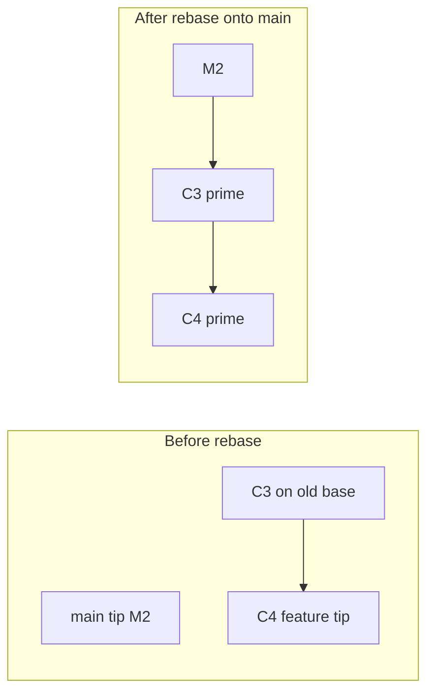

# Rebase: Linear History and Interactive Rebase

> Roadmap: `0.2.3` · Node: `0.2` — Git: branches and collaboration · Depth: **deep**

## Learning Objectives

After this lesson you will be able to:

- Explain **rebase** as replaying commits onto a new base, creating new commit objects.
- Contrast rebase with **merge** in terms of graph shape and history preservation.
- Perform a standard **`git rebase main`** on a feature branch before opening a PR.
- Use **interactive rebase** (`git rebase -i`) to squash, reword, reorder, or drop commits.
- State the **golden rule of rebase**: never rebase public/shared history others have pulled.
- Recover from rebase conflicts and use **`git rebase --abort`** safely.

---

## Why This Matters

Merge (`0.2.2`) integrates two lines of history by joining them — often with a merge commit that permanently records the fork. That honesty is valuable, but some teams prefer **`main` to read like a single timeline**: feature A, then feature B, then fix C, each commit buildable and reviewable in order. **Rebase** rewrites local feature work **as if** it had started from the latest `main` all along, eliminating the merge bubble and producing linear first-parent history.

Rebase is also the editor for your own draft history before sharing. Interactive rebase lets you squash WIP commits, fix typos in messages, split a too-large commit, or drop debug commits — without polluting the shared remote. Used well, it makes code review and `git bisect` easier. Used carelessly on commits others already built upon, it causes duplicate work, mysterious duplicates, and force-push incidents. Middle developers must rebase confidently on **private feature branches** and refuse to rebase **published shared tips**.

---

## Core Concepts

### What Rebase Does

Check out branch `feature` at tip F with commits C3, C4 on top of old base C2. Meanwhile `main` advanced to M. **`git rebase main`** (while on `feature`):

1. Finds commits reachable from F but not from M (C3, C4).
2. Temporarily removes them from the branch tip.
3. Moves `feature` ref to M (same as checking out M as new base).
4. **Replays** C3', C4' one by one: for each original commit, Git applies its patch onto the current tip, creating **new commit objects** with new hashes.
5. Points `feature` at C4'.

```
Before:
  C2 — M1 — M2   (main)
   \
    C3 — C4       (feature)

After rebase feature onto main:
  C2 — M1 — M2 — C3' — C4'   (feature; main unchanged)
```

C3 and C4 still exist in the object store until gc, but `feature` no longer references them. **Parent pointers changed → new hashes** — the defining property of rebase (`0.1.5` commit graph).

### Rebase vs Merge (Mechanics)

**Merge** on `main` adds a merge commit linking M and F. **Rebase** on `feature` moves F's commits on top of M; merging `feature` into `main` afterward is often **fast-forward**. Same integrated code; different **story** in the graph.

Rebase does not "move" commits — it **creates new ones** with the same diffs (modulo conflicts). Old commits become unreachable from the branch unless reflog remembers them.

### Interactive Rebase

**`git rebase -i HEAD~3`** opens an editor listing the last three commits on the current branch with actions:

| Command | Effect |
|---------|--------|
| `pick` | keep commit as-is |
| `reword` | change commit message |
| `squash` / `fixup` | meld into previous commit |
| `edit` | pause to amend commit |
| `drop` | remove commit |
| `reorder` | change line order to reorder commits |

Interactive rebase is **history editing before push**. It rewrites hashes of affected commits and all descendants. After `-i`, you often **`git push --force-with-lease`** to update a remote feature branch — never on `main` others use.

### Conflicts During Rebase

Each replayed commit is a mini-merge. If the patch does not apply cleanly, Git stops with conflict markers. You fix files, `git add`, then **`git rebase --continue`**. To bail out entirely: **`git rebase --abort`** restores pre-rebase state via ORIG_HEAD machinery.

Unlike a single merge conflict, you may resolve **multiple rounds** — one per conflicting commit in the replay chain.

### The Golden Rule (Preview of `0.2.4`)

**Do not rebase commits that exist on a remote branch others have fetched**, unless the team explicitly coordinates a force-push. Rebase rewrites history; collaborators' local branches still point at old hashes. Their next pull creates duplicates and pain. Rebase **your** feature branch before first push, or force-with-lease **your** remote feature after agreement — not **`main`**, not **release tags**.

---

## Under the Hood

### Cherry-Pick Loop

Rebase internally uses a sequence similar to **`git cherry-pick`**: for each commit in the replay list, Git computes a diff against its parent, applies that diff to the current HEAD, and commits if clean. New commit gets new author/committer timestamps (committer always "now"; author preserved by default).

### Reflog Safety Net

Before rebase, Git records previous tip in reflog (`feature@{1}`). **`git reset --hard feature@{1}`** or **`git rebase --abort`** recovers if you have not gc'd. Reflog is local and time-limited — not a substitute for pushing backups before risky rewrites.

### `onto` Syntax

**`git rebase --onto newBase oldBase feature`** replays commits from `(oldBase, feature]` onto `newBase`. Useful when trimming merge commits from feature or transplanting a subset of commits — advanced but common in large repos.

```bash
git rebase --onto main feature~3 feature
# replay last 3 commits of feature onto main
```

### Why Hashes Change

Commit hash includes tree, parents, author, committer, message. Rebase changes **parents** (and possibly tree if conflicts resolved differently). Identical patch content with different parent → different hash. Hence "rebase creates new commits."



---

## Syntax / Commands / API

| Task | Command |
|------|---------|
| Rebase feature onto main | `git switch feature` then `git rebase main` |
| Interactive last N commits | `git rebase -i HEAD~N` |
| Continue after conflict | `git add ...` ; `git rebase --continue` |
| Skip commit | `git rebase --skip` |
| Abort | `git rebase --abort` |
| Rebase onto specific | `git rebase --onto target upstream branch` |
| Update remote after rebase | `git push --force-with-lease` |

---

## Examples

### Example 1: Update feature before PR

```bash
git switch feature/login
git fetch origin
git rebase origin/main
# resolve conflicts if any; continue
git push --force-with-lease origin feature/login
```

Feature branch now sits linearly on latest `main`; PR diff excludes unrelated merge commits.

### Example 2: Squash WIP before push

```bash
git rebase -i HEAD~4
# mark commits 2-4 as fixup into first
# save editor
git push --force-with-lease
```

Four local commits become one polished commit on the remote feature branch.

### Example 3: Abort when rebase goes wrong

```bash
git rebase main
# conflicts overwhelming, wrong branch
git rebase --abort
git status   # back to pre-rebase feature tip
```

---

## Common Mistakes & Anti-patterns

**Rebasing public `main` or shared release branches.** Breaks teammates; use merge for shared integration.

**Force push without `--force-with-lease`.** Overwrites others' pushes silently; lease checks remote ref first.

**Interactive rebase on commits already merged.** Duplicates changes if old and new hashes both reachable via mistakes.

**Confusing rebase with merge.** Rebase rewrites; merge joins. Different recovery and push rules.

**Drop commits in `-i` without reading diffs.** Lost work until reflog rescue.

---

## Production & Real-World Notes

Many teams: **rebase feature on main daily**; **squash merge** PR to main. Combines linear remote feature with clean main.

**GitHub "Rebase and merge"** rebases PR commits onto base then FF — server-side rebase.

CI on feature branches: rebase triggers new pipeline on new hashes — expected.

Document **force-push policy** on feature branches in team wiki.

---

## Comparison / Trade-offs

| | Rebase | Merge |
|---|--------|-------|
| Graph on main | Often linear after FF | Diamonds / merge commits |
| Rewrites history | Yes (new hashes) | No |
| Safe on shared tips | No | Yes |
| Conflict handling | Per replayed commit | Usually once |

Full decision framework: **`0.2.4`**.

---

## Quick Reference

| Term | Meaning |
|------|---------|
| Rebase | Replay commits onto new base; new objects |
| `-i` | Interactive edit of commit list |
| `--continue` / `--abort` | Progress or cancel rebase |
| `--force-with-lease` | Safe remote update after rewrite |
| Golden rule | Don't rebase published shared history |

---

## Key Takeaways

- **Rebase** creates new commits with same changes on a new base; old branch tips orphaned.
- **Interactive rebase** edits local history before sharing.
- **Conflicts** resolve per commit in the replay chain.
- **`--abort`** and **reflog** provide escape hatches.
- **Never rebase** commits others depend on without coordination.
- Rebase + FF merge yields linear `main`; merge preserves fork topology.

---

## Further Reading

- [Git Book — Rebasing](https://git-scm.com/book/en/v2/Git-Branching-Rebasing)
- [git rebase documentation](https://git-scm.com/docs/git-rebase)
- [git push --force-with-lease](https://git-scm.com/docs/git-push#Documentation/git-push.txt---force-with-lease)

---

## Up Next

**`0.2.4`** — merge vs rebase: trade-offs and golden rules in team workflows.
