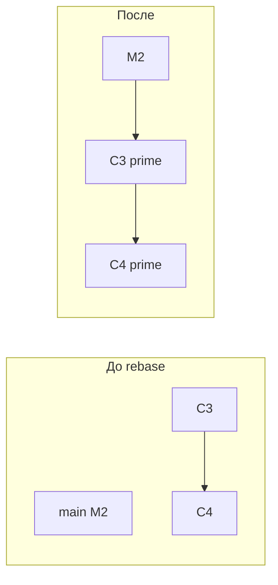

# Rebase: linear history, interactive rebase

> Roadmap: `0.2.3` · Node: `0.2` — Git: branches and collaboration · Depth: **глубоко**

## Learning Objectives

После этого урока ты сможешь:

- Объяснить **rebase** как replay commit'ов на новый base с созданием новых commit objects.
- С contrast rebase и **merge** по форме graph и сохранению history.
- Выполнить **`git rebase main`** на feature branch перед PR.
- Использовать **interactive rebase** (`git rebase -i`) для squash, reword, reorder, drop.
- Сформулировать **golden rule of rebase**: не rebase public/shared history, которую другие уже pull'нули.
- Восстановиться после rebase conflicts; использовать **`git rebase --abort`**.

---

## Why This Matters

Merge (`0.2.2`) объединяет две линии, часто merge commit'ом, навсегда фиксируя fork. Это честно, но некоторые команды хотят, чтобы **`main` читался как single timeline**. **Rebase** переписывает local feature work **как будто** она началась с latest `main`, убирая merge bubble и давая linear first-parent history.

Rebase — редактор **черновой** history перед sharing. Interactive rebase: squash WIP, fix messages, split commit, drop debug — без мусора на remote. Хороший rebase упрощает review и bisect. Rebase на commit'ах, на которых уже строятся другие, даёт duplicates и force-push инциденты. Middle уверенно rebases **private feature branches** и отказывается rebase **published shared tips**.

---

## Core Concepts

### Что делает rebase

`feature` на F с C3, C4 поверх старого base C2. `main` на M. **`git rebase main`** на `feature`:

1. Commit'ы reachable от F, но не от M (C3, C4).
2. Временно снимает их с tip.
3. Ставит base `feature` на M.
4. **Replay** C3', C4' — для каждого patch на текущий tip → **новые commit objects**, новые hash'и.
5. `feature` → C4'.

```
До:
  C2 — M1 — M2   (main)
   \
    C3 — C4       (feature)

После rebase feature onto main:
  C2 — M1 — M2 — C3' — C4'   (feature)
```

C3, C4 остаются в object store до gc; `feature` их не ссылается. **Parent изменился → новый hash** (`0.1.5`).

### Rebase vs merge (механика)

**Merge** на `main` — merge commit M+F. **Rebase** на `feature` — commits поверх M; merge в `main` часто **FF**. Код тот же; **story** в graph разная.

Rebase не «двигает» commit'ы — **создаёт новые** с теми же diffs (минус conflict resolution). Старые unreachable с ветки, reflog помнит.

### Interactive rebase

**`git rebase -i HEAD~3`** — editor со списком commit'ов:

| Command | Effect |
|---------|--------|
| `pick` | оставить |
| `reword` | message |
| `squash` / `fixup` | в предыдущий |
| `edit` | pause для amend |
| `drop` | удалить |

После `-i` на remote feature — **`git push --force-with-lease`**, не на `main`.

### Conflicts при rebase

Каждый replay — mini-merge. Conflict → markers, fix, `git add`, **`git rebase --continue`**. **`git rebase --abort`** — полный откат.

Может быть **несколько раундов** — по commit в chain.

### Golden rule (preview `0.2.4`)

**Не rebase commit'ы на remote, которые другие уже fetch'нули**, без координации force-push. Rebase rewrite history; у коллег старые hash'и. Rebase **свою** feature до первого push или force-with-lease **свою** remote feature — не **`main`**, не **release tags**.

---

## Under the Hood

### Cherry-pick loop

Rebase ≈ **`git cherry-pick`** series: diff commit vs parent → apply на HEAD → commit. Новый committer time «now»; author сохраняется.

### Reflog

Reflog (`feature@{1}`) до rebase. **`git rebase --abort`** или reset по reflog. Local, time-limited.

### `--onto`

**`git rebase --onto newBase oldBase feature`** — replay `(oldBase, feature]` на `newBase`.

### Почему меняются hash'и

Hash включает parents, tree, metadata. Rebase меняет **parents** → новый hash. «Rebase creates new commits.»



---

## Syntax / Commands / API

| Задача | Команда |
|--------|---------|
| Rebase feature на main | `git switch feature` ; `git rebase main` |
| Interactive | `git rebase -i HEAD~N` |
| Continue | `git add` ; `git rebase --continue` |
| Abort | `git rebase --abort` |
| Remote update | `git push --force-with-lease` |

---

## Examples

### Update feature перед PR

```bash
git switch feature/login
git fetch origin
git rebase origin/main
git push --force-with-lease origin feature/login
```

### Squash WIP

```bash
git rebase -i HEAD~4
# fixup 2-4 into 1
```

### Abort

```bash
git rebase main
git rebase --abort
```

---

## Common Mistakes & Anti-patterns

**Rebase public main.** Ломает команду.

**Force push без `--force-with-lease`.**

**`-i` на уже merged commit'ах.**

**Путать rebase и merge.**

**Drop в `-i` без чтения diff.**

---

## Production & Real-World Notes

Pattern: **rebase feature daily**; **squash merge** PR. GitHub **Rebase and merge** — server-side rebase + FF.

---

## Comparison / Trade-offs

| | Rebase | Merge |
|---|--------|-------|
| Graph | Linear после FF | Diamonds |
| Rewrite | Да | Нет |
| Shared tips | Небезопасно | Безопасно |
| Conflicts | Per commit | Обычно один раз |

Framework: **`0.2.4`**.

---

## Quick Reference

| Term | Meaning |
|------|---------|
| Rebase | Replay на новый base |
| `-i` | Interactive edit |
| `--force-with-lease` | Safe push после rewrite |

---

## Key Takeaways

- Rebase = **новые commit'ы**, старые tips orphaned.
- **`-i`** — edit перед push.
- Conflicts **по цепочке** replay.
- **`--abort`**, **reflog** — escape.
- **Golden rule** — не rewrite public shared history.
- Rebase + FF → linear main.

---

## Further Reading

- [Git Book — Rebasing](https://git-scm.com/book/en/v2/Git-Branching-Rebasing)
- [git rebase](https://git-scm.com/docs/git-rebase)

---

## Up Next

**`0.2.4`** — merge vs rebase: trade-offs, golden rules.
