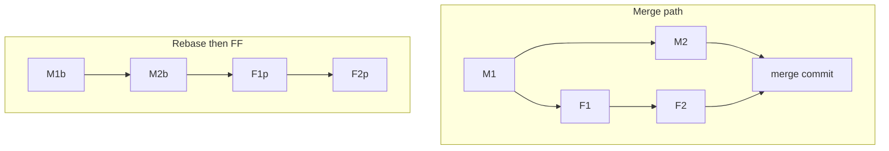

# Merge vs Rebase — Trade-offs and Golden Rules

> Roadmap: `0.2.4` · Node: `0.2` — Git: branches and collaboration · Depth: **deep**

## Learning Objectives

After this lesson you will be able to:

- Compare **merge** and **rebase** across history shape, safety, review, bisect, and recovery.
- Apply the **golden rules** of rebase and force-push in team settings.
- Recommend a **branch integration policy** for a given team size and release cadence.
- Explain when **merge commits**, **squash**, **rebase + FF**, and **rebase and merge** fit.
- Navigate social and technical consequences of rewriting published history.
- Resolve "merge vs rebase" debates with trade-offs, not dogma.

---

## Why This Matters

Lessons `0.2.2` and `0.2.3` taught the mechanics: merge **joins** histories; rebase **replays** commits onto a new base with new hashes. In isolation both work. In a team, the choice affects every pull request, every incident postmortem, and every argument in Slack. Juniors hear absolutes — "never merge on main" or "rebase is always better" — that ignore context. Middle developers choose policies and explain them to juniors and PMs.

The wrong policy costs real time. Squash everything and you lose bisect granularity on `main`. Rebase shared `develop` and you break five laptops. Never rebase and `main` becomes an unreadable braid of merge bubbles. Force-push without lease and you delete a teammate's commits. This lesson gives you **decision criteria** and **golden rules** that survive production pressure — not a single "correct" workflow for every company.

---

## Core Concepts

### Two Philosophies of History

**Preserve topology (merge-heavy):** The graph shows what actually happened — parallel features, when they integrated, hotfix branches. Truthful for forensics; noisier to read.

**Prefer linear narrative (rebase/squash-heavy):** `main` reads top-to-bottom as sequential features. Easier mental model for releases and changelog; rewrites or collapses parallel reality.

Neither is morally superior. Open-source Linux kernel favors merges; many SaaS startups squash PRs to `main`. Your team picks explicit trade-offs.

### Golden Rule #1: Do Not Rewrite Shared Published History

**If a commit is on a remote branch that others may have fetched, do not rebase that branch tip without team coordination.**

Why: collaborators hold old hashes. Their next fetch sees divergent histories — duplicate commits, painful conflict resolution, or silent overwrites if someone force-pushes. **`main`**, **`develop`**, **release branches**, and **tags** are almost always **append-only** from the consumer's perspective.

Safe rebase targets: **your local commits not yet pushed**, **your remote feature branch** if only you use it (force-with-lease after agreement).

### Golden Rule #2: Force-Push With Lease, Never Bare Force on Shared Names

After rebasing a pushed feature branch: **`git push --force-with-lease`**. It fails if remote moved since your last fetch — someone else pushed. Plain **`--force`** overwrites blindly.

Never force-push **`main`** on platforms without protected-branch exceptions — and even then, only incident response with team approval.

### Golden Rule #3: Integrate Often, Integrate Small

Merge vs rebase debate matters less if branches live **hours or days**, not months. Long-lived branches amplify both merge conflicts and rebase conflict chains. **Trunk-based development** reduces the need for heroic integration regardless of merge/rebase preference.

### Decision Matrix

| Situation | Often best | Why |
|-----------|------------|-----|
| Integrate feature PR to protected `main` | Squash merge or rebase-and-merge | Clean linear release history |
| Preserve PR boundary for audit | `--no-ff` merge commit | Explicit integration node |
| Update local feature with latest `main` | `git rebase main` on feature | Linear feature branch; no merge bubble on feature |
| Shared long-lived `develop` | Merge main into develop (or FF) | Avoid rewriting shared tip |
| Hotfix on release branch | Merge or cherry-pick (`0.2.11`) | No rebase on tagged release |
| Open source external contributors | Merge commit (respect their hashes) | Don't rewrite contributor commits without consent |

### Combining Strategies (Common in Production)

A pattern that works for many ASP.NET/React teams:

1. Developer rebases **private feature** on `origin/main` daily.
2. PR review sees linear commits (or squashes locally before PR).
3. Platform **squash and merge** to `main` — one commit per ticket.
4. **Never** rebase `main`; **never** force-push shared integration branches.

Another valid pattern (GitFlow-style):

1. Feature merges to `develop` with **merge commits** (`--no-ff`).
2. Release branch cut; hotfixes merge back.
3. Rebase only on **private feature** before merging to `develop`.

Document the chosen pattern in CONTRIBUTING.md so debate stops at merge time.

### Social Contract

When you rebase a branch others pulled:

1. Announce in chat.
2. Force-with-lease push.
3. Tell teammates to **`git fetch`** and **`git reset --hard origin/feature/x`** (or rebase their local work onto new tip).

Without step 3, they push old hashes back and undo your fix.

---

## Under the Hood

### Why Both Can Produce Same Tree, Different History

The **final file content** on `main` after integration can be identical whether you merged or rebased-then-FF'd. **Commit graph and hashes differ.** Tools care:

- **`git blame`**: points to different commits.
- **`git bisect`**: different steps.
- **Revert**: merge commit revert may need `-m 1` parent selection; squash revert is one commit.

Understanding this prevents "the code is the same so history doesn't matter" — it matters for tooling and audit.

### First-Parent History

Many log views follow **first parent only** — simulating main-line march. Rebase+squash optimizes this view. Merge commits require `--first-parent` flags to hide side branches. Teams arguing about readability often argue about **first-parent log**, not full DAG.



---

## Syntax / Commands / API

| Policy action | Typical commands |
|---------------|------------------|
| Update feature with main (rebase policy) | `git fetch origin` ; `git rebase origin/main` |
| Update feature with main (merge policy) | `git merge origin/main` on feature |
| Safe force push | `git push --force-with-lease origin feature/x` |
| Teammate resync after your rebase | `git fetch` ; `git switch feature/x` ; `git reset --hard origin/feature/x` |
| Revert merge commit on main | `git revert -m 1 <merge-commit-hash>` |

---

## Examples

### Example 1: Daily rebase policy

Team rule: before each push to remote feature, rebase on `main`. Developer:

```bash
git fetch origin
git rebase origin/main
# resolve conflicts
git push --force-with-lease origin feature/payments
```

Main never rewritten; feature history linear for reviewers.

### Example 2: Squash-only main, no rebase on shared develop

Contributors merge feature → `develop` with merge commits. Release cuts from `develop`. Main/production receives squash from release PR only. Rebase allowed only on **local feature before merging to develop**.

### Example 3: Recover after accidental rebase of shared branch

Someone rebased `develop` and force-pushed. Before others push:

```bash
git reflog develop   # find pre-rebase hash on someone's machine or CI
git push --force-with-lease origin develop@{recovery-hash}
```

Prevention beats recovery — protect branches on hosting platform.

---

## Common Mistakes & Anti-patterns

**Dogma:** "We only rebase" on shared long-lived branches — breaks collaborators.

**Dogma:** "We never rebase" — yields unreadable `main` and giant merge commits.

**Rebase + merge** without team doc — each PR uses random strategy; bisect/blame inconsistent.

**Force-push `main`** to "fix history" — catastrophic; use revert (`0.2.11`).

**Assuming GitHub default matches team intent** — configure allowed merge methods in repo settings.

---

## Production & Real-World Notes

**GitHub/GitLab settings:** disable merge methods you don't want; require linear history (rebase-only merge) if policy demands.

**Protected branches + required reviews** enforce policy technically; README enforces socially.

**Compliance/audit** may require merge commits to prove when code entered `main` — squash still has PR record on platform even if Git graph is one commit.

**Monorepo** teams often standardize one strategy repo-wide — mixed strategies confuse automation.

---

## Comparison / Trade-offs

| Criterion | Merge (incl. --no-ff) | Rebase (+ FF to main) | Squash on main |
|-----------|----------------------|------------------------|----------------|
| Graph fidelity | High | Medium (rewrites feature) | Low on main |
| Linear main log | No (unless FF only) | Often yes | Yes |
| Safe on shared tips | Yes | No (rewrite) | N/A (on integrate) |
| Bisect on main | Granular if FF | Granular if FF | Coarse |
| Conflict resolution | Usually once | Per replayed commit | Once at squash |
| Contributor-friendly OSS | Yes | Controversial | Loses commit authorship chain on main |

---

## Quick Reference

| Rule | Summary |
|------|---------|
| Golden #1 | Don't rebase shared published tips |
| Golden #2 | `--force-with-lease`, not `--force` |
| Golden #3 | Short-lived branches |
| Merge | Join histories; safe for shared |
| Rebase | Rewrite feature; private/pre-push |
| Squash | One commit on main; platform PR retains detail |

---

## Key Takeaways

- **Merge** preserves truth; **rebase** optimizes narrative — choose per branch role.
- **Never rebase** `main`/shared branches others depend on.
- **Force-with-lease** after rebasing pushed feature branches.
- **Team policy** in writing beats individual preference.
- Same **tree content**, different **history** — tooling and audit care.
- **Integrate often** reduces pain more than picking the "perfect" strategy.

---

## Further Reading

- [Git Book — Rebasing vs Merging](https://git-scm.com/book/en/v2/Git-Branching-Rebasing#_rebase_vs_merging_revisited)
- [Atlassian — Merge vs Rebase](https://www.atlassian.com/git/tutorials/merging-vs-rebasing)
- [GitHub — About merge methods](https://docs.github.com/en/repositories/configuring-branches-and-merges-in-your-repository/configuring-pull-request-merges/about-merge-methods-on-github)

---

## Up Next

**`0.2.5`** — conflict resolution: markers, strategies, and tools.
