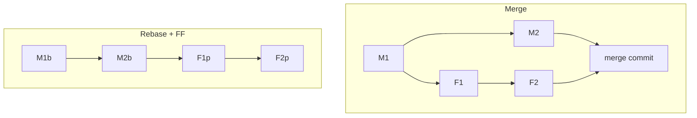

# Merge vs rebase — trade-offs, golden rules

> Roadmap: `0.2.4` · Node: `0.2` — Git: branches and collaboration · Depth: **глубоко**

## Learning Objectives

После этого урока ты сможешь:

- Сравнить **merge** и **rebase** по history shape, safety, review, bisect, recovery.
- Применить **golden rules** rebase и force-push в команде.
- Рекомендовать **branch integration policy** под размер команды и release cadence.
- Объяснить, когда уместны merge commits, squash, rebase + FF, rebase and merge.
- Оценить social и technical последствия rewrite published history.
- Вести debate merge vs rebase через trade-offs, не dogma.

---

## Why This Matters

В `0.2.2` и `0.2.3` — mechanics: merge **joins**; rebase **replays** с новыми hash'ами. В команде выбор влияет на каждый PR, postmortem и спор в Slack. Абсолюты («never merge» / «always rebase») игнорируют context. Middle выбирает policy и объясняет juniors и PM.

Неверная policy стоит времени: squash всего — нет bisect granularity; rebase shared `develop` — сломанные laptop'ы; never rebase — нечитаемый braid merge bubbles; force без lease — чужие commit'ы удалены. Этот урок — **decision criteria** и **golden rules** под production pressure.

---

## Core Concepts

### Две философии history

**Preserve topology (merge-heavy):** graph показывает реальность — parallel features, точки integration. Truthful forensics; шумнее читать.

**Linear narrative (rebase/squash-heavy):** `main` сверху вниз — sequential features. Проще releases/changelog; rewrite или collapse parallel reality.

Нет «мoral winner». Kernel — merges; многие SaaS — squash PR. Команда выбирает trade-offs явно.

### Golden Rule #1: Не rewrite shared published history

**Commit на remote branch, который другие fetch'нули — не rebase tip без координации.**

Collaborators на старых hash'ах → duplicates, painful conflicts, overwrite при force. **`main`**, **`develop`**, **release**, **tags** — **append-only** для consumers.

Safe: **local unpushed**; **remote feature** только ты (+ force-with-lease).

### Golden Rule #2: Force-with-lease

После rebase pushed feature: **`git push --force-with-lease`**. Fail если remote сдвинулся — кто-то push'нул. **`--force`** — blind overwrite.

Force **`main`** — incident-only с approval.

### Golden Rule #3: Integrate often, small

Merge vs rebase меньше важен при branch **hours/days**, не months. Long-lived branches усиливают conflicts и rebase chains. **Trunk-based** снижает heroic integration.

### Decision matrix

| Situation | Often best | Why |
|-----------|------------|-----|
| Feature PR → protected `main` | Squash / rebase-and-merge | Linear release |
| Audit PR boundary | `--no-ff` merge | Explicit node |
| Update feature с `main` | rebase на feature | Linear feature |
| Shared long-lived `develop` | merge main in | No rewrite tip |
| Hotfix release | merge/cherry-pick | No rebase tags |
| OSS contributors | merge commit | Respect their hashes |

### Combined strategies

Pattern ASP.NET/React teams:

1. Rebase **private feature** on `origin/main` daily.
2. PR linear (или local squash).
3. Platform **squash and merge** → `main`.
4. Never rebase `main`; never force shared integration branches.

GitFlow-style: `--no-ff` → `develop`; rebase только local feature before merge.

**CONTRIBUTING.md** — end debate at merge time.

### Social contract

Rebase branch others pulled:

1. Announce.
2. Force-with-lease.
3. Teammates: **`git fetch`** + **`git reset --hard origin/feature/x`**.

---

## Under the Hood

### Same tree, different history

**Final content** на `main` может совпадать после merge vs rebase+FF. **Graph и hash'и** — нет. **`git blame`**, **bisect**, **revert** (`-m 1` для merge) ведут себя иначе.

### First-parent history

Log views часто **first parent only**. Rebase+squash оптимизирует это. Merge — нужен `--first-parent`. Споры о readability — often про **first-parent log**, не full DAG.



---

## Examples

### Daily rebase policy

```bash
git fetch origin && git rebase origin/main
git push --force-with-lease origin feature/payments
```

### Squash main, merge develop

Feature → `develop` merge commits; production squash from release.

### Recovery accidental rebase develop

`git reflog` → restore hash → force-with-lease push. Prevention: branch protection.

---

## Common Mistakes & Anti-patterns

Dogma only-rebase на shared branches. Dogma never-rebase → unreadable main. Random strategy per PR. Force `main` to fix history — use revert.

---

## Comparison / Trade-offs

| Criterion | Merge | Rebase + FF | Squash main |
|-----------|-------|-------------|-------------|
| Graph fidelity | High | Medium | Low on main |
| Linear main | No* | Often | Yes |
| Shared tips safe | Yes | No | N/A |
| Bisect main | Granular* | Granular* | Coarse |

*FF exception

---

## Key Takeaways

- Merge = truth; rebase = narrative — по роли branch.
- Never rebase shared `main`/develop others use.
- Force-with-lease после rebase feature.
- Written team policy > individual taste.
- Same tree ≠ same history для tooling.
- Integrate often > perfect strategy.

---

## Further Reading

- [Git Book — Rebase vs Merge revisited](https://git-scm.com/book/en/v2/Git-Branching-Rebasing#_rebase_vs_merging_revisited)
- [Atlassian — Merge vs Rebase](https://www.atlassian.com/git/tutorials/merging-vs-rebasing)

---

## Up Next

**`0.2.5`** — conflict resolution.
