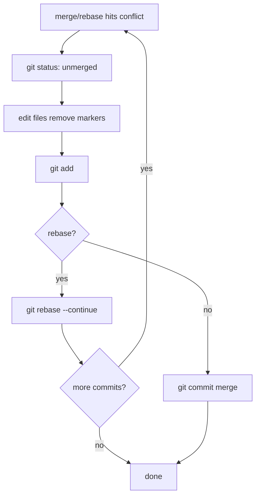

# Conflict Resolution: Markers, Strategies, and Tools

> Roadmap: `0.2.5` · Node: `0.2` — Git: branches and collaboration · Depth: practice

## Learning Objectives

After this lesson you will be able to:

- Read and interpret **conflict markers** (`<<<<<<<`, `=======`, `>>>>>>>`) in merged files.
- Explain why Git stops and leaves markers instead of guessing the correct code.
- Resolve conflicts during **merge**, **rebase**, and **cherry-pick** using a repeatable workflow.
- Use **`git status`**, **`git diff`**, and stage numbers in the index to track conflict state.
- Choose strategies: take ours/theirs, manual edit, union, or abort.
- Use IDE merge tools and **`git mergetool`** effectively in daily work.

---

## Why This Matters

You learned merge (`0.2.2`) and rebase (`0.2.3`): Git combines changes from two histories using the merge base. When the **same lines** changed differently on both sides, no algorithm can know which version matches product intent. Git marks the file **conflicted** and stops — forcing a human decision. That pause is a feature, not a failure.

Conflicts are routine on fullstack teams: two developers edit the same React component, both adjust the same EF migration snippet, or you rebase a week-old feature onto a moved `main`. Juniors panic; seniors follow a checklist. Middle developers resolve conflicts quickly, verify with tests, and avoid committing marker text or half-resolved files. CI that never ran because "merge conflict" blocked the PR costs the same as a bug. This lesson makes conflict resolution **mechanical and safe**.

---

## Core Concepts

### When Conflicts Happen

Git can auto-merge when changes touch **different lines** or the **same lines identically**. Conflict when:

- Both sides **modified** the same region differently.
- One side **deleted** what the other **edited**.
- Both **renamed** or **moved** the same file differently (rename conflicts — advanced).

During **merge**, Git compares base vs ours (HEAD) vs theirs (MERGE_HEAD). During **rebase**, "ours" and "theirs" **swap roles** from intuition — the branch you rebase onto is "ours" in conflict messages; the replayed commit is "theirs". Read markers carefully in rebase context.

### Conflict Markers

Git writes into the working tree file:

```
<<<<<<< HEAD
code from current branch (ours in merge)
=======
code from incoming branch (theirs in merge)
>>>>>>> feature/login
```

Some tools add **common ancestor** section (diff3 style) if `merge.conflictStyle=diff3`:

```
<<<<<<< ours
...
||||||| merged common ancestors
...
=======
theirs
>>>>>>> branch
```

**Your job:** edit to the final correct code — remove **all** markers. Keep one side, blend both, or rewrite entirely. Then `git add` the file.

Committing with markers left in file is a production incident waiting for code review miss.

### Index Stages During Conflict

The index uses **stage numbers** (from `0.1.4` / merge):

| Stage | Meaning |
|-------|---------|
| 0 | resolved, ready to commit |
| 1 | common ancestor (base) |
| 2 | ours (HEAD side) |
| 3 | theirs (incoming) |

`git ls-files -u` lists unmerged paths with stages. After resolution, single stage 0 entry remains.

### Resolution Workflow (Merge)

1. `git merge feature` → conflict.
2. `git status` — list **Unmerged paths**.
3. Open each file; understand both sides (talk to author if needed).
4. Edit to final content; remove markers.
5. `git add <file>` for each resolved file.
6. `git commit` (merge message prefilled) or merge completes.

**Abort:** `git merge --abort` — back to pre-merge.

### Resolution Workflow (Rebase)

1. `git rebase main` → stops at commit N with conflict.
2. Fix files; `git add`.
3. **`git rebase --continue`** (not commit manually — rebase creates commits).
4. Repeat for each stopped commit.
5. **Abort:** `git rebase --abort`.

### Strategies Without Manual Line Edit

For whole-file or binary choices:

```bash
git checkout --ours path/to/file    # keep HEAD version (merge)
git checkout --theirs path/to/file  # keep incoming
git restore --source=HEAD --staged --worktree path   # modern variants
```

Use sparingly — easy to pick wrong side in rebase where ours/theirs invert. Prefer reading markers for code files.

**`git merge -X ours/theirs`** — prefer one side on conflict **automatically** (dangerous for code; sometimes OK for lockfiles with team policy).

### Tools

**IDE built-in:** VS Code, Rider, Visual Studio — 3-pane merge UI; accept incoming/current/both.

**`git mergetool`:** launches configured tool (meld, kdiff3, vscode as mergetool). Sets `$MERGED`, `$LOCAL`, `$REMOTE`, `$BASE`.

**`git diff --merge`:** shows combined diff during conflict.

After resolution, always **run tests** and **open the app** — merged syntax may compile but behave wrong.

---

## Under the Hood

### Why Git Does Not Auto-Pick

Content-addressable integrity (`0.1.4`) applies to trust: silently dropping one side's logic would violate review expectations. Stop + markers = explicit human merge decision recorded in the next commit.

### Rerere (Reuse Recorded Resolution)

**`git config rerere.enabled true`** — Git remembers how you resolved a conflict hunk; replays if same conflict appears again (useful on long rebase branches). Optional advanced optimization.

### Conflict Types in Graph

```
      base
     /    \
   ours    theirs
     \    /
    (you edit → one merged result)
```

Merge commit stores one tree — your resolved snapshot — not two competing versions.



---

## Syntax / Commands / API

| Action | Command |
|--------|---------|
| See unmerged files | `git status` ; `git ls-files -u` |
| Abort merge | `git merge --abort` |
| Abort rebase | `git rebase --abort` |
| Continue rebase | `git rebase --continue` |
| Open mergetool | `git mergetool` |
| diff3 style | `git config merge.conflictStyle diff3` |
| Take our/their file | `git checkout --ours/--theirs -- path` |

---

## Examples

### Example 1: Simple text conflict

`Program.cs` on `main` changed greeting to "Hello"; `feature` changed to "Hi". Merge produces markers. You decide product wants "Hello, user" — edit manually, remove markers, `git add Program.cs`, `git commit`.

### Example 2: Rebase inversion awareness

Rebasing feature onto main: conflict markers say `HEAD` = main code, `>>>>>>> abc1234` = your feature commit being replayed. Don't blindly "keep ours" without reading which is which.

### Example 3: Lockfile policy

Team policy: on `package-lock.json` conflict, run `npm install` to regenerate; don't hand-merge. Abort markers by replacing file with regenerated lock, `git add package-lock.json`.

---

## Common Mistakes & Anti-patterns

**Committing conflict markers.** Reviewers miss; runtime breaks.

**Wrong ours/theirs during rebase.** Deleted feature code or reintroduced bug.

**Resolving without running tests.** Merge compiles, logic wrong.

**Mass `--theirs` on every file** to "finish fast" — discards teammate work.

**Ignoring rename/delete conflicts** — file missing after merge; read status carefully.

---

## Production & Real-World Notes

**Pair on hard conflicts** — two sets of eyes on payment/auth code.

**Smaller PRs** — fewer overlapping edits (`0.2.4` integrate often).

**Communication:** "I'm merging the router refactor — ping before editing `Routes.tsx`."

Document **lockfile/binary** resolution in CONTRIBUTING.md.

Some teams use **union merge driver** for specific paths — rare; know if your repo configures it in `.gitattributes`.

---

## Comparison / Trade-offs

| Approach | When |
|----------|------|
| Manual edit | Business logic, UI, most code |
| Regenerate (lockfile) | npm/pnpm/dotnet lock conflicts |
| `--ours/theirs` whole file | Binary, intentional override |
| Abort + rebase later | Too messy; split PR |
| Pair / call author | Unclear intent |

---

## Quick Reference

```
<<<<<<< HEAD
ours
=======
theirs
>>>>>>> branch
```

→ Edit → remove markers → `git add` → continue/commit/abort

---

## Key Takeaways

- Conflicts = **same region, different edits** — Git cannot guess intent.
- **Remove all markers** before add/commit.
- **Rebase:** ours/theirs **inverted** vs merge intuition.
- Workflow: status → fix → add → continue/commit.
- **Test** after every resolution.
- **mergetool** and IDE — use them; don't fear conflicts.

---

## Further Reading

- [Git Book — Basic Merge Conflicts](https://git-scm.com/book/en/v2/Git-Branching-Basic-Branching-and-Merging#_basic_merge_conflicts)
- [git merge.conflictStyle](https://git-scm.com/docs/git-merge#Documentation/git-merge.txt-mergeconflictStyle)
- [VS Code — Merge conflicts](https://code.visualstudio.com/docs/sourcecontrol/overview#_merge-conflicts)

---

## Up Next

**`0.2.6`** — remote: origin, fetch, pull, push.
