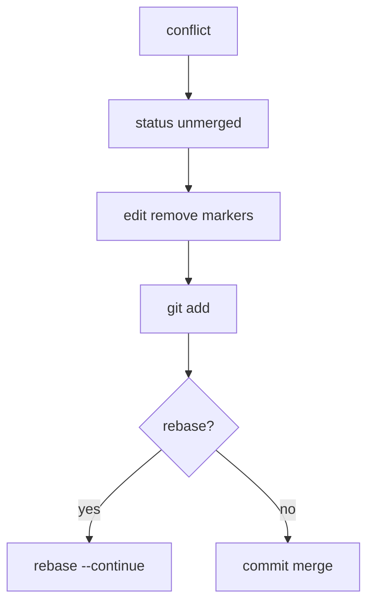

# Conflict resolution: markers, strategies, tools

> Roadmap: `0.2.5` · Node: `0.2` — Git: branches and collaboration · Depth: практика

## Learning Objectives

После этого урока ты сможешь:

- Читать **conflict markers** (`<<<<<<<`, `=======`, `>>>>>>>`).
- Объяснить, почему Git останавливается вместо «угадывания» кода.
- Resolve conflicts при **merge**, **rebase**, **cherry-pick** по checklist.
- Использовать **`git status`**, **`git diff`**, stage numbers в index.
- Выбирать стратегии: ours/theirs, manual, regenerate, abort.
- Применять IDE merge tools и **`git mergetool`**.

---

## Why This Matters

Merge (`0.2.2`) и rebase (`0.2.3`) объединяют histories через merge base. Когда **одни и те же строки** изменены по-разному, алгоритм не знает product intent. Git помечает **conflict** и останавливается — это **feature**, не сбой.

Conflicts routine: два dev правят один React component, оба трогают EF migration, rebase week-old feature на moved `main`. Middle resolve быстро, test'ит, не commit'ит markers. PR, заблокированный conflict'ом, стоит как bug. Урок делает resolution **mechanical and safe**.

---

## Core Concepts

### Когда возникает conflict

Auto-merge если **разные строки** или **одинаковые изменения**. Conflict если:

- Обе стороны **по-разному** изменили region.
- Одна **удалила**, другая **редактировала**.
- **Rename/move** collision (advanced).

При **merge:** base vs ours (HEAD) vs theirs (MERGE_HEAD). При **rebase** **ours/theirs inverted** — branch rebased onto = «ours» в markers; replayed commit = «theirs». Читай markers в context rebase.

### Conflict markers

```
<<<<<<< HEAD
код current branch (ours в merge)
=======
код incoming (theirs в merge)
>>>>>>> feature/login
```

**diff3** (`merge.conflictStyle=diff3`) добавляет ancestor section.

**Задача:** финальный код — **удалить все markers**. `git add`.

Commit с markers в файле — incident.

### Index stages

| Stage | Meaning |
|-------|---------|
| 0 | resolved |
| 1 | base (ancestor) |
| 2 | ours (HEAD) |
| 3 | theirs |

`git ls-files -u` — unmerged paths.

### Workflow merge

1. `git merge feature` → conflict.
2. `git status` — Unmerged paths.
3. Edit files; remove markers.
4. `git add` each.
5. `git commit`.

**Abort:** `git merge --abort`.

### Workflow rebase

Fix → `git add` → **`git rebase --continue`** (не manual commit). **Abort:** `git rebase --abort`.

### Strategies

```bash
git checkout --ours path
git checkout --theirs path
```

Осторожно при rebase — roles swap. Для lockfiles: regenerate (`npm install`), не hand-merge.

**IDE / `git mergetool`:** 3-pane UI. **`git diff --merge`**.

После resolution — **tests + run app**.

---

## Under the Hood

Git не auto-pick — silent drop ломает review trust. Stop + markers = explicit human decision.

**rerere** — remember resolution для повторяющихся hunks (optional).



---

## Examples

### Text conflict
Merge greeting "Hello" vs "Hi" → edit "Hello, user" → add → commit.

### Rebase inversion
HEAD = main; `>>>>>>>` = replayed feature commit. Не blind `--ours`.

### Lockfile
Policy: regenerate lock, add, continue.

---

## Common Mistakes

Markers в commit. Wrong ours/theirs на rebase. No tests. Mass `--theirs`. Ignore rename/delete.

---

## Production Notes

Pair на auth/payment. Smaller PRs. Communicate overlapping files. CONTRIBUTING для lockfiles.

---

## Key Takeaways

- Conflict = different edits same region.
- Remove **all** markers.
- Rebase: **ours/theirs inverted**.
- status → fix → add → continue/commit.
- Test always.
- Use mergetool/IDE.

---

## Further Reading

- [Git Book — Basic Merge Conflicts](https://git-scm.com/book/en/v2/Git-Branching-Basic-Branching-and-Merging#_basic_merge_conflicts)
- [VS Code merge conflicts](https://code.visualstudio.com/docs/sourcecontrol/overview#_merge-conflicts)

---

## Up Next

**`0.2.6`** — remote: origin, fetch, pull, push.
