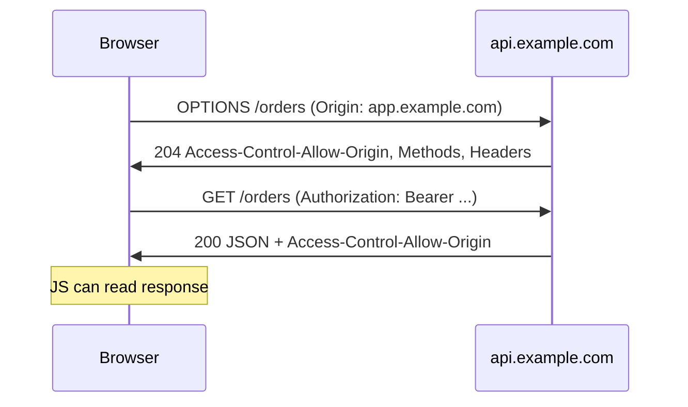

# CORS — Same-Origin Policy and Preflight (Preview)

> Roadmap: `0.4.10` · Node: `0.4` — Networking · Depth: understanding

## Learning Objectives

After this lesson you will be able to:

- Define **origin** (scheme + host + port) and explain the browser **same-origin policy**.
- Describe why a React app on `app.example.com` calling `api.example.com` triggers **CORS** checks.
- Distinguish **simple requests** from requests that trigger a **preflight** (`OPTIONS`).
- Read basic CORS response headers: `Access-Control-Allow-Origin`, `Access-Control-Allow-Methods`, `Access-Control-Allow-Headers`.
- Explain why CORS is a **browser** enforcement mechanism, not API authentication.
- Know where **full CORS configuration** is covered later in ASP.NET Core and React phases.

---

## Why This Matters

In `0.4.9` you split production hosting: static React on a CDN at `https://app.example.com`, ASP.NET Core API at `https://api.example.com`. Locally, Vite proxies API calls or you enable CORS on Kestrel — everything "just works." After deploy, the browser loads JS from one origin and `fetch('https://api.example.com/orders')` from another. The request may succeed on the server (you see 200 in logs) while the browser **blocks JavaScript from reading the response** and prints a CORS error in DevTools. Juniors often blame the API or React when the issue is missing `Access-Control-Allow-Origin`.

**CORS (Cross-Origin Resource Sharing)** is a controlled relaxation of the **same-origin policy**. It lets servers explicitly tell browsers which cross-origin requests are permitted. It does **not** stop curl, Postman, or server-to-server calls — only browser-based JavaScript with user cookies/context.

This lesson is a **preview** at the networking layer: enough to debug deploys and read error messages. Full production setup — ASP.NET `AddCors`, policy names, credentials mode, React `fetch` options — comes in later roadmap nodes (ASP.NET middleware, React/HTTP client topics). Bookmark this mental model before those implementation lessons.

---

## Core Concepts

### What Is an Origin?

An **origin** is the tuple **(scheme, host, port)**. These are different origins:

- `https://app.example.com` vs `https://api.example.com` — different **host**
- `http://localhost:5173` vs `http://localhost:5000` — different **port**
- `http://example.com` vs `https://example.com` — different **scheme**

Same origin means all three match. Path and query do **not** affect origin: `https://app.example.com/a` and `https://app.example.com/b` share an origin.

The **same-origin policy** prevents a script loaded from origin A from reading responses from origin B unless B opts in via CORS headers. Without it, a malicious site could embed your bank's cookies and exfiltrate data — the browser restricts cross-origin **reads** by default.

### Browser vs Server Perspective

When your React app calls the API, the **HTTP request often reaches the server**. Kestrel processes it, hits the database, builds JSON. CORS failure happens when the **browser** inspects the response headers and decides JavaScript must not access the body. Network tab may show 200 OK with a red CORS message — confusing until you understand the split.

Tools like Postman ignore CORS — they are not browsers enforcing SOP. Security reviews must not conclude "API is secure because Postman works."

### Simple vs Non-Simple Requests

Browsers classify some cross-origin requests as **simple** — no preflight. Criteria include method `GET`, `HEAD`, or `POST` with limited content types (e.g. `application/x-www-form-urlencoded`, `multipart/form-data`, `text/plain`), and only "safelisted" headers like `Accept`, `Content-Language`, `Content-Type` (with restrictions).

Anything else — e.g. `PUT`, `DELETE`, `Authorization` header, `Content-Type: application/json` — triggers a **preflight**: the browser sends **`OPTIONS`** first asking "is this allowed?" Server must respond with appropriate `Access-Control-Allow-*` headers; only then the real request is sent.

Typical ASP.NET JSON API with JWT:

```
OPTIONS /orders  → 204 + Allow-Origin, Allow-Methods, Allow-Headers
GET /orders      → 200 + Allow-Origin (+ credentials headers if cookies)
```

If OPTIONS fails or lacks headers, the GET never fires from the browser's perspective.

### Key Response Headers

**`Access-Control-Allow-Origin`:** which origin may read the response. `*` allows any (not with credentials). Production often echoes specific origin: `https://app.example.com`.

**`Access-Control-Allow-Methods`:** permitted methods for preflight (e.g. `GET, POST, PUT, DELETE`).

**`Access-Control-Allow-Headers`:** permitted request headers (e.g. `Authorization, Content-Type`).

**`Access-Control-Allow-Credentials: true`:** allows cookies/Authorization with a **specific** origin (not `*`).

**`Access-Control-Max-Age`:** how long browser caches preflight result — reduces OPTIONS traffic.

The **server** must send these; React cannot "fix" CORS alone on the client side (except dev proxy — a workaround, not production fix).

### Preflight Flow (Diagram)



Without Allow-Origin on the GET response, the browser hides the body from JavaScript even if JSON is valid.

---

## Under the Hood

### Why the Policy Exists

Before CORS, browsers still sent cookies on cross-origin requests (e.g. ``). **Same-origin policy on reading** limits what attacker JavaScript can learn. CORS lets **trusted** APIs declare cross-origin access for SPA architectures without opening all sites to all data.

### Credentialed Requests

When `fetch(url, { credentials: 'include' })` sends cookies, server must respond with `Allow-Credentials: true` and a **specific** `Allow-Origin` — not wildcard. ASP.NET and React must align; misconfiguration shows as opaque network errors.

---

## Syntax / Commands / API

### Browser fetch (React) — preview only

```javascript
fetch('https://api.example.com/orders', {
  method: 'GET',
  headers: { Authorization: `Bearer ${token}` },
  credentials: 'include', // only if using cookies cross-origin
});
```

### ASP.NET Core — preview (full lesson later)

```csharp
builder.Services.AddCors(options =>
{
    options.AddPolicy("Spa", policy =>
        policy.WithOrigins("https://app.example.com")
              .AllowAnyHeader()
              .AllowAnyMethod());
});
app.UseCors("Spa"); // before auth/endpoints
```

Order matters in full ASP.NET pipeline — detailed in hosting/security nodes.

### curl (no CORS)

```bash
curl -H "Origin: https://app.example.com" -I https://api.example.com/health
# Check Access-Control-Allow-Origin in response
```

---

## Examples

### Local Dev Proxy (Workaround)

Vite `server.proxy` forwards `/api` to `localhost:5000` — browser sees **same origin** (`localhost:5173`). CORS not needed locally; production split requires real CORS policy.

### Typical Production Error

Console: `Access to fetch at 'https://api.example.com/orders' from origin 'https://app.example.com' has been blocked by CORS policy: No 'Access-Control-Allow-Origin' header.`

Fix on **API**: add CORS policy allowing `https://app.example.com`. Not on CDN hosting React static files alone.

---

## Common Mistakes & Anti-patterns

**Trying to fix CORS in React only** — headers must come from API (or edge in front of API with correct config).

**Using `AllowAnyOrigin()` with credentials** — invalid combination; browser rejects.

**Assuming CORS replaces authentication** — CORS is not a security gate for non-browser clients.

**Forgetting OPTIONS in middleware pipeline** — preflight never reaches controller.

---

## Production & Real-World Notes

Some teams terminate CORS at **API gateway** or **reverse proxy** (`0.4.8`) instead of Kestrel — same headers, different layer.

**Multiple SPA environments:** dev/staging/prod origins listed explicitly in policy.

Full coverage later: ASP.NET Core CORS middleware order with authentication, minimal APIs, SignalR, and React Query fetch wrappers.

---

## Comparison / Trade-offs

| Approach | Pros | Cons |
|----------|------|------|
| API CORS policy | Explicit, versioned with app | Must maintain origin list |
| Same origin via reverse proxy (`/api` on app domain) | No browser CORS | Couples routing; proxy config |
| Vite dev proxy | Fast local dev | Not production |

---

## Quick Reference

- **Origin** = scheme + host + port.
- **CORS** = server tells browser which cross-origin reads are OK.
- **Preflight** = OPTIONS before non-simple requests.
- **Browser only** — curl/Postman unaffected.
- **Fix location:** API (or gateway), not static CDN.
- **Full setup:** later ASP.NET + React roadmap nodes.

---

## Key Takeaways

- CDN React + separate API host = **cross-origin** by design (`0.4.9`).
- Same-origin policy protects users; CORS is opt-in cross-origin read permission.
- JSON + JWT APIs almost always need **preflight** and correct response headers.
- 200 in server logs ≠ success in browser if Allow-Origin missing.
- This is a preview — implement policies deeply in ASP.NET/React phases.

---

## Further Reading

- [MDN: CORS](https://developer.mozilla.org/en-US/docs/Web/HTTP/CORS)
- [Microsoft: Enable CORS in ASP.NET Core](https://learn.microsoft.com/en-us/aspnet/core/security/cors)

---

## Up Next

**`0.4.11`** — Latency vs Bandwidth vs Throughput: metrics behind CDN and API performance.

**Later (full CORS):** ASP.NET Core middleware pipeline, authentication + credentials, React client configuration — see roadmap HTTP/ASP.NET and React nodes.
