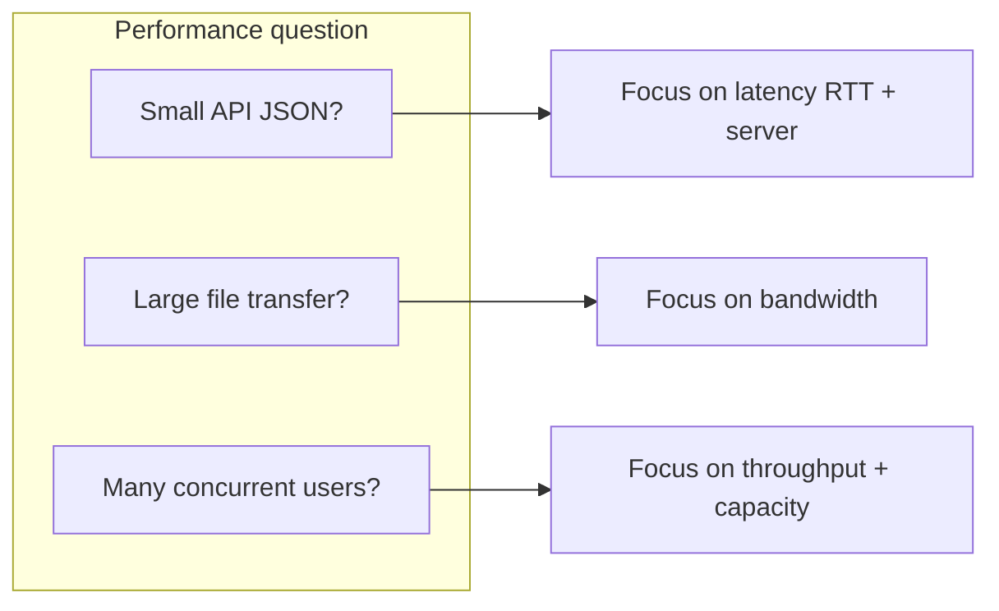

# Latency vs Bandwidth vs Throughput

> Roadmap: `0.4.11` · Node: `0.4` — Networking · Depth: understanding

## Learning Objectives

After this lesson you will be able to:

- Define **latency**, **bandwidth**, and **throughput** and use each term correctly in conversation.
- Explain why a **1 Gbps** link can feel slow for a small API request.
- Relate **RTT (Round-Trip Time)** to latency and to TCP handshake cost from `0.4.3`.
- Describe how **CDN** (`0.4.9`) improves perceived performance via latency reduction.
- Identify whether a performance problem is likely latency-bound or bandwidth-bound.
- Use basic units: ms, Mbps, MB/s, requests per second.

---

## Why This Matters

Teams say "the network is slow" without precision — and choose wrong fixes. Upgrading a 100 Mbps office link to 1 Gbps will not help an API whose p95 latency is 400 ms because of cross-region database calls. Adding a CDN helps static assets but not a serial chain of ten sequential API calls each waiting on RTT. Middle developers need vocabulary to read APM dashboards, size cloud regions, and argue for pagination vs compression with evidence.

These three metrics appear everywhere: Chrome DevTools waterfall (latency per request), AWS instance network caps (bandwidth), load test reports (throughput in RPS). Confusing bandwidth with throughput leads to surprise when a "gigabit" pipe delivers only 80 Mbps on a single TCP flow due to window limits or CPU. This lesson separates the concepts and connects them to the networking stack you built in node `0.4`.

---

## Core Concepts

### Latency: Time to Wait

**Latency** is delay — how long one unit of work takes to complete, usually measured in **milliseconds (ms)**. For HTTP, **RTT** is the time for a request packet to reach the server and an acknowledgment or response bit to return. One API call from browser to server in the same city might be 20 ms RTT; Sydney to London might be 250 ms **before** the server runs any code.

Latency dominates **interactive** experiences: clicking a button, loading the first byte of HTML, opening a TCP connection (`0.4.3` three-way handshake adds one RTT before data). Serial operations multiply latency: ten sequential 50 ms calls take 500 ms minimum even on an infinite bandwidth link.

**Propagation delay** is physics — speed of light in fiber (~200 km/ms round trip rough order). **Processing delay** is routers, TLS, Kestrel, EF query. **Queuing delay** appears under load when packets wait in buffers.

Users feel latency in **Time to First Byte (TTFB)** and ** Largest Contentful Paint** — not in raw Mbps printed on their ISP bill.

### Bandwidth: Pipe Capacity

**Bandwidth** is the **maximum data rate** a link can carry — theoretical capacity of the pipe, typically **Mbps or Gbps** (megabits per second; note bits vs bytes: 100 Mbps ≈ 12.5 MB/s). Your office internet "500 Mbps" is bandwidth; it says nothing about how long one small packet waits in queue.

Higher bandwidth helps when moving **large payloads**: video streaming, database backups, downloading 5 MB JavaScript bundles (though CDN edge caching attacks latency too). A single tiny JSON response uses almost no bandwidth; making the pipe wider does not shrink RTT.

**Network interface cards** and cloud instance types have bandwidth caps. An `t3.micro` has limited burst network — sustained high bandwidth workloads need sizing by **bandwidth**, not just CPU.

### Throughput: Actual Delivered Rate

**Throughput** is **what you actually achieve** over time — measured in Mbps, MB/s, or **requests per second (RPS)** at the application layer. Throughput ≤ bandwidth, always. Constraints include latency (TCP slow start), packet loss, server CPU, database locks, and concurrent connection limits.

A load test reporting "2,000 RPS with 50 ms average latency" describes throughput under those conditions. If latency doubles because of DB contention, throughput may halve for the same thread pool size.

**Goodput** is useful application data excluding protocol overhead — finer term, same idea.

### How They Interact

Imagine sending a 1 KB JSON response on a 1 Gbps link with 100 ms RTT. Bandwidth is huge; the transfer time for 1 KB is microseconds once data flows. Total time is dominated by **latency** (connection setup, TLS handshake ~2 RTT, server processing). Upgrading bandwidth barely matters.

Imagine downloading a 50 MB file on a 10 Mbps link with 20 ms RTT. **Bandwidth** caps transfer to ~1.25 MB/s — download takes ~40 seconds regardless of low latency after connection established.

Imagine 10,000 clients each downloading 50 MB simultaneously. **Throughput** aggregate may saturate **bandwidth**; latency rises due to **queuing** — everyone slows down.



### Connection to Prior Lessons

- **TCP handshake** (`0.4.3`): +1 RTT latency before first byte.
- **CDN** (`0.4.9`): cuts latency by serving from nearby edge, improves static throughput to users.
- **DNS** (`0.4.5`): lookup adds latency before connection.
- **CORS preflight** (`0.4.10`): extra RTT before API call.

---

## Under the Hood

### TCP and Bandwidth-Delay Product

The **bandwidth-delay product (BDP)** is bandwidth × RTT — how much data can be "in flight" on the wire before ACK returns. High bandwidth × high latency links need large TCP windows to fill the pipe; otherwise **throughput** stalls below bandwidth. This is why long-fat networks need tuning — relevant for cross-region replication, less for typical CRUD API in one region.

### HTTP/2 and Latency

**HTTP/2 multiplexing** reduces latency impact of many small assets on one connection — one TCP setup, parallel streams. Still bounded by server and RTT for each response start.

---

## Syntax / Commands / API

### Measure latency (ping)

```bash
ping -c 4 api.example.com
# RTT min/avg/max in ms
```

### Measure download throughput

```bash
curl -o /dev/null -w "time_total: %{time_total}s\nspeed: %{speed_download} bytes/s\n" \
  https://releases.example.com/large.zip
```

### Load test throughput (concept)

```bash
# tools: k6, hey, bombardier — report RPS and latency percentiles
hey -n 1000 -c 50 https://api.example.com/health
```

---

## Examples

### API Feels Slow

p95 latency 300 ms, payload 2 KB — **latency/processing** problem (DB query, cold start, wrong region). Doubling office bandwidth won't help.

### Video Buffering

4K stream needs sustained **throughput** in Mbps; buffering means delivered throughput < encode rate — bandwidth or CDN path issue.

### CDN Value

200 ms RTT to origin vs 20 ms to edge — **latency win** for each static file; parallel browser connections multiply savings (`0.4.9`).

---

## Common Mistakes & Anti-patterns

**"We have gigabit internet" as API performance proof** — ignores RTT and server time.

**Optimizing bundle size (bandwidth) while ignoring serial API waterfall (latency)** — reduce round trips, combine endpoints, GraphQL/batching where appropriate.

**Reporting bandwidth as throughput** — ISP Mbps vs measured MB/s on transfer.

**Single mega-response instead of pagination** — hurts both latency (TTFB) and bandwidth.

---

## Production & Real-World Notes

APM shows latency percentiles: p50, p95, p99. SLAs often "p95 < 200 ms." Capacity planning uses **peak RPS** × **average response size** for bandwidth needs.

Place API and DB in **same region** to minimize RTT. Multi-region active-active is latency optimization for global users — hard problem.

---

## Comparison / Trade-offs

| Metric | Unit | Answers |
|--------|------|---------|
| Latency | ms, RTT | How long one operation waits? |
| Bandwidth | Mbps, Gbps | How big is the pipe? |
| Throughput | Mbps, RPS | What do we actually deliver under load? |

**Reduce latency:** CDN, region colocation, connection reuse, fewer serial calls, caching.

**Increase throughput:** scale instances, optimize payload size, compression, wider bandwidth, DB read replicas.

---

## Quick Reference

- **Latency** = delay (ms). **Bandwidth** = capacity (Mbps). **Throughput** = achieved rate (RPS, MB/s).
- Small payloads → latency-dominated. Large transfers → bandwidth-dominated.
- **RTT** × serial requests = floor on UI responsiveness.
- CDN improves static **latency**; load tests measure **throughput**.

---

## Key Takeaways

- Use precise terms — avoids wrong infrastructure fixes.
- 1 Gbps link does not fix 200 ms RTT to another continent.
- Throughput is reality; bandwidth is ceiling.
- Connect metrics to TCP, CDN, CORS preflight, and API design.
- Measure with ping, curl, APM, load tests — not assumptions.

---

## Further Reading

- [High Performance Browser Networking (free book) — Latency](https://hpbn.co/primer-on-latency-and-bandwidth/)
- [Google Web Vitals](https://web.dev/vitals/)

---

## Up Next

**`0.4.12`** — `ping` and `traceroute` for basic network diagnostics.

**Then:** **`0.5.1`** — HTML document structure (Phase 0 continues).
