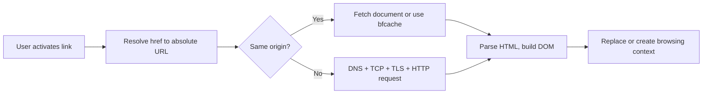

# Links: `a`, `href`, `target`, `rel noopener`

> Roadmap: `0.5.5` · Node: `0.5` — HTML · Depth: practice

## Learning Objectives

After this lesson you will be able to:

- Create hyperlinks with the `<a>` element and explain how `href` resolves to a destination.
- Choose between absolute, relative, root-relative, and fragment URLs in real pages.
- Use `target="_blank"` safely with `rel="noopener noreferrer"`.
- Write accessible link text that makes sense out of context.
- Place links correctly inside semantic landmarks from `0.5.2` (`nav`, `main`, `footer`).

---

## Why This Matters

In lessons `0.5.1`–`0.5.4` you built the skeleton of a document: valid doctype and charset, semantic regions like `<header>` and `<main>`, readable headings and lists. Those elements describe *structure*. Links are how structure becomes *navigation* — the connective tissue of the web. Every SPA route, every REST call, every email confirmation button ultimately depends on something resolving a URL and fetching or displaying a resource.

A broken or unsafe link is not a cosmetic bug. Users cannot complete tasks. Search engines lose crawl paths. Worse, a naïve `target="_blank"` without `rel="noopener"` opens a classic reverse-tabnabbing attack: the new page can reach back through `window.opener` and redirect your original tab to a phishing site while the user still thinks they are on your app. Middle developers treat links as security and accessibility surface area, not just blue underlined text.

---

## Core Concepts

### The `<a>` Element and `href`

The anchor element `<a>` marks the start (and optionally end) of a hyperlink. The **`href`** attribute (hypertext reference) names the destination. When a user activates the link — click, Enter on keyboard focus, or assistive tech equivalent — the browser navigates to that URL or scrolls to an in-page target.

```html
<p>
  Read our
  <a href="/docs/getting-started">getting started guide</a>
  before deploying.
</p>
```

The browser does not "run" the link until activation. That matters for performance: hundreds of links on a page cost almost nothing until clicked. It also matters for accessibility: screen readers can list all links on a page; poorly written link text becomes a usability problem at scale.

An `<a>` without `href` is a **placeholder anchor** — rarely what you want for navigation. For buttons that perform in-page actions, use `<button>` instead. For routing inside React, you still render real `<a href="...">` for crawlable, middle-clickable navigation unless you have a deliberate SPA pattern with equivalent accessibility.

### How URLs Resolve

Not every `href` looks like `https://example.com/page`. Understanding resolution prevents the most common production bugs in static sites and multi-page apps.

**Absolute URLs** include scheme and host: `https://api.example.com/v1/health`. Use them for external sites and canonical cross-origin resources. They do not depend on the current page location.

**Relative URLs** resolve against the current document path. If you are on `https://shop.example.com/products/shoes.html` and write `href="socks.html"`, the browser requests `https://shop.example.com/products/socks.html`. If you write `href="../cart.html"`, it walks up one directory. Relative links keep sites portable between staging and production domains — a reason static generators prefer them.

**Root-relative URLs** start with `/`: `href="/account/settings"`. They always resolve from the site root, regardless of how deep the current page is. This is the sweet spot for shared navigation in apps served from one origin.

**Fragment URLs** (hash links) point to an element `id` in the same document or, with full URLs, in another document: `href="#pricing"` or `href="/faq#returns"`. The browser scrolls the target into view without a full reload when staying on the same page. In lesson `0.5.2` you placed sections inside `<main>`; fragment links are how a table of contents connects to those sections.

**Special schemes** extend links beyond web pages. `mailto:user@example.com` opens the user's mail client. `tel:+15551234567` triggers dialer on mobile. Use them sparingly and never as the only way to expose critical information — not every environment has a configured mail client.

### `target` and Where Links Open

By default, activating a link replaces the current browsing context — what users experience as the current tab. The **`target`** attribute overrides that behavior. The value **`_blank`** requests a new top-level browsing context, usually a new tab.

```html
<a href="https://github.com/your-org/your-repo" target="_blank" rel="noopener noreferrer">
  View source on GitHub
</a>
```

`_blank` is appropriate when you want users to keep reading your documentation while inspecting an external reference. It is *inappropriate* for every external link by default — forcing new tabs removes user control and disorients screen reader users who may not hear that a new tab opened.

Other `target` values (`_self`, `_parent`, `_top`, or a frame name) appear in legacy frame layouts. Modern fullstack apps rarely use frames; know they exist when reading older admin panels.

### Why `rel="noopener noreferrer"` Is Not Optional

When you open a page with `target="_blank"` *without* `rel="noopener"`, the new page receives a reference to your original window through **`window.opener`**. Malicious or compromised destination sites can set `window.opener.location` to a phishing clone of your login page. The user glances at the new tab, switches back, and re-enters credentials on the fake tab — **reverse tabnabbing**.

`rel="noopener"` instructs the browser not to expose `window.opener`. **`noreferrer`** additionally withholds the `Referer` header (privacy bonus on external links). Major browsers now implicitly apply `noopener` for `_blank` in many cases, but explicit markup remains best practice: it documents intent, protects older browsers, and satisfies security linters in CI.

Do not treat this as paranoia. Security headers and frameworks do not fix markup-level mistakes on static `<a>` tags in CMS content, README files, or email templates your app renders.

### Accessible Link Text

Link text is the primary label assistive technologies announce. "Click here" and "Read more" repeated twelve times on a page force screen reader users to gather surrounding context for every item — context that may not be read in the same pass.

Write links that **describe the destination**:

```html
<!-- Weak: destination unclear in a links list -->
<a href="/report-2025.pdf">Download</a>

<!-- Strong: self-describing -->
<a href="/report-2025.pdf">Download 2025 annual report (PDF, 2.4&nbsp;MB)</a>
```

When the visible design uses a short label, you can supplement with **`aria-label`** or visually hidden text, but prefer visible descriptive text when possible — it helps sighted users skimming with a links list too.

If an link opens a new tab, expose that to assistive tech:

```html
<a href="https://example.com" target="_blank" rel="noopener noreferrer">
  Partner portal
  <span class="visually-hidden">(opens in a new tab)</span>
</a>
```

Icons inside links need **`alt=""`** on decorative images or meaningful `alt` when the icon carries information. Never leave an image-only link without accessible text.

### Links Inside Semantic Layout

From `0.5.2`, primary navigation belongs in `<nav>`, often with a list structure from `0.5.4`:

```html
<header>
  <nav aria-label="Primary">
    <ul>
      <li><a href="/" aria-current="page">Home</a></li>
      <li><a href="/pricing">Pricing</a></li>
      <li><a href="/docs">Docs</a></li>
    </ul>
  </nav>
</header>
```

Use **`aria-current="page"`** on the active nav link so assistive tech knows which page is current. Footer links to privacy policy and terms belong in `<footer>`, not duplicated randomly in `<main>`. Contextual links inside articles — citations, related reading — belong in `<main>` body copy where they support the narrative.

Avoid nesting interactive elements: do not put a `<button>` inside an `<a>` or another `<a>`. Invalid HTML produces unpredictable accessibility and click behavior.

---

## Under the Hood

When you click a link, the browser's navigation algorithm roughly follows this path:



Resolution happens in the URL parser: relative segments like `..` pop path components; fragments strip before the network request but guide scroll after load. For `target="_blank"`, the HTML specification creates a new browsing context with **`noopener`** semantics when `rel` includes it — the opener reference is null, so scripts in the child cannot touch the parent.

The **`Referer`** header (historic spelling) may send your page URL to the destination. `noreferrer` suppresses it — useful for links to third-party analytics-heavy sites or when your URL contains sensitive query parameters you do not want leaked.

Single-page applications intercept clicks on same-origin links in JavaScript (`history.pushState`), but the browser still relies on a real `href` for SEO, open-in-new-tab, and copy-link affordances. Stripping `href` or using `<div onclick>` recreates accessibility and security problems links were designed to solve.

---

## Syntax / Commands / API

| Attribute | Purpose | Example |
|-----------|---------|---------|
| `href` | Destination URL | `href="/docs"` |
| `target` | Browsing context | `target="_blank"` |
| `rel` | Relationship / security | `rel="noopener noreferrer"` |
| `download` | Hint to download resource | `download="invoice.pdf"` |
| `hreflang` | Language of linked resource | `hreflang="de"` |
| `type` | MIME hint (advisory) | `type="application/pdf"` |

Common `rel` values beyond noopener: **`nofollow`** (SEO hint to crawlers), **`canonical`** (on `<link>` in head, not `<a>`), **`help`**, **`license`**.

---

## Examples

### Internal navigation with root-relative paths

```html
<main>
  <h1>Account settings</h1>
  <p><a href="/dashboard">Back to dashboard</a></p>
  <section id="password">
    <h2>Password</h2>
    <!-- form in 0.5.7 -->
  </section>
</main>
```

Root-relative `/dashboard` works from any depth without `../../` mental arithmetic.

### External documentation link (safe blank target)

```html
<p>
  Configure CORS as described in the
  <a
    href="https://developer.mozilla.org/en-US/docs/Web/HTTP/CORS"
    target="_blank"
    rel="noopener noreferrer"
  >
    MDN CORS guide
  </a>.
</p>
```

### In-page table of contents using fragments

```html
<nav aria-label="On this page">
  <ol>
    <li><a href="#installation">Installation</a></li>
    <li><a href="#configuration">Configuration</a></li>
  </ol>
</nav>

<main>
  <section id="installation">
    <h2>Installation</h2>
    <!-- ... -->
  </section>
  <section id="configuration">
    <h2>Configuration</h2>
    <!-- ... -->
  </section>
</main>
```

Fragment links pair naturally with heading hierarchy from `0.5.3`.

---

## Common Mistakes & Anti-patterns

**Empty or missing `href`** on elements styled as links breaks keyboard navigation and produces confusing focus targets. Use `<button type="button">` for actions that do not navigate.

**`target="_blank"` without `rel="noopener noreferrer"`** on user-generated or CMS content is a recurring audit finding. Treat it as a lint rule.

**"Click here" epidemic** — fix by rewriting link text to include the object: "View pricing plans" not "Click here for pricing."

**JavaScript-only `href="#"` handlers** — pollute history and confuse assistive tech. Prefer buttons or proper routes.

**Blocking navigation with `preventDefault` without keyboard equivalent** — if you must intercept, replicate focus management and URL updates carefully (React Router `<Link>` does this when used correctly).

---

## Production & Real-World Notes

Content management systems often sanitize `target` and `rel`. Verify your sanitizer whitelist includes `rel="noopener noreferrer"` or you silently strip security attributes.

Design systems document **Link** components that enforce `rel` when `target="_blank"`. In React:

```jsx
function ExternalLink({ href, children }) {
  return (
    <a href={href} target="_blank" rel="noopener noreferrer">
      {children}
    </a>
  );
}
```

Log analyzers use referrers for traffic attribution; `noreferrer` on marketing links affects analytics — a conscious trade-off.

International sites use `hreflang` alternates in `<head>` for SEO; inline `<a hreflang>` appears in language switchers paired with visible text ("Deutsch").

---

## Comparison / Trade-offs

| Approach | Pros | Cons |
|----------|------|------|
| Same-tab external links | User controls tabs; simpler a11y | User leaves your site |
| `target="_blank"` + noopener | Keeps your tab open | Must announce new tab; tab clutter |
| Root-relative `href` | Portable paths | Breaks if app not at domain root |
| Absolute URLs | Unambiguous | Hard-code environment if misused |

For SPAs, **real `<a href>` + progressive enhancement** beats fake div links for resilience when JavaScript fails or hydrates late.

---

## Quick Reference

```html
<!-- Internal -->
<a href="/path">Label</a>

<!-- External, new tab, safe -->
<a href="https://example.com" target="_blank" rel="noopener noreferrer">Label</a>

<!-- In-page -->
<a href="#section-id">Jump</a>

<!-- Current nav item -->
<a href="/docs" aria-current="page">Docs</a>
```

---

## Key Takeaways

- `href` defines where navigation goes; resolution rules determine the actual request URL.
- Use descriptive link text — navigation menus are scanned as lists of labels alone.
- `target="_blank"` always pairs with `rel="noopener noreferrer"` in authored HTML.
- Place links in semantic containers: `nav` for site navigation, contextual links in `main`.
- Fragments connect headings and TOCs without reload — align `id` on sections from `0.5.2`.
- Links are security boundaries: opener access and referrer leakage are real concerns.
- Prefer `<button>` for actions, `<a>` for navigation — do not mix roles.

---

## Further Reading

- [HTML Living Standard — The `a` element](https://html.spec.whatwg.org/multipage/text-level-semantics.html#the-a-element)
- [MDN: `<a>`](https://developer.mozilla.org/en-US/docs/Web/HTML/Element/a)
- [OWASP — Reverse Tabnabbing](https://owasp.org/www-community/attacks/Reverse_Tabnabbing)
- [WebAIM — Links and Hypertext](https://webaim.org/techniques/hypertext/)

---

## Up Next

**`0.5.6`** — Images: `alt`, `figure`/`figcaption`, and responsive `picture`/`source`.
