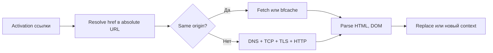

# Ссылки: `a`, `href`, `target`, `rel noopener`

> Roadmap: `0.5.5` · Node: `0.5` — HTML · Depth: practice

## Learning Objectives

После этой лекции ты сможешь:

- Создавать гиперссылки через `<a>` и объяснять, как `href` превращается в конечный URL.
- Выбирать между absolute, relative, root-relative и fragment URL в реальных страницах.
- Безопасно использовать `target="_blank"` вместе с `rel="noopener noreferrer"`.
- Писать доступный (accessible) текст ссылки, понятный вне контекста абзаца.
- Размещать ссылки в semantic landmarks из `0.5.2` (`nav`, `main`, `footer`).

---

## Why This Matters

В уроках `0.5.1`–`0.5.4` ты собрал каркас документа: корректный doctype и charset, semantic-регионы вроде `<header>` и `<main>`, заголовки и списки. Эти элементы описывают *структуру*. Ссылки — это то, как структура превращается в *навигацию*, connective tissue веба. Любой SPA-route, REST-вызов и кнопка в письме подтверждения в итоге сводятся к разрешению URL и загрузке ресурса.

Сломанная или небезопасная ссылка — не косметический баг. Пользователь не завершит сценарий. Поисковик потеряет crawl path. Хуже того, наивный `target="_blank"` без `rel="noopener"` открывает классическую атаку reverse tabnabbing: новая вкладка через `window.opener` может перенаправить исходную на phishing-клон, пока пользователь думает, что всё ещё на вашем сайте. Middle-разработчик относится к ссылкам как к поверхности безопасности и accessibility, а не как к «синему подчёркнутому тексту».

---

## Core Concepts

### Элемент `<a>` и атрибут `href`

Элемент `<a>` (anchor) обозначает начало (и опционально конец) гиперссылки. Атрибут **`href`** (hypertext reference) задаёт destination. Когда пользователь активирует ссылку — клик, Enter при фокусе с клавиатуры или эквивалент в assistive tech — браузер переходит по URL или прокручивает страницу к in-page target.

```html
<p>
  Прочитай
  <a href="/docs/getting-started">руководство по началу работы</a>
  перед деплоем.
</p>
```

Браузер не «выполняет» ссылку до activation. Это важно для performance: сотни ссылок на странице почти ничего не стоят, пока по ним не кликнули. И для accessibility: screen reader может вывести список всех ссылок; плохой link text превращается в проблему юзабилити.

`<a>` без `href` — **placeholder anchor**, для навигации почти никогда не то, что нужно. Для действий на странице — `<button>`. В React для crawlable и middle-clickable навигации по-прежнему рендерят настоящий `<a href="...">`, если только осознанно не выбран SPA-паттерн с эквивалентной a11y.

### Как разрешаются URL

Не каждый `href` выглядит как `https://example.com/page`. Понимание resolution спасает от типичных production-багов на static sites и multi-page apps.

**Absolute URL** включает scheme и host: `https://api.example.com/v1/health`. Для внешних сайтов и cross-origin ресурсов. Не зависят от текущего path.

**Relative URL** разрешаются относительно текущего документа. На `https://shop.example.com/products/shoes.html` значение `href="socks.html"` даст `.../products/socks.html`, а `href="../cart.html"` — подъём на уровень выше. Relative links делают сайт переносимым между staging и production без правки домена.

**Root-relative URL** начинаются с `/`: `href="/account/settings"`. Всегда от корня origin, независимо от глубины текущей страницы. Удобны для общей навигации.

**Fragment URL** (hash) указывают на `id` элемента: `href="#pricing"` или `href="/faq#returns"`. На той же странице часто без full reload — только scroll. В `0.5.2` секции лежат в `<main>`; fragment links связывают оглавление с этими секциями.

**Special schemes**: `mailto:user@example.com`, `tel:+15551234567`. Не делай их единственным способом показать критичную информацию — не у всех настроен mail client.

### `target` и где открывается ссылка

По умолчанию activation заменяет текущий browsing context (обычно вкладку). **`target`** это переопределяет. Значение **`_blank`** запрашивает новый top-level context, обычно новую вкладку.

```html
<a href="https://github.com/your-org/your-repo" target="_blank" rel="noopener noreferrer">
  Исходники на GitHub
</a>
```

`_blank` уместен, когда читатель должен остаться в вашей документации и параллельно смотреть внешний ресурс. Не ставь `_blank` на каждую внешнюю ссылку по умолчанию — это лишает пользователя контроля и дезориентирует screen reader users.

Другие значения (`_self`, `_parent`, `_top`, имя frame) — наследие frames. В modern fullstack apps встречаются редко, но в legacy admin panels — да.

### Почему `rel="noopener noreferrer"` не опционален

При `target="_blank"` **без** `rel="noopener"` новая страница получает ссылку на исходное окно через **`window.opener`**. Вредоносный или скомпрометированный destination может выставить `window.opener.location` на phishing-клон вашей login page. Пользователь переключается обратно и вводит credentials на подделке — **reverse tabnabbing**.

`rel="noopener"` запрещает браузеру отдавать `window.opener`. **`noreferrer`** дополнительно не отправляет заголовок `Referer` (бонус приватности). Современные браузеры часто неявно применяют noopener для `_blank`, но явная разметка остаётся best practice: документирует intent, защищает старые браузеры и проходит security linters в CI.

Security headers и фреймворки не исправят ошибку в static `<a>` из CMS, README или email template, который рендерит ваше приложение.

### Доступный текст ссылки

Link text — главная метка, которую озвучивает assistive tech. «Нажмите здесь» и «Подробнее» двенадцать раз подряд заставляют собирать контекст из окружающего текста — который может не читаться в том же проходе.

Пиши ссылки так, чтобы **destination был понятен**:

```html
<!-- Слабо -->
<a href="/report-2025.pdf">Скачать</a>

<!-- Сильно -->
<a href="/report-2025.pdf">Скачать годовой отчёт 2025 (PDF, 2,4&nbsp;МБ)</a>
```

При коротком visible label можно добавить **`aria-label`** или visually hidden текст, но visible descriptive text предпочтительнее.

Если открывается новая вкладка — сообщи об этом:

```html
<a href="https://example.com" target="_blank" rel="noopener noreferrer">
  Портал партнёра
  <span class="visually-hidden">(открывается в новой вкладке)</span>
</a>
```

Декоративные иконки внутри ссылки: `alt=""` или осмысленный `alt`. Image-only link без текста — ошибка.

### Ссылки в semantic layout

Из `0.5.2` primary navigation — в `<nav>`, часто списком из `0.5.4`:

```html
<header>
  <nav aria-label="Основная навигация">
    <ul>
      <li><a href="/" aria-current="page">Главная</a></li>
      <li><a href="/pricing">Тарифы</a></li>
      <li><a href="/docs">Документация</a></li>
    </ul>
  </nav>
</header>
```

**`aria-current="page"`** на активном пункте. Privacy и terms — в `<footer>`, не дублируй их хаотично в `<main>`. Контекстные ссылки в статьях — в теле `<main>`.

Не вкладывай interactive elements друг в друга: не `<button>` внутри `<a>` и не `<a>` в `<a>`. Invalid HTML даёт непредсказуемое поведение клика и a11y.

---

## Under the Hood

При клике по ссылке navigation algorithm браузера в упрощении:



Relative segments вроде `..` снимают компоненты path; fragment часто не уходит в network request, но задаёт scroll после load. Для `target="_blank"` со `rel="noopener"` opener null — скрипты дочернего окна не трогают родителя.

Заголовок **`Referer`** может отдать URL вашей страницы destination. `noreferrer` подавляет его — полезно, если в URL чувствительные query params.

SPA перехватывает same-origin clicks через `history.pushState`, но real `href` нужен для SEO, open in new tab и copy link. `<div onclick>` и пустой `href="#"` воссоздают проблемы, которые `<a>` решал изначально.

---

## Syntax / Commands / API

| Атрибут | Назначение | Пример |
|---------|------------|--------|
| `href` | Куда ведёт | `href="/docs"` |
| `target` | Browsing context | `target="_blank"` |
| `rel` | Связь / безопасность | `rel="noopener noreferrer"` |
| `download` | Скачать ресурс | `download="invoice.pdf"` |
| `hreflang` | Язык ресурса | `hreflang="de"` |

---

## Examples

### Root-relative внутренняя навигация

```html
<main>
  <h1>Настройки аккаунта</h1>
  <p><a href="/dashboard">Назад в dashboard</a></p>
</main>
```

### Безопасная внешняя ссылка

```html
<p>
  Настрой CORS по
  <a
    href="https://developer.mozilla.org/en-US/docs/Web/HTTP/CORS"
    target="_blank"
    rel="noopener noreferrer"
  >
    руководству MDN по CORS
  </a>.
</p>
```

### Оглавление на fragment

```html
<nav aria-label="На этой странице">
  <ol>
    <li><a href="#installation">Установка</a></li>
    <li><a href="#configuration">Конфигурация</a></li>
  </ol>
</nav>
```

---

## Common Mistakes & Anti-patterns

**Пустой `href` или `#` с JS-handler** — засоряет history; для действий используй `<button>`.

**`_blank` без noopener** — находка security audit; оформи lint rule.

**Эпидемия «Click here»** — перепиши: «Посмотреть тарифы», не «Подробнее».

**Только JavaScript-навигация без `href`** — ломает SEO и middle-click.

---

## Production & Real-World Notes

CMS часто sanitizes `rel` — проверь whitelist. Design systems оборачивают ExternalLink с принудительным `rel`. `noreferrer` влияет на referrer analytics — осознанный trade-off.

---

## Comparison / Trade-offs

Same-tab vs `_blank`+noopener: контроль пользователя vs удержание вашей вкладки открытой. Root-relative vs absolute: переносимость vs однозначность вне origin.

---

## Quick Reference

```html
<a href="/path">Метка</a>
<a href="https://example.com" target="_blank" rel="noopener noreferrer">Метка</a>
<a href="#section-id">Перейти</a>
<a href="/docs" aria-current="page">Docs</a>
```

---

## Key Takeaways

- `href` задаёт destination; правила resolution определяют фактический запрос.
- Текст ссылки должен быть self-describing.
- `target="_blank"` + `rel="noopener noreferrer"` — стандарт authored HTML.
- `nav` для site nav, контекстные ссылки в `main`.
- Fragment + `id` секций из `0.5.2` — оглавление без reload.
- `<button>` для actions, `<a>` для navigation.

---

## Further Reading

- [HTML Living Standard — `a`](https://html.spec.whatwg.org/multipage/text-level-semantics.html#the-a-element)
- [MDN: `<a>`](https://developer.mozilla.org/en-US/docs/Web/HTML/Element/a)
- [OWASP — Reverse Tabnabbing](https://owasp.org/www-community/attacks/Reverse_Tabnabbing)

---

## Up Next

**`0.5.6`** — Images: `alt`, `figure`/`figcaption`, responsive `picture`/`source`.
