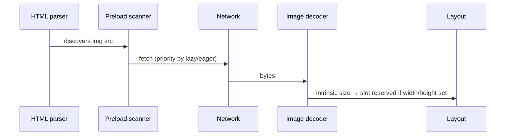

# Images: `img` `alt`, `figure`/`figcaption`, `picture`/`source`

> Roadmap: `0.5.6` · Node: `0.5` — HTML · Depth: practice

## Learning Objectives

After this lesson you will be able to:

- Mark up images with `` and write meaningful **`alt`** text for informative and decorative cases.
- Group images with captions using **`figure`** and **`figcaption`**.
- Deliver responsive and art-directed images with **`<picture>`** and **`<source>`**.
- Choose when to use **`width`**, **`height`**, and **`loading="lazy"`** for layout stability and performance.
- Connect image semantics to document structure from `0.5.1`–`0.5.4`.

---

## Why This Matters

Text from `0.5.3` and links from `0.5.5` carry most informational pages, but product catalogs, dashboards, and documentation rely on visuals. Images are not passive decoration in production — they are bytes on the wire, layout participants that can shift content when they arrive (CLS), and often the only label a user hears when a screen reader encounters an unmarked icon button adjacent to an image.

The **`alt`** attribute is not optional metadata for SEO checkboxes. It is the text alternative required by the HTML specification when the image conveys information. An empty `alt=""` explicitly marks decoration so assistive tech skips it. Omitting `alt` on informative images forces screen readers to read filenames like `IMG_4832.jpg` — a failure mode still common in enterprise apps.

Responsive layouts add another layer. One JPEG served to a 400px phone and a 2560px monitor wastes bandwidth or looks soft. **`picture`** and **`source`** let the browser pick appropriate resources without JavaScript hacks, while **`figure`** ties visuals to captions for readers who see and those who hear the caption read aloud.

---

## Core Concepts

### The `` Element

The void element **``** embeds an image into the document. Required attributes in practice: **`src`** (URL) and **`alt`** (text alternative). The browser fetches `src`, decodes the image, and paints it inline unless CSS overrides display.

```html

```

**`width`** and **`height`** in HTML map to intrinsic dimensions used to reserve space before the image loads. Pair them with CSS `max-width: 100%; height: auto;` for responsive scaling without layout jump — a Core Web Vitals concern teams track in production.

**`loading="lazy"`** defers offscreen image fetches until the user scrolls near them. Use for below-the-fold content; avoid lazy-loading the hero image that is the LCP (Largest Contentful Paint) element — that delays the metric you optimize.

**`decoding="async"`** hints that decode can happen off the critical path; modest gains, harmless on content images.

### Writing Effective `alt` Text

Ask: **If I could not see this image, what information would I miss?** Your answer becomes `alt` — concise, no "image of" prefix (screen readers already announce graphics).

| Scenario | `alt` approach |
|----------|----------------|
| Informative chart, photo, diagram | Describe the insight, not every pixel |
| Functional icon (print, search) | Verb or purpose: `alt="Search"` |
| Pure decoration | `alt=""` — intentionally empty |
| Redundant with adjacent text | Often `alt=""` to avoid duplication |
| Complex diagram | Short `alt` + longer description nearby or `aria-describedby` |

```html
<!-- Informative -->


<!-- Decorative hero pattern -->


<!-- Icon with visible label: empty alt avoids double announcement -->
<button type="button">
  
  Delete project
</button>
```

Never use `alt` to store SEO keywords unrelated to the image. Abuse erodes trust with assistive tech users and search quality systems.

### `figure` and `figcaption`

When an image (or code snippet, chart, quotation) is a **self-contained unit** referenced from the narrative, wrap it in **`<figure>`**. **`figcaption`** provides a visible caption — accessible name for the figure when associated correctly.

```html
<figure>
  
  <figcaption>Figure 1. Login flow before MFA step was added in v2.4.</figcaption>
</figure>
```

Place **`figcaption`** first or last inside `figure`; CSS controls visual order. One `figure` — one primary caption. Refer to figures in prose: "As shown in Figure 1…" so readers connect text and visual.

`figure` is semantic grouping from the same family as `article` and `section` in `0.5.2`: it does not replace headings but complements them for media-heavy content like tutorials — the natural home for screenshots after link-heavy intros in `0.5.5`.

### Responsive Images with `picture` and `source`

**`<picture>`** wraps multiple **`<source>`** elements plus a fallback **``**. The browser evaluates each `source` top to bottom and uses the first match.

Two main patterns:

**1. Resolution switching (same crop, different file sizes)**

```html
<picture>
  <source srcset="/hero-800.webp 800w, /hero-1200.webp 1200w, /hero-1600.webp 1600w" sizes="(max-width: 600px) 100vw, 50vw" type="image/webp" />
  
</picture>
```

**`srcset`** lists URLs with width descriptors (`800w`) or density (`2x`). **`sizes`** tells the browser how wide the image will render at each viewport — critical so it picks a file close to needed pixels, not the largest always.

**2. Art direction (different crop or composition)**

```html
<picture>
  <source media="(max-width: 599px)" srcset="/team-portrait-vertical.jpg" />
  <source media="(min-width: 600px)" srcset="/team-portrait-wide.jpg" />
  
</picture>
```

**`media`** on `source` mirrors CSS media queries — show a tight crop on narrow screens, wide banner on desktop.

**`type`** on `source` (`image/webp`, `image/avif`) lets browsers skip formats they decode poorly. Always end with `` as universal fallback and carrier of **`alt`**.

### Images Inside Semantic Layout

Hero images often sit in `<header>` or the top of `<main>`. Article body images belong inside `<main>` within `<article>` when content is an article. Do not put essential information only inside images without text alternative — that excludes blind users and fails in low-bandwidth mode when images fail to load.

For linked images (product thumbnail → detail page), put **`alt`** on the `` inside the `<a>` from `0.5.5`:

```html
<a href="/products/aurora-headphones">
  
</a>
```

The link may need visible text elsewhere if the image alt alone is insufficient for your design pattern.

---

## Under the Hood

Image loading participates in the browser pipeline separately from HTML parse:



Without explicit dimensions, layout may **reflow** when intrinsic size arrives — hurting CLS. Lazy images below the fold start with placeholder box height zero unless CSS aspect-ratio or width/height reserve space.

For `<picture>`, the user agent runs the **source selection algorithm**: filter by `type` support and `media` match, then pick `srcset` candidate using `sizes` and device pixel ratio. No JavaScript required — unlike `` alone with client-side `window.devicePixelRatio` switches.

The **`alt`** attribute maps to accessibility APIs as the accessible name for the image role. Empty alt removes the image from the accessibility tree as a meaningful node (decorative case). Missing alt may trigger repair heuristics (filename), which is why validators flag it.

---

## Syntax / Commands / API

| Element / attribute | Role |
|---------------------|------|
| `` | Embedded image + text alternative |
| `width`, `height` | Intrinsic size hints for layout |
| `loading="lazy\|eager"` | Fetch timing |
| `srcset`, `sizes` | Responsive candidates (`img` or `source`) |
| `<picture>` | Container for art direction / format choice |
| `<source media srcset type>` | Conditional variant |
| `<figure>`, `<figcaption>` | Captioned unit of content |

---

## Examples

### Tutorial screenshot with figure

```html
<article>
  <h1>Deploying the API</h1>
  <p>Confirm the health endpoint returns 200.</p>
  <figure>
    
    <figcaption>Health check response in Development environment.</figcaption>
  </figure>
</article>
```

### WebP with JPEG fallback

```html
<picture>
  <source type="image/webp" srcset="/logo.webp" />
  
</picture>
```

---

## Common Mistakes & Anti-patterns

**Missing or filename `alt`** on informative images — fix with purposeful description or `alt=""` if decorative.

**Keyword stuffing in `alt`** — hurts real users; may trigger quality penalties.

**Lazy-loading LCP hero** — delays largest paint; use `loading="eager"` or omit (default eager).

**Only `picture` without fallback `img` alt** — invalid pattern; `img` carries alt.

**Huge unoptimized PNG for photos** — use WebP/AVIF via `source`; keep PNG for transparency diagrams.

**CSS background-image for content** — no `alt`; screen readers and no-CSS users miss information.

---

## Production & Real-World Notes

CDNs often append width params (`?w=800`); still provide `sizes` so browser picks wisely. Image CDNs (Cloudinary, imgix) generate `srcset` server-side — understand the HTML you emit.

Design systems ship **Avatar**, **Icon**, and **ResponsiveImage** components with enforced alt props in TypeScript. Decorative icons: `alt=""` required, not omitted.

Track CLS in RUM; missing dimensions on CMS-uploaded images is a top culprit. Enforce width/height at upload or via aspect-ratio CSS.

---

## Comparison / Trade-offs

| Approach | When | Trade-off |
|----------|------|-----------|
| Single `` | Same art, multiple sizes | Simpler markup than picture |
| `<picture>` + media | Different crops | More assets to maintain |
| CSS `background-image` | Pure decoration | No alt — never for content |
| `` | Long pages | Wrong for above-fold LCP |

---

## Quick Reference

```html


<figure>
  
  <figcaption>Caption text</figcaption>
</figure>

<picture>
  <source type="image/webp" srcset="img.webp" />
  
</picture>
```

---

## Key Takeaways

- Every content decision about an image starts with: informative → descriptive `alt`; decorative → `alt=""`.
- `figure`/`figcaption` link visuals to captions for all users.
- `picture`/`source` handle format fallback and art direction without JS.
- `width`/`height` reduce layout shift; pair with responsive CSS.
- Lazy load below the fold, not LCP heroes.
- Linked thumbnails need meaningful `alt` inside `<a>` from `0.5.5`.

---

## Further Reading

- [MDN: Responsive images](https://developer.mozilla.org/en-US/docs/Learn/HTML/Multimedia_and_embedding/Responsive_images)
- [HTML spec: `picture`](https://html.spec.whatwg.org/multipage/embedded-content.html#the-picture-element)
- [W3C WAI: Images Tutorial](https://www.w3.org/WAI/tutorials/images/)
- [web.dev: Optimize CLS](https://web.dev/articles/optimize-cls)

---

## Up Next

**`0.5.7`** — Forms: `form`, `label`, input types, `textarea`, `select`.
