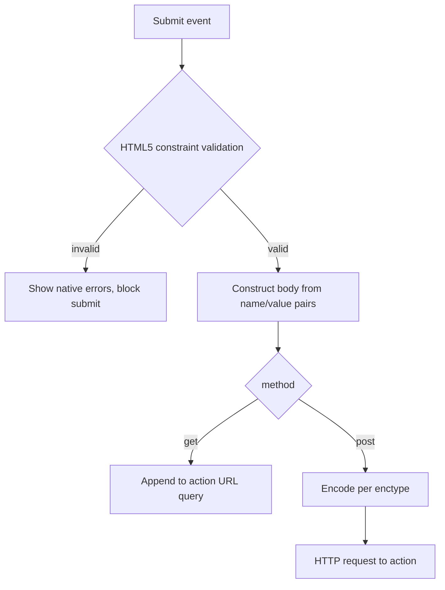

# Forms: `form`, `label`, Input Types, `textarea`, `select`

> Roadmap: `0.5.7` · Node: `0.5` — HTML · Depth: practice

## Learning Objectives

After this lesson you will be able to:

- Structure interactive data entry with **`<form>`**, **`action`**, **`method`**, and **`enctype`**.
- Associate labels to controls using **`<label for>`** and implicit wrapping.
- Choose appropriate **`input`** **`type`** values for text, email, password, number, date, checkbox, radio, file, and hidden fields.
- Use **`<textarea>`** and **`<select>`** / **`<option>`** / **`<optgroup>`** for multi-line and enumerated input.
- Group related fields with **`<fieldset>`** and **`<legend>`** inside semantic layout from `0.5.2`.

---

## Why This Matters

Every fullstack feature eventually asks the user for data: login, checkout, admin filters, support tickets. HTML forms are the native contract between browser and server — even React apps that POST JSON often begin as `<form>` for progressive enhancement, autofill, and accessibility. A form without proper **labels** fails WCAG and produces mystery meat inputs on mobile. Wrong **`method`** or **`enctype`** corrupts file uploads or exposes credentials in query strings.

Lesson `0.5.8` adds client-side validation attributes, but the field markup you build now determines whether validation messages attach to the right control, whether screen readers announce errors, and whether your ASP.NET Core model binder receives field names you expect. Middle developers treat forms as API surfaces: predictable names, explicit types, accessible labels.

---

## Core Concepts

### The `<form>` Element

**`<form>`** wraps controls that submit data to a URL. Core attributes:

- **`action`** — URL receiving the submission (absolute or relative).
- **`method`** — HTTP verb: **`get`** (append query string) or **`post`** (message body). Mutations and credentials use **`post`**.
- **`enctype`** — how body is encoded for **`post`**: default `application/x-www-form-urlencoded`; file uploads require **`multipart/form-data`**.

```html
<form action="/api/contact" method="post">
  <!-- labeled controls -->
  <button type="submit">Send message</button>
</form>
```

Pressing Enter in a single-line input triggers submit when one submit button exists — keyboard behavior users expect. Multiple submit buttons require explicit **`type="submit"`** vs **`type="button"`** discipline.

**`get`** forms suit idempotent searches: `/products?category=shoes&page=2` bookmarkable in the URL — a pattern connecting to URL state in React later. Never **`get`** for passwords.

Place primary task forms in **`<main>`** from `0.5.2`; login may live in `<header>` or dedicated page — keep one logical `<h1>` per view from `0.5.3`.

### Labels and Control Association

Every visible control needs an accessible name. **`<label>`** provides it visually and programmatically.

**Explicit association** (preferred for flexibility):

```html
<label for="email">Work email</label>
<input id="email" name="email" type="email" autocomplete="email" />
```

**Implicit association** — label wraps control:

```html
<label>
  Subscribe to newsletter
  <input type="checkbox" name="subscribe" value="yes" />
</label>
```

The **`for`** attribute must match control **`id`** (unique in document). **`name`** is what the server receives — `id` is for labels and JS; do not conflate them.

Placeholder is **not** a label. It disappears while typing and often fails contrast rules. Always use `<label>`.

Clicking label focuses associated control — larger hit target on mobile. This is why icon-only fields still need visible or visually hidden labels.

### Input Types You Use Daily

**`type="text"`** — generic single-line string. Default when type omitted (but always specify in codebases for clarity).

**`type="email"`** — email keyboard on mobile; basic format hint for validation in `0.5.8`.

**`type="tel"`** — telephone keyboard; does not enforce format (international variants).

**`type="password"`** — masked characters; pair with autocomplete `current-password` / `new-password`.

**`type="number"`** — numeric spinner; **`min`**, **`max`**, **`step`** in `0.5.8`. Beware: `value` is still string in DOM; localization commas trip juniors.

**`type="date"`**, **`time`**, **`datetime-local`** — browser-native pickers; display locale-dependent; server receives ISO-like strings — validate server-side.

**`type="checkbox"`** — zero or more flags; same **`name`** groups independent booleans only if you design array binding; unchecked boxes submit nothing.

**`type="radio"`** — exactly one of a set sharing **`name`**:

```html
<fieldset>
  <legend>Shipping speed</legend>
  <label><input type="radio" name="shipping" value="standard" checked /> Standard</label>
  <label><input type="radio" name="shipping" value="express" /> Express</label>
</fieldset>
```

**`type="file"`** — requires `enctype="multipart/form-data"` on form. **`accept`** filters picker (`image/*`, `.pdf`).

**`type="hidden"`** — carries metadata (CSRF token, record id) without UI — still tamperable; verify server-side.

**`type="submit"`** / **`reset`** / **`button"`** — on `<input>` or prefer **`<button type="submit">`** for richer inner HTML.

### `<textarea>`

Multi-line text:

```html
<label for="message">Message</label>
<textarea id="message" name="message" rows="5" cols="40" maxlength="2000"></textarea>
```

Content between tags is default value (escape user data to avoid XSS when re-rendering). **`rows`** hints height; CSS usually controls resize. Use for comments, descriptions — not single-line fields (autocomplete suffers).

### `<select>`, `<option>`, `<optgroup>`

Dropdown for enumerated choices:

```html
<label for="country">Country</label>
<select id="country" name="country" required>
  <option value="">Select a country</option>
  <optgroup label="North America">
    <option value="US">United States</option>
    <option value="CA">Canada</option>
  </optgroup>
  <optgroup label="Europe">
    <option value="DE">Germany</option>
  </optgroup>
</select>
```

**`value`** on `<option>` submits; visible text can differ. Empty first option often acts placeholder — still label the `<select>` itself.

Native `<select>` struggles with hundreds of items — consider combobox patterns later; for country lists it remains fine.

### `fieldset` and `legend`

Groups related controls, especially radios and long forms:

```html
<fieldset>
  <legend>Billing address</legend>
  <!-- inputs -->
</fieldset>
```

**`legend`** is the group title announced by screen readers when focus enters the fieldset. Do not skip it for radio groups.

---

## Under the Hood

On submit, the browser builds **form data** from successful controls — those with `name`, not disabled, inside the form:



For **`application/x-www-form-urlencoded`**, spaces become `+` or `%20`; for **`multipart/form-data`**, each field is a MIME part — necessary for binary file streams.

ASP.NET Core **model binding** maps `name` attributes to action parameters and DTO properties case-insensitively. Mismatched `name` yields null properties — a common integration bug between React-less SSR forms and controllers.

**Autocomplete** attributes (`autocomplete="email"`) hook into password managers and browser heuristics — improves UX and security (correct field recognition).

---

## Syntax / Commands / API

| Element | Purpose |
|---------|---------|
| `<form action method enctype>` | Submission container |
| `<label for>` | Accessible name |
| `<input type name id>` | Single-line control |
| `<textarea name>` | Multi-line |
| `<select>` / `<option>` / `<optgroup>` | Dropdown |
| `<button type="submit">` | Submit control |
| `<fieldset>` / `<legend>` | Group |

Common **`input`** types: `text`, `email`, `tel`, `password`, `number`, `date`, `checkbox`, `radio`, `file`, `hidden`, `submit`.

---

## Examples

### Login form (semantic, labeled)

```html
<main>
  <h1>Sign in</h1>
  <form action="/account/login" method="post" autocomplete="on">
    <div>
      <label for="login-email">Email</label>
      <input id="login-email" name="email" type="email" autocomplete="email" required />
    </div>
    <div>
      <label for="login-password">Password</label>
      <input id="login-password" name="password" type="password" autocomplete="current-password" required />
    </div>
    <button type="submit">Sign in</button>
  </form>
</main>
```

### File upload form

```html
<form action="/upload" method="post" enctype="multipart/form-data">
  <label for="doc">Attach PDF</label>
  <input id="doc" name="document" type="file" accept=".pdf,application/pdf" />
  <button type="submit">Upload</button>
</form>
```

---

## Common Mistakes & Anti-patterns

**Placeholder-only labeling** — no accessible name when placeholder cleared.

**Missing `name`** — control omitted from submission payload.

**Radio buttons with different `name` values** — allows multiple selection logically broken.

**File input without `multipart/form-data`** — corrupted uploads.

**`<div onclick>` fake inputs** — breaks autofill, validation API, and AT.

**Nested forms** — invalid HTML; splits user mental model.

---

## Production & Real-World Notes

CSRF tokens as **`hidden`** inputs in server-rendered forms; SPA POST JSON with antiforgery headers instead — know both.

Always validate and sanitize **server-side**; HTML attributes are UX hints only.

Use **`autocomplete`** consistently for login, address, payment — reduces friction and phishing mistypes.

Enterprise apps: consistent **`name`** conventions match API DTOs (`BillingAddress.City` in ASP.NET).

---

## Comparison / Trade-offs

| Control | Use when | Avoid when |
|---------|----------|------------|
| `<input type="text">` | Short single line | Multi-paragraph |
| `<textarea>` | Long free text | Boolean flags |
| `<select>` | Known finite set | Huge searchable lists |
| `radio` | 2–7 exclusive options | Single checkbox scenario |
| `checkbox` | Independent toggles | Mutually exclusive set |

Native controls vs custom React widgets: native first for a11y baseline; customize when design system requires — replicate keyboard and ARIA.

---

## Quick Reference

```html
<form action="/path" method="post">
  <label for="x">Label</label>
  <input id="x" name="x" type="email" />
  <textarea id="y" name="y" rows="4"></textarea>
  <select id="z" name="z"><option value="a">A</option></select>
  <button type="submit">Save</button>
</form>
```

File upload: `method="post" enctype="multipart/form-data"`.

---

## Key Takeaways

- `form` defines where and how data travels — `method` and `enctype` matter.
- Every control needs a `<label>` linked via `for`/`id`.
- Pick `input type` for keyboard and validation hints.
- Radio groups share `name`; use `fieldset`/`legend`.
- File uploads require multipart encoding.
- `name` is the server-side key; align with backend model binding.

---

## Further Reading

- [MDN: Your first HTML form](https://developer.mozilla.org/en-US/docs/Learn/Forms/Your_first_form)
- [HTML spec: Forms](https://html.spec.whatwg.org/multipage/forms.html)
- [ASP.NET Core Model Binding](https://learn.microsoft.com/en-us/aspnet/core/mvc/models/model-binding)

---

## Up Next

**`0.5.8`** — Form validation attributes: `required`, `pattern`, `min`, `max`.
