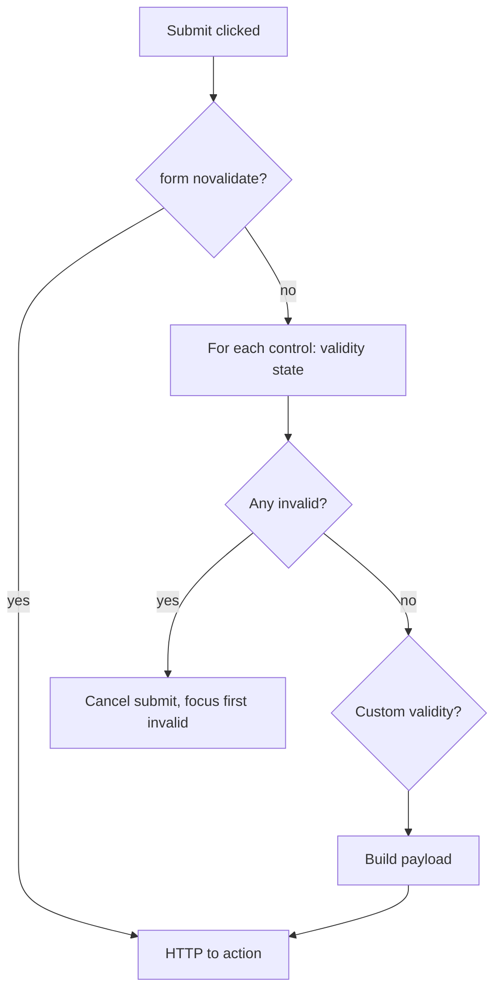

# Form Validation Attributes: `required`, `pattern`, `min`, `max`

> Roadmap: `0.5.8` · Node: `0.5` — HTML · Depth: practice

## Learning Objectives

After this lesson you will be able to:

- Apply **HTML5 constraint validation** attributes on form controls from `0.5.7`.
- Use **`required`**, **`min`**, **`max`**, **`step`**, **`minlength`**, **`maxlength`**, and **`pattern`** appropriately per input type.
- Explain how browser **constraint validation** blocks submit and surfaces native error UI.
- Recognize why **client-side HTML validation is not security** — server must re-validate.
- Style validation states with **`:valid`** / **`:invalid`** and integrate with accessible error messaging patterns.

---

## Why This Matters

Forms from `0.5.7` collect data; validation decides whether bad data leaves the browser. HTML5 ships a **constraint validation API** so you get immediate feedback without writing JavaScript first — empty required fields, malformed emails, out-of-range quantities fail before network round-trips. That improves UX and reduces junk hitting your ASP.NET Core controllers and PostgreSQL constraints.

Relying on attributes alone is a common junior mistake. Attackers bypass the DOM with curl; browsers differ slightly in `pattern` and date parsing. Middle developers treat HTML validation as **first-line UX**, not authority. Still, getting attributes right matters: a regex `pattern` on the wrong `type`, or `min` on text fields where you meant `minlength`, produces forms that feel broken on mobile Safari while passing manual QA on Chrome desktop.

---

## Core Concepts

### How Constraint Validation Works

Each form control can have **validation constraints**. On submit (and on blur/interaction depending on browser), the user agent checks them. If any control is **invalid**, submit is cancelled and the browser shows native messages (tooltips or inline bubbles).

```html
<label for="qty">Quantity</label>
<input id="qty" name="quantity" type="number" min="1" max="99" required />
```

Programmatic API (for later JavaScript integration):

- **`checkValidity()`** — returns boolean
- **`reportValidity()`** — shows UI if invalid
- **`setCustomValidity(message)`** — custom error; empty string clears

The **`formnovalidate`** attribute on submit buttons and **`novalidate`** on `<form>` disable validation for specific actions (e.g. "Save draft") — use intentionally.

### `required`

**`required`** marks that the control must have a value before submit. For checkboxes, the box must be checked. For radio groups, one option must be selected. For `<select>`, a non-empty **`value`** option must be chosen — placeholder options often use `value=""`.

```html
<input id="terms" name="acceptTerms" type="checkbox" required />
<label for="terms">I accept the terms of service</label>
```

Do not sprinkle `required` on optional filters unless business rules demand it — blocked submit frustrates users.

### Length Constraints: `minlength` and `maxlength`

Apply to **textual** inputs and **`textarea`**:

```html
<label for="bio">Bio</label>
<textarea id="bio" name="bio" minlength="10" maxlength="500"></textarea>
```

**`maxlength`** hard-stops typing in many browsers. **`minlength`** validates on submit — user can submit short text and see error. Do not confuse with **`min`**/` **`max`**, which apply to numeric and date types.

### Numeric and Date Bounds: `min`, `max`, `step`

For **`type="number"`**, **`range`**, **`date`**, **`month`**, **`week`**, **`time`**, **`datetime-local`**:

```html
<label for="age">Age</label>
<input id="age" name="age" type="number" min="18" max="120" step="1" required />

<label for="appointment">Appointment</label>
<input id="appointment" name="appointment" type="date" min="2026-07-04" />
```

**`step`** defines legal increments; default for number is 1; for date is 1 day. **`step="any"`** allows decimals on number inputs.

Date **`min`**/**`max`** use ISO8601 date strings `YYYY-MM-DD`. Display is locale-specific; parsed value is standardized — still validate server-side for timezone edge cases.

### `pattern` and Regular Expressions

**`pattern`** applies to `text`, `tel`, `email`, `url`, `password`, `search` when you need a custom rule. Value is a **JavaScript regular expression** without delimiters; match is **full string** (as if anchored with `^...$`).

```html
<label for="postcode">UK postcode</label>
<input
  id="postcode"
  name="postcode"
  type="text"
  pattern="[A-Za-z]{1,2}[0-9][A-Za-z0-9]? ?[0-9][A-Za-z]{2}"
  title="Format like SW1A 1AA"
  required
/>
```

Use **`title`** to hint the expected format — many browsers surface it in validation message. Prefer simple patterns; complex regex in HTML is hard to test and i18n-hostile.

**`type="email"`** already enforces email-ish syntax — duplicate with strict `pattern` only when product rules require it.

### Type-Specific Built-in Validation

Some **`input type`** values carry implicit constraints:

| Type | Built-in check |
|------|----------------|
| `email` | Token with `@` structure (browser-dependent) |
| `url` | Absolute URL with scheme |
| `number` | Numeric; honors min/max/step |

Combining **`required`** + appropriate **`type`** covers many cases before custom `pattern`.

### `:valid` and `:invalid` CSS

Pseudo-classes reflect current validation state:

```css
input:user-valid {
  border-color: green;
}

input:user-invalid {
  border-color: #c00;
}
```

**`:user-invalid`** / **`:user-valid`** (newer) avoid red borders on empty required fields before user interaction — better UX than raw `:invalid` on page load.

Native error bubbles are hard to style; design systems often use **`reportValidity()`** + custom message elements linked with **`aria-invalid="true"`** and **`aria-describedby`** pointing to error text — production pattern beyond native UI but built on same constraints.

---

## Under the Hood

On submit, the form runs **interactively validate the constraints** algorithm:



Each control exposes **`ValidityState`**: flags like `valueMissing`, `patternMismatch`, `rangeUnderflow`, `tooShort`, etc. JavaScript and CSS hook into the same state — no duplicate source of truth if you avoid parallel manual regex in JS unless needed for async rules (username taken).

Server-side, ASP.NET Core **DataAnnotations** (`[Required]`, `[Range]`, `[RegularExpression]`) mirror HTML concepts but execute on the server — always keep them. HTML attributes can be stripped from requests; never trust client.

---

## Syntax / Commands / API

| Attribute | Applies to | Effect |
|-----------|------------|--------|
| `required` | most inputs, select, textarea | Non-empty value |
| `minlength` / `maxlength` | text, textarea | String length |
| `min` / `max` / `step` | number, date, time, range | Numeric/date bounds |
| `pattern` | text-like types | Regex full match |
| `title` | with pattern | Hint in error message |
| `novalidate` | form | Skip client validation |
| `formnovalidate` | submit button | Skip for this submit |

---

## Examples

### Registration with mixed constraints

```html
<form action="/register" method="post">
  <div>
    <label for="reg-email">Email</label>
    <input id="reg-email" name="email" type="email" autocomplete="email" required />
  </div>
  <div>
    <label for="reg-password">Password</label>
    <input
      id="reg-password"
      name="password"
      type="password"
      minlength="12"
      required
      autocomplete="new-password"
    />
  </div>
  <div>
    <label for="reg-age">Age</label>
    <input id="reg-age" name="age" type="number" min="18" max="130" required />
  </div>
  <button type="submit">Create account</button>
</form>
```

### Pattern for hex color code

```html
<label for="brand-color">Brand color</label>
<input
  id="brand-color"
  name="brandColor"
  type="text"
  pattern="^#[0-9A-Fa-f]{6}$"
  title="Six-digit hex color, e.g. #1a2b3c"
  required
/>
```

---

## Common Mistakes & Anti-patterns

**HTML validation only** — always duplicate rules server-side and in DB constraints where appropriate.

**`min`/`max` on `type="text"`** — ignored for length; use `minlength`/`maxlength`.

**Overly strict `pattern`** — rejects valid real-world data (international phone formats).

**`required` on hidden fields users cannot fill** — logic bug.

**Disabling submit instead of showing validation errors** — hides what's wrong; prefer visible messages.

**Relying on `type="email"` alone for security** — format ≠ mailbox exists.

---

## Production & Real-World Notes

React Hook Form + Zod often replace native UI but may still set the same attributes for progressive enhancement. Test forms with keyboard only and with screen readers — native errors announce differently per OS.

Localization: native validation messages are browser-language, not app-language — i18n apps use JS custom messages via `setCustomValidity` or library validators.

API endpoints receiving JSON never see HTML attributes — validate with FluentValidation or similar.

Feature flags: "Save draft" buttons use `formnovalidate` while publish stays validated.

---

## Comparison / Trade-offs

| Layer | Role |
|-------|------|
| HTML attributes | Instant UX, low effort |
| JS + ARIA errors | Branded UI, i18n |
| Server validation | Security and data integrity |
| DB constraints | Last line of defense |

Native vs custom: native is fast to ship; custom scales for complex async rules (`email already registered`).

---

## Quick Reference

```html
<input type="text" required minlength="2" maxlength="50" />
<input type="number" min="0" max="100" step="5" required />
<input type="date" min="2026-01-01" max="2026-12-31" />
<input type="text" pattern="[A-Z]{3}" title="Three uppercase letters" />
<form novalidate>...</form>
```

---

## Key Takeaways

- Constraint validation runs on submit unless `novalidate`.
- `required`, length, range, and `pattern` cover most client UX checks.
- `title` helps users fix `pattern` mismatches.
- `:user-invalid` styles fields after interaction without premature red borders.
- Server-side validation is mandatory; HTML is hint layer only.
- Align attribute rules with ASP.NET DataAnnotations and DB schema.

---

## Further Reading

- [MDN: Client-side form validation](https://developer.mozilla.org/en-US/docs/Learn/Forms/Form_validation)
- [HTML spec: Constraint validation](https://html.spec.whatwg.org/multipage/form-control-infrastructure.html#constraint-validation)
- [WCAG: Error identification](https://www.w3.org/WAI/WCAG21/Understanding/error-identification.html)

---

## Up Next

**`0.5.9`** — Tables: `thead`, `tbody`, `th` scope — accessibility.
