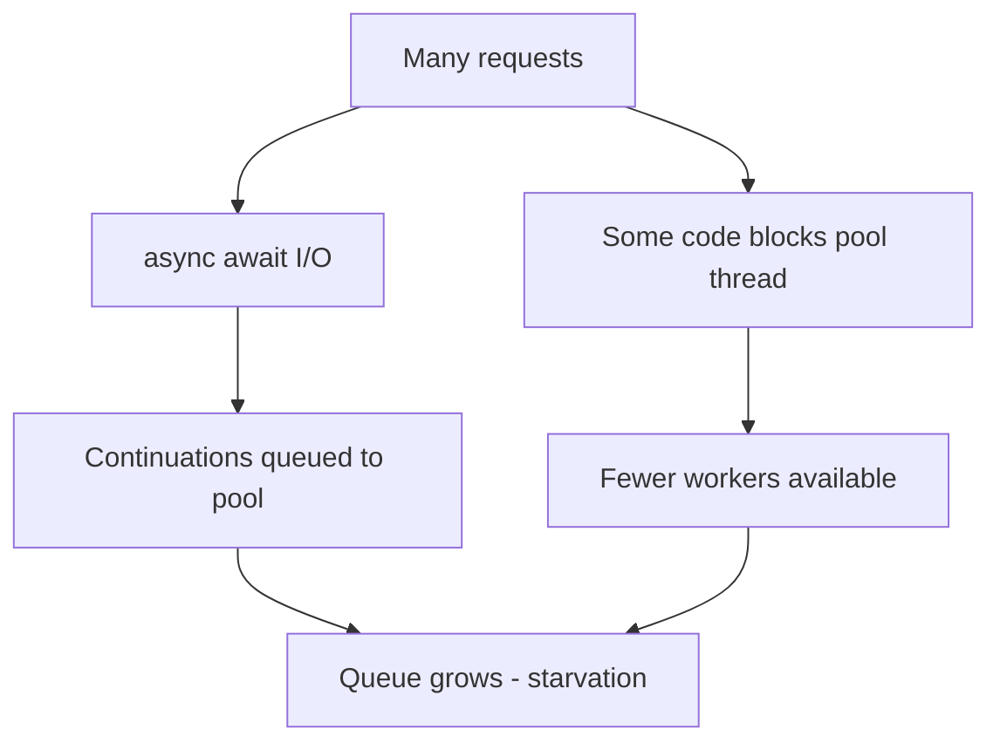

# Thread Pool Starvation — Symptoms and Fixes

> Roadmap: `1.4.10` · Node: `1.4` — Async/await · Depth: **глубоко**

## Learning Objectives

After this lesson you will be able to:

- Describe how the **.NET thread pool** schedules work and why **blocking** on pool threads causes **starvation**.
- Recognize **symptoms**: rising latency, `ThreadPool.SetMinThreads` “fixes,” hung requests under load.
- Distinguish starvation from **SyncContext deadlocks** (`1.4.9`) and **sync-over-async** (`.Wait()`, `1.4.14`).
- Apply fixes: **async all the way**, offload CPU with bounded **`Task.Run`**, avoid **`Thread.Sleep`** in request path, tune **`MinThreads`** only as last resort.
- Relate starvation to **state machine continuations** resuming on pool threads (`1.4.7`).

---

## Why This Matters

ASP.NET Core removed `SynchronizationContext`, so teams assume async code cannot deadlock. Under load, apps still **freeze**: health checks timeout, Kestrel queue grows, CPU looks idle. Often the cause is **thread pool starvation** — all worker threads blocked synchronously while thousands of async continuations wait for a free thread to run `MoveNext`.

Middle developers must read **dotnet-counters** (`threadpool-thread-count`, `threadpool-queue-length`, `monitor-lock-contention`) and trace blocking calls in async controllers. Starvation is a **production scalability** failure mode, not an interview trivia item.

---

## Core Concepts

### Thread Pool Basics

The CLR **thread pool** maintains a set of worker threads and a **global queue** of work items (plus local queues per thread). `Task.Run`, timer callbacks, ASP.NET request processing (when not purely async), and **async continuations** when no SyncContext all use the pool.

When a thread pool thread executes **`thread.Join()`**, **`.Wait()`**, **`.Result`**, **`Thread.Sleep`**, synchronous **`HttpClient`** in legacy code, or long **CPU work** without offload, that thread **does not** pick up new work. Under burst load, **all workers block**; queued continuations and new requests wait — **starvation**.

Async I/O itself does not consume a thread while waiting on the kernel. The problem is **mixing sync blocking with async** on the same pool that must resume state machines.

### Symptoms

- P99 latency spikes while **CPU utilization stays moderate** (threads blocked, not computing).
- **`ThreadPool.PendingWorkItemCount`** or queue length grows (`.NET 6+` counters).
- Temporary relief from **`ThreadPool.SetMinThreads(100, 100)`** — smell that something blocks.
- **`async` methods never completing** because continuations cannot get a thread.
- Hang after deploying **`Task.WhenAll`** with hidden sync work inside “async” methods.

Link to state machine: when await completes, **`MoveNext`** is queued to the pool. No free thread → completion appears “lost” until a thread frees up.



### Common Causes in ASP.NET Core

1. **Sync-over-async** in middleware, filters, or libraries — `.Result`, `.Wait()`, `GetAwaiter().GetResult()`.
2. **`Task.Run(...).Wait()`** deadlocks when pool exhausted (nested blocking).
3. **`Thread.Sleep`** or **`lock`** held long on request path.
4. **`DbContext`** or HTTP calls wrapped in **`Task.Run`** then blocked incorrectly.
5. **High `MinThreads` missing** combined with slow thread injection (cold start) — less common on modern .NET.

### Fixes

**Primary:** eliminate blocking — use **`await`** end-to-end (`1.4.20`). Refactor legacy SDKs to truly async APIs or isolate blocking to **`Task.Run` + dedicated limited scheduler** (not on every request).

**CPU-bound work:** **`await Task.Run(() => Compute())`** with **throttling** (`SemaphoreSlim`, `1.4.18`) so you do not flood the pool.

**Do not** sprinkle **`ConfigureAwait(false)`** expecting it to fix starvation — it does not add threads.

**Tuning:** **`ThreadPool.SetMinThreads(processorCount, completionPortThreads)`** for cold-start burst (Azure Functions notes). Use **`DOTNET_ThreadPool_UnfairSemaphoreSpinLimit`** etc. only with metrics. Prefer fixing code.

**Diagnostics:** `dotnet-counters monitor --counters System.Runtime`, **Application Insights** dependency duration vs server response, **async stack traces** (`1.4.37`).

---

## Under the Hood

The pool **injects** new threads slowly (hill-climbing algorithm) to avoid unbounded thread creation. Sudden **blocking** on all existing workers outpaces injection → queue delay.

**IO completion ports** handle async I/O completions; continuations still often marshal to pool threads for `MoveNext` unless synchronous completion optimization applies.

**ASP.NET Core** limits **`Kestrel`** concurrent connections; starvation is internal — requests accepted but handlers stall waiting for pool.

**Lock contention** on singletons can block pool threads similarly — shows as starvation in counters.

State machine: each `await` that yields may enqueue one continuation. Thousands of concurrent requests → thousands of continuations; blocking reduces throughput multiplicatively.

---

## Syntax / API

```csharp
// Diagnostic (.NET 6+)
ThreadPool.GetAvailableThreads(out int worker, out int io);
ThreadPool.GetPendingWorkItemCount(); // when available

// Last-resort tuning at startup
ThreadPool.SetMinThreads(50, 50);

// Wrong — blocks pool thread in async app
public async Task<string> Bad()
{
    return await Task.Run(() =>
    {
        Thread.Sleep(5000); // blocks pool worker
        return "done";
    });
}

// Better — truly async I/O
await httpClient.GetAsync(url);
```

---

## Examples

### Hidden Blocking in “Async” Service

```csharp
public async Task<Order> GetOrderAsync(int id)
{
    // BUG: legacy sync API blocks pool thread entire call
    return await Task.Run(() => _legacySyncRepo.GetOrder(id));
}
```

Under 500 concurrent requests, **`Task.Run`** queues 500 work items; if anything else blocks, tail latency explodes. Fix: async repository or dedicated **`Channel`** / limited parallelism.

### Middleware `.Wait()`

```csharp
public async Task InvokeAsync(HttpContext ctx, RequestDelegate next)
{
    _auth.Validate(ctx).Wait(); // blocks — starves pool
    await next(ctx);
}
```

Should be **`await _auth.ValidateAsync(ctx)`**.

---

## Common Mistakes & Anti-patterns

**Increasing MinThreads instead of removing `.Result`.** Masks the bug until higher load.

**`Task.Run` for every I/O** thinking it “makes async.” Adds pool pressure; use native async I/O.

**Parallel.ForEach with sync body** on ASP.NET without limit.

---

## Production & Real-World Notes

Load tests reveal starvation that unit tests miss. Watch **request queue** + **threadpool-queue-length** correlation.

**Entity Framework** `ToList()` on huge sets blocking — same class of problem (sync CPU + I/O on pool thread).

---

## Key Takeaways

- Pool has **finite workers**; blocking on pool thread reduces throughput for **all** async continuations (`MoveNext`).
- Starvation ≠ SyncContext deadlock (`1.4.9`).
- Fix: **async all the way**, bounded CPU offload, remove `.Wait()`/`.Result` (`1.4.14`).
- **`SetMinThreads`** — mitigation, not architecture.
- Diagnose with **dotnet-counters** and code search for blocking APIs.

---

## Up Next

`1.4.11` — **CancellationToken**: cooperative cancellation in long async flows.
