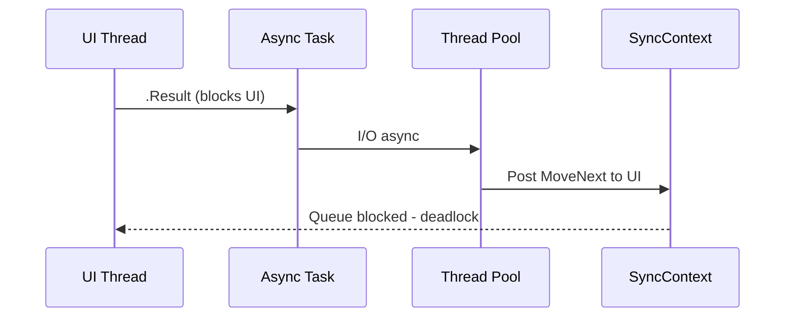

# .Result, .Wait(), and GetAwaiter().GetResult() — Deadlocks

> Roadmap: `1.4.14` · Node: `1.4` — Async/await · Depth: **глубоко**

## Learning Objectives

After this lesson you will be able to:

- Explain **sync-over-async**: blocking on **`Task`** while async work needs the **blocked thread** to resume **`MoveNext`** (`1.4.7`).
- Compare **`.Wait()`**, **`.Result`**, and **`GetAwaiter().GetResult()`** — exception wrapping differences.
- Diagnose **SyncContext deadlock** (UI, ASP.NET Framework — `1.4.9`) vs **thread pool starvation** (ASP.NET Core — `1.4.10`).
- Apply fixes: **async all the way**, **`ConfigureAwait(false)`** in libraries (`1.4.8`), avoid blocking in ASP.NET pipeline.
- Refactor legacy **`Main`**, constructors, and interface implementations without sync-over-async.

---

## Why This Matters

Legacy code and third-party SDKs push teams toward **`.Result`** in controllers “just to call async API.” Under load this becomes **hangs** that reproduce intermittently — classic Middle interview and production incident topic. The fix is not a hidden flag; it is understanding that **blocking waits for a continuation that cannot run because the waiter owns the only thread that can run it** (SyncContext) or **occupies a scarce pool thread** (Core).

---

## Core Concepts

### Sync-over-Async Defined

**Sync-over-async** means calling **`async`** API synchronously by blocking the calling thread until the **`Task`** completes:

```csharp
var data = GetDataAsync().Result;
GetDataAsync().Wait();
GetDataAsync().GetAwaiter().GetResult();
```

The **`async`** method starts; at first **`await`**, it may return control internally and schedule **`MoveNext`** continuation (`1.4.7`). The blocking call **holds the caller thread** in a wait state. If that same thread (or pool capacity) is required to execute the continuation, **forward progress stops** — **deadlock** or **indefinite delay**.

### SyncContext Deadlock (UI / Framework)

Scenario: **UI thread** or **ASP.NET Framework request thread** with **`SynchronizationContext`** (`1.4.9`).

1. UI thread calls **`.Result`** on async method.
2. Async method awaits I/O with **default `ConfigureAwait(true)`**.
3. Continuation is **posted** back to UI/request SyncContext.
4. UI thread is **blocked** in **`.Result`** — message pump / context cannot run posted continuation.
5. **Circular wait** — deadlock.

**Library `ConfigureAwait(false)`** breaks the cycle by running continuation on thread pool so blocked UI thread is not required — but **correct fix** is **`async` event handler** / **`await`**, not relying on library (`1.4.8`).



### Thread Pool Starvation (ASP.NET Core)

ASP.NET Core has **no request SyncContext** (`1.4.9`). **`.Wait()`** on request path still **blocks a pool thread**. Many concurrent blocked waits + continuations needing pool threads → **starvation** (`1.4.10`) — looks like deadlock (requests hang) but mechanism differs.

### .Wait() vs .Result vs GetAwaiter().GetResult()

| API | Blocks | Exception behavior |
|-----|--------|-------------------|
| `.Wait()` | Yes | **`AggregateException`** wrapping inner |
| `.Result` | Yes | Unwraps **`AggregateException`** (often inner only) |
| `GetAwaiter().GetResult()` | Yes | **Direct throw** inner — no Aggregate wrapper |

All three **block** equally for deadlock analysis. Prefer none in production async code.

**`Task.WaitAll`** / **`Task.WaitAny`** — same blocking family.

### AggregateException Nuance

```csharp
try { task.Wait(); }
catch (AggregateException ae) { ae.InnerException ... }

try { task.GetAwaiter().GetResult(); }
catch (HttpRequestException ex) { ... } // direct
```

In **`async`** methods, use **`await`** — exceptions propagate normally without Aggregate wrapper.

---

## Under the Hood

Blocking uses **`ManualResetEventSlim`** or similar inside **`Task.Wait`** implementation until task reaches terminal state. Completing task invokes continuations — if waiter is sync-blocked on same thread needed for **`MoveNext`**, deadlock.

**`GetAwaiter().GetResult()`** used in EF **`AsyncEnumerator`** legacy patterns and some BCL internals — not license for app code.

State machine link: blocked thread prevents **`SynchronizationContext.Post`** from running queued **`MoveNext`**; or reduces pool threads available for unposted continuations.

**`Task.Run(async () => ...).Result`** — outer blocks waiting inner async; inner continuations compete for pool — often worsens starvation.

---

## Syntax / API — What to Use Instead

```csharp
// BAD in ASP.NET action
public IActionResult Get() => Ok(_service.GetDataAsync().Result);

// GOOD
public async Task<IActionResult> Get() => Ok(await _service.GetDataAsync());

// Legacy Main (.NET 6+)
await MainAsync(args);

// Sync interface implementation — avoid
public void ISyncFoo.Bar() => GetBarAsync().GetAwaiter().GetResult(); // last resort

// Better: IAsyncFoo or sync API that doesn't wrap async
```

---

## Examples

### WinForms Deadlock

```csharp
private void button_Click(object sender, EventArgs e)
{
    label.Text = _api.GetLabelAsync().Result; // deadlock on UI thread
}

private async void button_Click(object sender, EventArgs e)
{
    label.Text = await _api.GetLabelAsync();
}
```

### ASP.NET Core Under Load

```csharp
public Task<User> Get(int id) =>
    Task.FromResult(_repo.FindAsync(id).Result); // blocks pool per request
```

Refactor to **`async Task<User>`** with **`await`**.

---

## Common Mistakes & Anti-patterns

**`.Result` in **`Parallel.ForEach`** calling async** — multiplies blocked threads.

**Blocking in **`DbContext`** sync wrappers** — `ToList()` on async query via `.Result`.

**“I use `GetResult` not `Result` so no deadlock”** — same block.

**`Task.Run(...).Wait()`** thinking it offloads — still blocks waiter; can exhaust pool.

---

## Production & Real-World Notes

Code search CI rule: block **`.Result`**, **`.Wait()`** in `Controllers/`, `Middleware/`.

Legacy SDK bridge: dedicated **limited** thread pool or **`IHostedService`** queue — not per-request `.Result` (`1.4.41`).

---

## Comparison / Trade-offs

| Fix | Pros | Cons |
|-----|------|------|
| async all the way | Correct, scalable | Requires refactor |
| ConfigureAwait(false) in lib | Mitigates UI deadlock | Doesn't fix pool starvation |
| SetMinThreads | Quick mask | Hides root cause |
| Sync API duplicate | No async leak | Duplication |

---

## Key Takeaways

- **`.Wait()` / `.Result` / GetResult()`** all **block** — sync-over-async.
- **SyncContext deadlock**: blocked thread = target of **`MoveNext` Post** (`1.4.9`, `1.4.7`).
- **Core starvation**: blocked **pool threads** (`1.4.10`).
- **Library `ConfigureAwait(false)`** helps UI scenario, not excuse for `.Result`.
- **Fix: `await`** end-to-end (`1.4.20`).
- Exception: **`GetResult`** throws direct; **`Wait`** wraps Aggregate.

---

## Up Next

`1.4.15` — **ValueTask**: pooling and don't await twice.
