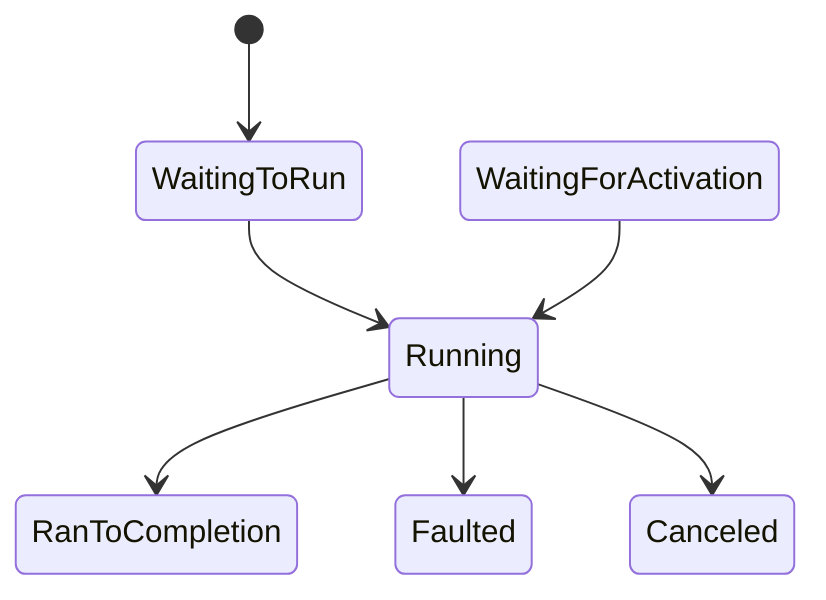

# The Task Class: Status, IsCompleted, and Exception

> Roadmap: `1.4.3` · Node: `1.4` — C# async ⚡ · Depth: **глубоко**

## Learning Objectives

After this lesson you will be able to:

- Explain **`Task` vs `Task<T>`** as representations of asynchronous operations.
- Interpret **`TaskStatus`** values and the **`IsCompleted`/`IsCompletedSuccessfully`** family.
- Retrieve exceptions via **`await`**, **`Exception`**, and **`AggregateException`** rules.
- Apply **task observation** rules — when exceptions become **unobserved**.
- Distinguish **completed**, **faulted**, **canceled**, and **running** tasks.
- Use **`Task.WhenAll`** exception aggregation behavior at a preview level.

---

## Why This Matters

In `1.4.1`–`1.4.2` you saw that **`Task` is not a thread** — it is the handle for async work. Every `await`, controller action returning `Task<IActionResult>`, and `SaveChangesAsync()` flows through `Task`. Misunderstanding **when a task is done**, **where the exception lives**, and **what happens if nobody awaits** causes silent failures and production crashes (`UnobservedTaskException`, `1.4.31`).

Middle developers must read task state like they read HTTP status codes — without guessing.

---

## Core Concepts

### What Is a Task?

A **`Task`** object represents an asynchronous operation that may still be running or may have finished. **`Task<T>`** adds a **`Result`** (available when completed successfully). Tasks are **references** to state held by the runtime (often a `Task` object with fields for status, continuations, exception).

Creating a task (`Task.Run`, `async` method, `TaskCompletionSource`) returns a handle; completing it transitions **status** and schedules **continuations**.

### TaskStatus Enum

Key states:

- **`Created`** — `new Task(...)` not started (rare in modern code).
- **`WaitingForActivation`** — external completion (e.g. TCS waiting).
- **`WaitingToRun`** / **`Running`** — queued or executing on thread pool.
- **`WaitingForChildrenToComplete`** — attached child tasks.
- **`RanToCompletion`** — success (`Task` or `Task<T>` done).
- **`Canceled`** — canceled via `CancellationToken`.
- **`Faulted`** — exception; **`Exception`** property holds **`AggregateException`**.

**`IsCompleted`** is true for RanToCompletion, Canceled, and Faulted. **`IsCompletedSuccessfully`** is true only for RanToCompletion without cancel.

### Exception Storage and Observation

When async method throws, the runtime captures the exception into the **`Task`** (faulted). **`await task`** unwraps and rethrows the **first** inner exception (not `AggregateException` to caller).

If you **`await`**, exception propagates to your `try/catch` — **observed**.

If task **faults** and **no one awaits** or checks `.Exception`, the exception may remain **unobserved** until GC/finalizer — .NET raises **`TaskScheduler.UnobservedTaskException`** (process may still continue depending on version/handler).

**Never fire-and-forget** without explicit error handling in server apps (`1.4.30`).

Accessing **`task.Result`** or **`task.Wait()`** on incomplete task **blocks**; on faulted completed task wraps exception in **`AggregateException`** — avoid (`1.4.14`).

### Task<T>.Result and GetAwaiter().GetResult()

After completion, **`Result`** returns value or throws. Before completion, blocking. **`GetAwaiter().GetResult()`** throws inner exception directly (no aggregate wrapper) — still blocking; used in ASP.NET sync context deadlocks historically.

### Canceled Tasks

`ThrowIfCancellationRequested()` or token canceled → **`OperationCanceledException`** (sometimes `TaskCanceledException`). **`IsCanceled`** true. Distinguish **cooperative cancel** from fault.

---

## Under the Hood

### Task Object Layout (Conceptual)

A `Task` contains: status field, continuation list, exception object, scheduling flags, `TaskCreationOptions`. **`Task<T>`** subclasses add result field. Completed synchronous tasks may use **`Task.CompletedTask`** cached singletons — no allocation.

**`ConfigureAwait(false)`** affects continuation scheduling, not status enum (`1.4.9`).

### ExceptionDispatchInfo

Runtime preserves stack trace when capturing exception into task via **`ExceptionDispatchInfo.Capture`**. `await` restores stack — better than `throw ex`.

### Multiple Exceptions

`Task.WhenAll` with multiple faulted tasks: **`AggregateException`** with multiple inners. **`await WhenAll`** throws **first** only — inspect **`task.Exception`** for all if needed.

### Status Transitions (Diagram)



Faulted is terminal; exception available on `.Exception`.

---

## Syntax / Commands / API

```csharp
Task t = DoWorkAsync();
Console.WriteLine(t.Status); // Running, etc.

if (t.IsCompletedSuccessfully) { /* rare without await */ }

try
{
    await t;
}
catch (Exception ex) { /* observed */ }

// Anti-pattern
t.Wait(); // block + AggregateException
var x = t.Result; // block

// Safe sync wait only when sure completed — still prefer await
Task<T> ct = GetAsync();
T value = await ct;
```

**Inspection without await (discouraged in app code):**

```csharp
if (t.IsFaulted)
    foreach (var ex in t.Exception!.InnerExceptions)
        Log(ex);
```

---

## Examples

### Example 1: Fault Propagation

```csharp
async Task FailAsync() => throw new InvalidOperationException("boom");

async Task CallerAsync()
{
    try { await FailAsync(); }
    catch (InvalidOperationException ex) { Console.WriteLine(ex.Message); }
}
```

Exception observed at `await`.

### Example 2: Unobserved Fire-and-Forget

```csharp
_ = FailAsync(); // no await — fault may become unobserved
```

In ASP.NET, request may complete before task faults — **lost error**. Use `await`, or `.ContinueWith` with logging, or background queue with handler.

### Example 3: TaskStatus After Completion

```csharp
var t = Task.FromResult(42);
// Status = RanToCompletion, IsCompletedSuccessfully = true
var bad = Task.FromException<int>(new Exception());
// Status = Faulted, IsFaulted = true
```

---

## Common Mistakes & Anti-patterns

**Ignoring returned `Task`** from async method — compiler warns CS4014 for good reason.

**Checking only `IsCompleted`** without handling **`IsFaulted`** / **`IsCanceled`**.

**`.Result` in library code** — blocks and aggregate exceptions.

**Assuming canceled == fault** — different handling in APIs (204 vs 500).

---

## Production & Real-World Notes

Global handler: **`TaskScheduler.UnobservedTaskException`** — log and mark observed. Not a substitute for awaiting.

ASP.NET Core: unhandled exception middleware catches **`await`** failures in request pipeline; not fire-and-forget tasks.

Use **`IHostApplicationLifetime`** shutdown with **`await`** on background tasks.

---

## Comparison / Trade-offs

| API | Blocks? | Exception type |
|-----|---------|------------------|
| `await` | No (async) | Direct exception |
| `Wait()` | Yes | AggregateException |
| `.Result` | Yes | AggregateException |
| `GetAwaiter().GetResult()` | Yes | Inner exception |

Always prefer **`await`** in async code paths.

---

## Quick Reference

- **Faulted** → check `.Exception`, observe via `await`.
- **IsCompleted** ⊃ success | fault | canceled.
- **Unobserved fault** → scheduler event / crash risk.
- **Task<T>.Result** after await OK; before — blocks.

---

## Key Takeaways

- `Task` is state machine handle for async operation.
- Exceptions live on faulted task until observed.
- **`await`** is correct observation mechanism.
- **`Wait`/`.Result`** block and complicate exceptions.
- Next: **`Task.Run`** (`1.4.4`).

---

## Further Reading

- [Task Class](https://learn.microsoft.com/en-us/dotnet/api/system.threading.tasks.task)
- [Task Status Property](https://learn.microsoft.com/en-us/dotnet/api/system.threading.tasks.task.status)

---

## Up Next

**`1.4.4`** — `Task.Run`: offload CPU work, not I/O.
