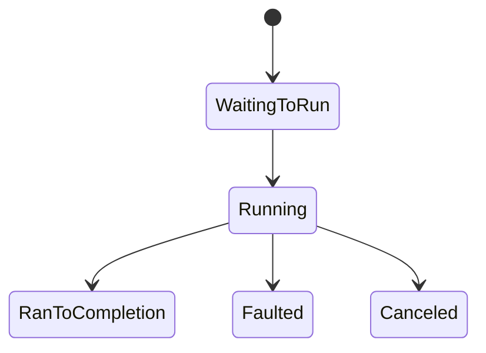

# Класс Task: Status, IsCompleted, Exception

> Roadmap: `1.4.3` · Node: `1.4` — C# async ⚡ · Depth: **глубоко**

## Learning Objectives

После лекции ты сможешь:

- Объяснить **`Task` vs `Task<T>`** как представление async operation.
- Интерпретировать **`TaskStatus`**, **`IsCompleted`**, **`IsCompletedSuccessfully`**.
- Получать exceptions через **`await`**, **`.Exception`**, **`AggregateException`**.
- Применять правила **observation** — **unobserved** exceptions.
- Различать **completed**, **faulted**, **canceled**, **running**.
- Понимать preview поведения **`Task.WhenAll`** при multiple faults.

---

## Why This Matters

В `1.4.1`–`1.4.2`: **`Task` ≠ thread** — handle async work. Каждый `await`, `Task<IActionResult>`, `SaveChangesAsync` — через `Task`. Непонимание **когда task done**, **где exception**, **что если не await** → silent failures, `UnobservedTaskException` (`1.4.31`).

Middle-разработчик читает task state как HTTP status — без guessing.

---

## Core Concepts

### Что такое Task?

**`Task`** — async operation, running или finished. **`Task<T>`** — **`Result`** при success. Task — reference на runtime state (status, continuations, exception).

### TaskStatus

- **`Created`**, **`WaitingForActivation`**, **`WaitingToRun`**, **`Running`**
- **`RanToCompletion`** — success
- **`Canceled`** — token
- **`Faulted`** — **`.Exception`** = **`AggregateException`**

**`IsCompleted`** — true для completion/cancel/fault. **`IsCompletedSuccessfully`** — только RanToCompletion.

### Exception storage и observation

Throw в async method → capture в **faulted Task**. **`await`** unwraps first inner exception.

**`await`** → **observed** → `try/catch`.

Fault без await/check → **unobserved** → **`UnobservedTaskException`**.

**`.Result`/`Wait()`** на incomplete — block; на faulted — **`AggregateException`** (`1.4.14`).

### Canceled

`OperationCanceledException` / `TaskCanceledException`. **`IsCanceled`**. Cooperative cancel ≠ fault.

---

## Under the Hood

Task object: status, continuation list, exception, flags. **`Task<T>`** — result field. **`Task.CompletedTask`** — cached.

**`ExceptionDispatchInfo`** — stack trace при capture.

**`Task.WhenAll`**: multiple faults → **`AggregateException`**; **`await`** throws first only.



---

## Syntax / Commands / API

```csharp
try { await t; }
catch (Exception ex) { }

// Anti-pattern
t.Wait();
var x = t.Result;
```

---

## Examples

`await FailAsync()` — observed. `_ = FailAsync()` — unobserved risk.

`Task.FromResult(42)` — RanToCompletion. `Task.FromException` — Faulted.

---

## Common Mistakes

Ignore returned Task (CS4014). Only `IsCompleted` without fault/cancel check. `.Result` in libs. Canceled treated as 500.

---

## Production

`UnobservedTaskException` handler — log, not substitute await. Fire-and-forget traps (`1.4.30`).

---

## Comparison

| API | Block? | Exception |
|-----|--------|-----------|
| await | No | Direct |
| Wait/Result | Yes | Aggregate |

---

## Key Takeaways

- Exceptions on faulted task until observed.
- **`await`** — правильное observation.
- **`Wait`/Result** — block + aggregate.
- Далее: **`Task.Run`** (`1.4.4`).

---

## Up Next

**`1.4.4`** — Task.Run: CPU offload, not I/O.
