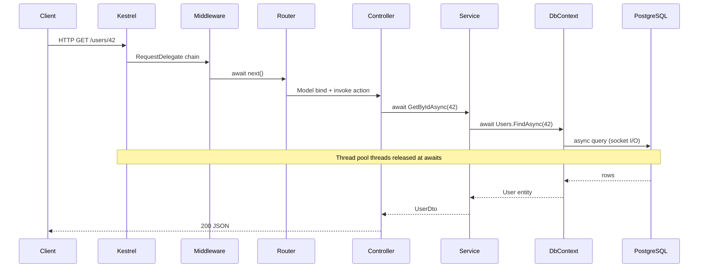

# End-to-End: HTTP Request → Service → Database Async Flow

> Roadmap: `1.4.40` · Node: `1.4` — C# async · Depth: **глубоко**

## Learning Objectives

After this lesson you will be able to:

- Draw and explain the **full async path** from Kestrel socket to EF Core query and back.
- Identify **where threads are acquired and released** at each `await`.
- Describe **scoped `DbContext`**, **connection pooling**, and **per-request DI** in async terms.
- Connect **middleware**, **routing**, **filters**, and **action** as sequential async delegates.
- Explain **why the request thread is not blocked** during SQL I/O.
- Diagnose bottlenecks using the diagram: thread pool, pool exhaustion, sync-over-async.

---

## Why This Matters

You write:

```csharp
[HttpGet("{id}")]
public async Task<UserDto> Get(int id) =>
    await _userService.GetByIdAsync(id);
```

What happens from browser click to PostgreSQL row read and JSON response? Middle developers must answer without hand-waving. Production issues — latency spikes, thread pool starvation, connection pool timeouts — map to **specific layers** in this flow. The diagram is your mental model for code review, architecture discussions, and incident response.

This lesson ties together ASP.NET Core hosting (`Phase` middleware), EF Core async (`I/O`), and C# async mechanics (`1.4.1`–`1.4.39`) into **one sequence**.

---

## Core Concepts

### Layered Overview



### Step 1: Kestrel Accepts Connection

**Kestrel** uses **libuv / IOCP / epoll** (platform-specific) for non-blocking socket I/O. When enough bytes arrive for an HTTP request, Kestrel schedules **`IHttpApplication.ProcessRequestAsync`** on the **thread pool**. No dedicated thread per connection — scalable.

### Step 2: Middleware Pipeline

Each middleware is `RequestDelegate`:

```csharp
public delegate Task RequestDelegate(HttpContext context);
```

```csharp
public async Task InvokeAsync(HttpContext context, RequestDelegate next)
{
    // before
    await next(context); // awaits rest of pipeline
    // after
}
```

**`await next(context)`** suspends current middleware until downstream completes — state machine, thread may return to pool. Order: exception handler, HTTPS, static files, routing, auth, authorization, endpoints.

### Step 3: Routing and Endpoint

Endpoint routing matches URL → selects **Controller action** or minimal API delegate. **Model binding** may async-read body (`[FromBody]`). **Filters** run (`IAsyncActionFilter`):

```csharp
await next(); // action
```

### Step 4: Controller Action

```csharp
public async Task<ActionResult<UserDto>> Get(int id, CancellationToken ct)
{
    var dto = await _userService.GetByIdAsync(id, ct);
    return Ok(dto);
}
```

**`CancellationToken`** links client disconnect to downstream cancellation (Kestrel triggers `RequestAborted`).

Controller resolved from DI — **scoped** lifetime per request. Constructor ran **synchronously** at first resolve in request scope.

### Step 5: Service Layer

```csharp
public async Task<UserDto?> GetByIdAsync(int id, CancellationToken ct)
{
    var user = await _db.Users.AsNoTracking()
        .FirstOrDefaultAsync(u => u.Id == id, ct);
    return user is null ? null : Map(user);
}
```

Service often **scoped** or **transient**; shares request's **`DbContext`** when scoped.

### Step 6: EF Core and Database I/O

`FirstOrDefaultAsync` translates to SQL, sends command via **Npgsql** (or provider). **Async ADO.NET** uses **non-blocking socket read** — `await` on network I/O completes on thread pool when data ready.

**Connection pooling:** `NpgsqlConnection` from pool — not new TCP per query. Pool size limits concurrent physical connections — separate from thread pool.

**DbContext** is **not thread-safe** — one instance per request scope; do not share across parallel tasks without care.

### Step 7: Response Serialization

`Ok(dto)` executes result filter → **System.Text.Json** serializes to response body — may use async `WriteAsync` on response stream. Kestrel sends bytes to client.

### Thread Timeline (One Request)

| Phase | Thread pool thread | Blocked? |
|-------|-------------------|----------|
| Middleware entry | TP #1 | No (async) |
| await DB | TP #1 released | No — I/O pending |
| DB completes | TP #7 (maybe) resumes continuation | No |
| JSON write | TP #7 | No |

**Zero blocked threads** during SQL wait — ideal async. Contrast: `.Result` on same path **blocks** TP #1 entire wait.

---

## Under the Hood

**Async all-the-way** means I/O layers expose `Task` and use OS async I/O (completion ports, async network APIs). Thread pool **inject** continuations when I/O completes — not one thread blocked per request.

**SynchronizationContext** in ASP.NET Core is **null** — continuations run on thread pool without UI-style marshal. `ConfigureAwait(false)` irrelevant in app code here.

**Scoped DI:** `IServiceScope` created per request in `RequestServicesMiddleware` — disposed at end of request, disposing **`DbContext`**.

**Identity map** in DbContext: same request sees tracked entities; `AsNoTracking` skips tracking for read DTO paths.

---

## Common Mistakes & Anti-patterns

**`Task.Run` wrapping EF query in controller** — wastes thread pool; use `FirstOrDefaultAsync` directly.

**Sharing one `DbContext` across `Task.WhenAll` parallel queries** — undefined behavior; use separate contexts or sequential.

**Sync `.ToList()` in service** — blocks thread during I/O.

**Long CPU work after `await`** on hot path — occupies thread pool without I/O; offload CPU separately (`1.4.x` parallel vs concurrent).

**Ignoring `CancellationToken`** — wasted work after client disconnect.

---

## Production & Real-World Notes

**OpenTelemetry:** span per middleware, `Activity` for EF command — reconstruct this diagram in Jaeger.

**Health:** readiness fails if DB pool exhausted — manifests as timeouts at `await FirstOrDefaultAsync`, not Kestrel accept failures.

**PgBouncer** transaction pooling affects EF prepared statements — ops concern at DB boundary.

Scale-out: stateless app servers; **no sticky session required** for this async read path.

---

## Comparison / Trade-offs

| Symptom | Layer to inspect |
|---------|------------------|
| Slow TTFB before DB | Middleware, auth, model bind |
| Slow DB span | SQL, indexes, N+1 |
| Thread pool queue length high | Sync-over-async, CPU-bound on TP |
| Connection pool timeout | Too many concurrent DB calls |

---

## Quick Reference

```
Client → Kestrel (async IO) → Middleware chain (await next)
  → Route → Filters → Controller (await service)
  → Service (await EF) → Npgsql async → PostgreSQL
  → map → JSON → response
Request thread NOT held during SQL; scoped DbContext per request
```

---

## Key Takeaways

- Full path is **chain of async delegates** from Kestrel to DB driver.
- **`await` at I/O** frees thread pool threads — scalability source.
- **Scoped `DbContext`** aligns with request lifetime.
- **Connection pool** ≠ thread pool — both can exhaust independently.
- Diagram guides **where to profile** and **where sync-over-async hurts**.
- **`CancellationToken`** propagates from HTTP abort through EF.

---

## Further Reading

- [ASP.NET Core middleware](https://learn.microsoft.com/en-us/aspnet/core/fundamentals/middleware)
- [EF Core async queries](https://learn.microsoft.com/en-us/ef/core/querying/async)
- [Kestrel source design](https://learn.microsoft.com/en-us/aspnet/core/fundamentals/servers/kestrel)

---

## Up Next

`1.4.41` — Compare sync-over-async fixes in legacy code.
