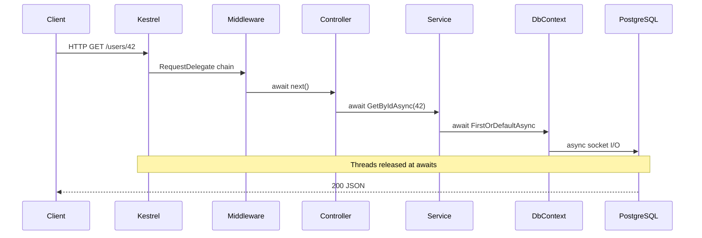

# End-to-end: HTTP → service → DB — async flow

> Roadmap: `1.4.40` · Node: `1.4` — C# async · Depth: **глубоко**

## Learning Objectives

После урока ты сможешь:

- Нарисовать и объяснить **полный async path** от Kestrel socket до EF Core query и обратно.
- Указать **где threads берутся и освобождаются** на каждом `await`.
- Описать **scoped `DbContext`**, **connection pooling**, **per-request DI** в async-терминах.
- Связать **middleware**, **routing**, **filters**, **action** как цепочку async delegates.
- Объяснить, **почему request thread не блокируется** во время SQL I/O.
- Диагностировать bottlenecks по диаграмме: thread pool, connection pool, sync-over-async.

---

## Why This Matters

Ты пишешь:

```csharp
public async Task<UserDto> Get(int id) =>
    await _userService.GetByIdAsync(id);
```

Что происходит от клика в браузере до чтения строки в PostgreSQL и JSON response? Middle должен ответить без hand-waving. Production issues — latency, thread pool starvation, connection pool timeout — мапятся на **слои** этого flow. Диаграмма — mental model для code review, архитектуры и incident response.

Урок связывает ASP.NET hosting, EF Core async и C# async mechanics в **одну sequence**.

---

## Core Concepts

### Слои



### Kestrel

Non-blocking socket I/O. Достаточно байт для HTTP → **`ProcessRequestAsync`** на **thread pool**. Нет dedicated thread per connection.

### Middleware

`RequestDelegate` → `Task`. `await next(context)` — suspension, thread может вернуться в pool. Порядок: exception handler, HTTPS, routing, auth, endpoints.

### Controller

```csharp
public async Task<ActionResult<UserDto>> Get(int id, CancellationToken ct)
{
    var dto = await _userService.GetByIdAsync(id, ct);
    return Ok(dto);
}
```

**`CancellationToken`** — `RequestAborted` при disconnect клиента. Controller **scoped** per request; ctor — sync при resolve.

### Service + EF Core

`FirstOrDefaultAsync` → SQL → **Npgsql async** → non-blocking read. **`await`** завершается на thread pool когда данные готовы.

**Connection pooling** — не новый TCP на query. **DbContext** — not thread-safe, один per request scope.

### Response

`Ok(dto)` → JSON serialization → async `WriteAsync` на response stream.

### Thread timeline

| Phase | Thread | Blocked? |
|-------|--------|----------|
| Middleware | TP #1 | No |
| await DB | TP released | No — I/O pending |
| Resume | TP #7 maybe | No |

**Contrast:** `.Result` **блокирует** TP на всё время SQL.

---

## Under the Hood

I/O layers используют OS async I/O; thread pool **inject** continuations. **SyncContext** в ASP.NET Core **null**. **Scoped DI** — `DbContext` dispose в конце request.

---

## Common Mistakes

- `Task.Run` вокруг EF в controller
- Один `DbContext` в `Task.WhenAll`
- Sync `.ToList()` в service
- Игнор `CancellationToken`

---

## Quick Reference

```
Kestrel → middleware (await next) → controller → service → EF async → PG
Scoped DbContext; thread не держится на SQL
Connection pool ≠ thread pool
```

---

## Key Takeaways

- Цепочка **async delegates** от Kestrel до driver.
- **`await` на I/O** освобождает threads — scalability.
- **Scoped DbContext** = request lifetime.
- Два pool'а могут исчерпаться отдельно.
- Diagram → где профилировать.

---

## Up Next

`1.4.41` — sync-over-async fixes в legacy.
