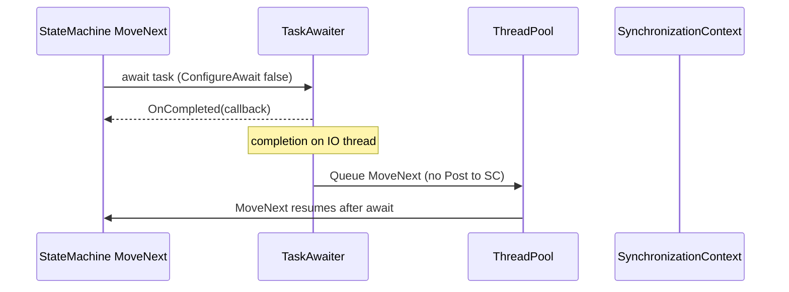

# ConfigureAwait(false) — Library vs Application Code

> Roadmap: `1.4.8` · Node: `1.4` — Async/await · Depth: **глубоко**

## Learning Objectives

After this lesson you will be able to:

- Explain what `ConfigureAwait(bool)` does at the **continuation scheduling** level, not just as a rule of thumb.
- Connect `ConfigureAwait` to the **async state machine** (`IAsyncStateMachine`, `MoveNext`) from `1.4.6`–`1.4.7`.
- Decide when to use `ConfigureAwait(false)` in **library code** vs **application/UI code**.
- Predict whether a missing `ConfigureAwait(false)` can cause **deadlocks** or **UI thread marshaling**.
- Recognize when `ConfigureAwait` is **unnecessary** (ASP.NET Core, console apps without SyncContext).

---

## Why This Matters

Every `await` in C# is more than “pause and resume.” When the awaited operation completes, the compiler-generated state machine must decide **on which thread or context** the remainder of your method runs. That decision is controlled by `ConfigureAwait`. Library authors who ignore it can force UI apps to deadlock; application developers who sprinkle `ConfigureAwait(false)` everywhere can break UI updates and `HttpContext`-dependent code on legacy stacks.

Middle developers debug production hangs where “async all the way” still blocks because continuations were posted back to a **SynchronizationContext** that is already blocked. Understanding `ConfigureAwait` is the bridge between the **state machine mechanics** you studied in `1.4.7` and the **SynchronizationContext** story in `1.4.9`.

---

## Core Concepts

### What `await` Really Schedules

When you write `await someTask`, the compiler lowers your method into a struct implementing `IAsyncStateMachine`. After the awaiter reports completion, runtime calls `MoveNext()` again to execute the code **after** the await point. The critical question: does `MoveNext()` run inline on the completing thread, or is it **queued** somewhere else?

By default, if a **SynchronizationContext** is present and `continueOnCapturedContext` is `true` (the default for `await`), the continuation is **posted** to that context via `SynchronizationContext.Post`. If there is no context, or you pass `false` to `ConfigureAwait`, the continuation runs on a **thread pool thread** (or inline if the awaiter allows it).

```csharp
await httpClient.GetStringAsync(url);                    // default: capture context
await httpClient.GetStringAsync(url).ConfigureAwait(false); // do not capture
```

The boolean parameter is **`continueOnCapturedContext`**: `true` means “try to resume on the context that was current when the await started”; `false` means “I do not need that context; resume wherever is efficient.”

### Library Code vs Application Code

**Library code** (NuGet packages, shared data access, HTTP wrappers) should almost always use `ConfigureAwait(false)` on every await. The library cannot know whether it runs in a WinForms app, WPF, ASP.NET (Framework), ASP.NET Core, or a unit test. By not capturing context, the library avoids imposing UI-thread marshaling on callers and reduces deadlock risk when callers block on the library synchronously.

**Application code** at the top level (ASP.NET Core controllers, minimal APIs, console `Main`, background services) typically **does not need** `ConfigureAwait(false)` because there is no meaningful `SynchronizationContext` to capture — a topic we develop fully in `1.4.9`. In UI applications (WPF, WinForms, MAUI), **do not** use `ConfigureAwait(false)` on awaits that must update the UI after resumption unless you explicitly marshal back with `Dispatcher.Invoke` or equivalent.

The classic guidance from .NET team documentation: **use `ConfigureAwait(false)` in library code unless you know you need the context**; **do not bother in app code on ASP.NET Core** unless profiling shows a measurable benefit.

### Relationship to the State Machine

In `1.4.7` you saw that `MoveNext` is invoked when an await completes. The awaiter’s `OnCompleted` / `UnsafeOnCompleted` callback registers that invocation. When `ConfigureAwait(false)` is used, the registration path skips capturing `SynchronizationContext.Current` into the state machine builder. The generated IL still uses the same state machine struct; only the **continuation scheduling policy** changes.

Conceptually:



With default `ConfigureAwait(true)` and a non-null SyncContext, the arrow goes through `SC.Post` instead of directly to the thread pool.

---

## Under the Hood

The C# compiler stores a `ConfiguredTaskAwaitable` / `ConfiguredValueTaskAwaitable` when you call `ConfigureAwait`. The configured awaiter’s `IsCompleted` and `GetResult` behave like the plain awaiter; the difference is in **`UnsafeOnCompleted`**, which wraps the state machine’s `MoveNext` delegate.

For `Task`, when `continueOnCapturedContext` is true and `SynchronizationContext.Current != null`, `TaskAwaiter` captures that context (and optionally `ExecutionContext` for logical call context flow). On completion, it calls `context.Post(state => action(), null)` rather than running `action()` synchronously on the completer thread.

**ExecutionContext** (AsyncLocal, security context on Framework) may still flow even with `ConfigureAwait(false)` in modern .NET — `ConfigureAwait` only affects **SynchronizationContext**, not all ambient context. That distinction matters for `AsyncLocal<T>` in `1.4.32`.

Performance: each `Post` to a UI SyncContext is a queue operation plus a message pump dispatch — unnecessary in ASP.NET Core or library internals. Hence the library default of `false`.

---

## Syntax / API

```csharp
// Every await in a library method — typical pattern
public async Task<string> FetchAsync(HttpClient client, string url)
{
    var json = await client.GetStringAsync(url).ConfigureAwait(false);
    return await ParseAsync(json).ConfigureAwait(false);
}

// Explicit default (rarely written)
await task.ConfigureAwait(true);

// ValueTask — same API
await valueTask.ConfigureAwait(false);
```

There is no global switch to change default behavior for a whole assembly. Analyzers (e.g. community rules) can enforce `ConfigureAwait(false)` in libraries.

---

## Examples

### Library That Avoids UI Deadlock

Imagine a WinForms button handler that incorrectly blocks:

```csharp
private void button_Click(object sender, EventArgs e)
{
    var data = _service.GetDataAsync().GetAwaiter().GetResult(); // sync-over-async
    label.Text = data;
}
```

If `GetDataAsync` uses default `ConfigureAwait(true)` and internally awaits I/O, the continuation tries to post back to the UI thread — which is **blocked** in `GetResult()`. Deadlock. If every await inside the library uses `ConfigureAwait(false)`, continuations run on thread pool threads; `GetResult()` can complete. (Fixing the handler to be `async` is still the right solution — see `1.4.14`.)

### ASP.NET Core Controller — No ConfigureAwait Needed

```csharp
[HttpGet("{id}")]
public async Task<ActionResult<User>> GetUser(int id)
{
    var user = await _repo.GetByIdAsync(id); // no ConfigureAwait(false) required
    return Ok(user);
}
```

ASP.NET Core does not install a request `SynchronizationContext`. Capturing “nothing” is cheap; adding `ConfigureAwait(false)` is stylistic, not required.

---

## Common Mistakes & Anti-patterns

**Using `ConfigureAwait(false)` in UI code before touching controls.** After `await` with `false`, you are not on the UI thread. Updating `label.Text` throws or behaves races.

**Believing `ConfigureAwait(false)` fixes all deadlocks.** It helps when SyncContext is the culprit. Blocking the thread pool (`Task.Run` + `.Wait()` chains) causes different starvation — see `1.4.10`.

**Applying it only on the first await in a method.** Every await that should not capture context needs its own `ConfigureAwait(false)`; context is captured **per await**, not once per method.

**Omitting it in reusable libraries** because “our app is ASP.NET Core.” The same library may later run in tests with a custom SyncContext or in a desktop tool.

---

## Production & Real-World Notes

Most internal company libraries on ASP.NET Core skip `ConfigureAwait(false)` for readability; deadlock risk is low on that stack. Public NuGet libraries still use it defensively. Code reviews often debate style vs analyzer enforcement.

When migrating **ASP.NET Framework** to **Core**, teams discover that `ConfigureAwait` mattered less than removing `.Result` on `HttpContext`-bound code. Profile before mass-editing.

---

## Comparison / Trade-offs

| Context | ConfigureAwait(false) in app code | In library code |
|---------|-----------------------------------|-------------------|
| ASP.NET Core | Optional / noise | Recommended |
| WPF / WinForms app | Avoid for UI-bound awaits | Required on all awaits |
| Unit tests (no SyncContext) | Irrelevant | Harmless |
| ASP.NET Framework | Sometimes needed in libraries | Required |

---

## Quick Reference

| `ConfigureAwait(true)` (default) | `ConfigureAwait(false)` |
|----------------------------------|-------------------------|
| Capture SyncContext if present | Do not capture |
| Resume via `Post` to UI / request context | Resume on thread pool / inline |
| Needed for UI updates after await | Standard in libraries |

---

## Key Takeaways

- `ConfigureAwait` controls **where the state machine resumes**, not whether the operation is async.
- Default `true` captures `SynchronizationContext`; `false` avoids marshaling back.
- **Libraries:** use `false` everywhere unless context is required.
- **ASP.NET Core app code:** usually omit; no SyncContext to capture.
- **UI app code:** keep default for UI-bound code paths.
- Deadlocks from SyncContext + blocking are fixed by async handlers **and** library `ConfigureAwait(false)`.
- Links to state machine: each await compiles to `MoveNext` continuation registration — `ConfigureAwait` changes that registration target.

---

## Further Reading

- [ConfigureAwait FAQ — Stephen Toub (.NET Blog)](https://devblogs.microsoft.com/dotnet/configureawait-faq/)
- [AsyncGuidelines.md — davidfowl](https://github.com/davidfowl/vscode-dotnet-pack/blob/master/docs/async-guidelines.md)

---

## Up Next

`1.4.9` — **SynchronizationContext** and why ASP.NET Core has none; the missing piece that makes `ConfigureAwait` a non-issue on modern web hosts.
