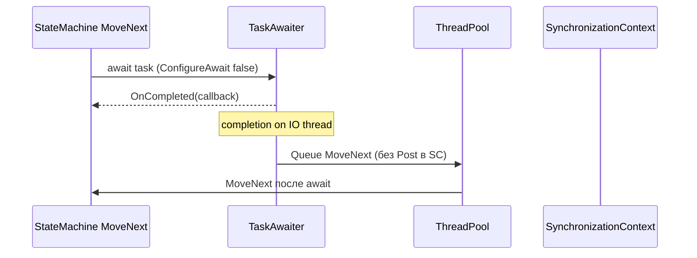

# ConfigureAwait(false) — library vs application code

> Roadmap: `1.4.8` · Node: `1.4` — Async/await · Depth: **глубоко**

## Learning Objectives

После урока ты сможешь:

- Объяснить, что делает `ConfigureAwait(bool)` на уровне **планирования continuation**, а не только как «правило из блога».
- Связать `ConfigureAwait` с **async state machine** (`IAsyncStateMachine`, `MoveNext`) из `1.4.6`–`1.4.7`.
- Выбирать, когда нужен `ConfigureAwait(false)` в **library code** vs **application/UI code**.
- Предсказывать **deadlock** и лишний marshaling на UI thread при неправильном использовании.
- Понимать, когда `ConfigureAwait` **не нужен** (ASP.NET Core, console без SyncContext).

---

## Why This Matters

Каждый `await` в C# — это не просто «пауза и продолжение». Когда awaited-операция завершается, сгенерированная компилятором state machine должна решить, **на каком потоке или в каком контексте** выполнится код после `await`. Это решение контролирует `ConfigureAwait`. Авторы библиотек, игнорирующие его, могут вызвать deadlock в UI-приложениях; разработчики приложений, рассыпающие `ConfigureAwait(false)` везде, могут сломать обновление UI и код, зависящий от `HttpContext`, на legacy-стеках.

Middle-разработчик разбирает production-hangs, где «async all the way» всё равно блокирует, потому что continuation **posted** обратно в **SynchronizationContext**, который уже заблокирован. `ConfigureAwait` — мост между **механикой state machine** (`1.4.7`) и **SynchronizationContext** (`1.4.9`).

---

## Core Concepts

### Что на самом деле планирует `await`

Когда ты пишешь `await someTask`, компилятор превращает метод в struct с `IAsyncStateMachine`. После завершения awaiter вызывает `MoveNext()` для кода **после** точки await. Ключевой вопрос: `MoveNext()` выполняется **inline** на потоке завершения или **ставится в очередь**?

По умолчанию, если есть **SynchronizationContext** и `continueOnCapturedContext == true` (default для `await`), continuation **post'ится** через `SynchronizationContext.Post`. Если контекста нет или передан `false` в `ConfigureAwait`, continuation выполняется на **thread pool** (или inline, если awaiter разрешает).

```csharp
await httpClient.GetStringAsync(url);                     // default: capture context
await httpClient.GetStringAsync(url).ConfigureAwait(false); // не захватывать
```

Параметр — **`continueOnCapturedContext`**: `true` — «постарайся продолжить на контексте, который был Current при await»; `false` — «контекст не нужен; продолжай где эффективно».

### Library code vs application code

**Library code** (NuGet, shared DAL, HTTP wrappers) почти всегда должен использовать `ConfigureAwait(false)` на каждом await. Библиотека не знает, запущена ли она в WinForms, WPF, ASP.NET Framework, ASP.NET Core или unit test. Без capture context библиотека не навязывает UI marshaling и снижает риск deadlock, когда caller блокирует её синхронно.

**Application code** верхнего уровня (ASP.NET Core controllers, console `Main`, background services) обычно **не требует** `ConfigureAwait(false)` — meaningful `SynchronizationContext` нет (`1.4.9`). В UI (WPF, WinForms, MAUI) **не** используй `ConfigureAwait(false)` перед обновлением controls, если явно не вернёшься на UI через `Dispatcher`.

Классическая рекомендация .NET team: **`ConfigureAwait(false)` в library, если не нужен context**; **в app на ASP.NET Core не обязателен**.

### Связь со state machine

В `1.4.7` ты видел, что при завершении await вызывается `MoveNext`. Callback регистрируется через `OnCompleted` / `UnsafeOnCompleted` awaiter'а. При `ConfigureAwait(false)` путь регистрации **не захватывает** `SynchronizationContext.Current` в builder state machine. IL тот же struct; меняется только **политика scheduling continuation**.



При default `ConfigureAwait(true)` и non-null SyncContext стрелка идёт через `SC.Post`.

---

## Under the Hood

Компилятор использует `ConfiguredTaskAwaitable` при вызове `ConfigureAwait`. `IsCompleted` и `GetResult` как у обычного awaiter; разница в **`UnsafeOnCompleted`** и обёртке delegate `MoveNext`.

Для `Task` при `continueOnCapturedContext == true` и `SynchronizationContext.Current != null` awaiter захватывает context (и опционально `ExecutionContext`). При completion — `context.Post(...)`, а не синхронный `action()` на completer thread.

**ExecutionContext** (`AsyncLocal`, security на Framework) может flow'ить даже с `ConfigureAwait(false)` — `ConfigureAwait` влияет только на **SynchronizationContext**, не на весь ambient context.

Performance: каждый `Post` в UI SyncContext — очередь + message pump. В ASP.NET Core и library internals это лишнее.

---

## Syntax / API

```csharp
public async Task<string> FetchAsync(HttpClient client, string url)
{
    var json = await client.GetStringAsync(url).ConfigureAwait(false);
    return await ParseAsync(json).ConfigureAwait(false);
}

await task.ConfigureAwait(true);  // явный default — редко
await valueTask.ConfigureAwait(false);
```

Глобального переключателя для assembly нет. Analyzers могут enforce'ить `false` в libraries.

---

## Examples

### Library и UI deadlock

WinForms handler блокирует неправильно:

```csharp
private void button_Click(object sender, EventArgs e)
{
    var data = _service.GetDataAsync().GetAwaiter().GetResult();
    label.Text = data;
}
```

Если `GetDataAsync` с default `ConfigureAwait(true)`, continuation post'ится на UI thread, который **заблокирован** в `GetResult()`. Deadlock. Если все await в library с `ConfigureAwait(false)`, continuations на thread pool — `GetResult()` может завершиться. (Правильный fix — async handler; см. `1.4.14`.)

### ASP.NET Core — ConfigureAwait не обязателен

```csharp
public async Task<ActionResult<User>> GetUser(int id)
{
    var user = await _repo.GetByIdAsync(id);
    return Ok(user);
}
```

ASP.NET Core не устанавливает request `SynchronizationContext`. Capture «ничего» — дёшево.

---

## Common Mistakes & Anti-patterns

**`ConfigureAwait(false)` в UI перед touch controls** — после await ты не на UI thread.

**«ConfigureAwait(false) лечит все deadlock'и»** — помогает при SyncContext; thread pool starvation — другая история (`1.4.10`).

**Только на первом await в методе** — capture **per await**, не once per method.

**Пропуск в reusable library** «потому что у нас Core» — library могут вызвать из test с custom SyncContext.

---

## Production & Real-World Notes

В internal libraries на ASP.NET Core часто пропускают `ConfigureAwait(false)` ради читаемости. Public NuGet — defensively. Code review: style vs analyzer.

При миграции Framework → Core часто выясняется, что важнее убрать `.Result`, чем массово добавлять `ConfigureAwait`.

---

## Comparison / Trade-offs

| Контекст | ConfigureAwait(false) в app | В library |
|----------|----------------------------|-----------|
| ASP.NET Core | Опционально | Рекомендуется |
| WPF / WinForms | Избегать для UI awaits | На всех awaits |
| Unit tests | Безразлично | Безвредно |
| ASP.NET Framework | Иногда в app | Обязательно |

---

## Quick Reference

| `ConfigureAwait(true)` | `ConfigureAwait(false)` |
|------------------------|-------------------------|
| Capture SyncContext | Не capture |
| Resume через `Post` | Thread pool / inline |
| UI после await | Стандарт в libraries |

---

## Key Takeaways

- `ConfigureAwait` — **где resume state machine**, не «async или нет».
- Default `true` захватывает SyncContext; `false` — без marshaling.
- **Libraries:** `false` везде, если context не нужен.
- **ASP.NET Core app:** обычно omit.
- **UI app:** default для UI-bound paths.
- Deadlock SyncContext + block — fix async **и** library `ConfigureAwait(false)`.
- Каждый await → регистрация `MoveNext`; `ConfigureAwait` меняет target.

---

## Further Reading

- [ConfigureAwait FAQ — Stephen Toub](https://devblogs.microsoft.com/dotnet/configureawait-faq/)

---

## Up Next

`1.4.9` — **SynchronizationContext** и почему в ASP.NET Core его нет.
