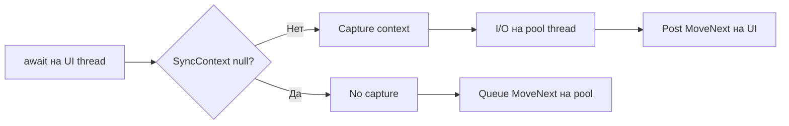

# SynchronizationContext — в ASP.NET Core его нет

> Roadmap: `1.4.9` · Node: `1.4` — Async/await · Depth: **глубоко**

## Learning Objectives

После урока ты сможешь:

- Определить **SynchronizationContext** и его роль в posting work на **single-threaded scheduler**.
- Объяснить, почему **ASP.NET Core** намеренно **не** устанавливает request `SynchronizationContext`, в отличие от **ASP.NET Framework**.
- Связать SyncContext с **`ConfigureAwait`** (`1.4.8`) и **continuations state machine** (`1.4.7`).
- Сравнить **UI SyncContext** (WPF, WinForms) с **null context** на server apps.
- Понимать, когда ещё нужен **`TaskScheduler.FromCurrentSynchronizationContext`**.

---

## Why This Matters

До async/await разработчики вручную marshaling'или callbacks на UI thread через `Control.Invoke` или `Dispatcher.BeginInvoke`. `SynchronizationContext` абстрагирует этот паттерн: hook, через который runtime говорит «выполни delegate на правильном потоке». Когда `await` захватывает context, он использует этот hook — критично для UI и footgun в **ASP.NET Framework**, где существовал request context.

ASP.NET Core **убрал** request context by design. Это объясняет, почему **`ConfigureAwait(false)` optional** в Core controllers и почему многие Framework deadlock recipes не переносятся один в один. Middle-разработчик всё ещё встречает SyncContext в desktop tools, Blazor Server, Unity и legacy Framework — и не должен путать «web server» с «нет threading concerns».

---

## Core Concepts

### Что такое SynchronizationContext

`SynchronizationContext` — abstract class с **`Post(SendOrPostCallback, state)`** и **`Send(...)`** (синхронное ожидание). **Current** context — `SynchronizationContext.Current`.

Если поток без special scheduler, **`Current` is `null`**. Async continuations с default `ConfigureAwait`: если `Current != null` — queue через `Post`; иначе thread pool.

UI frameworks устанавливают custom context на UI thread. **WPF** — `DispatcherSynchronizationContext`; **WinForms** — `WindowsFormsSynchronizationContext`. Один поток «владеет» UI — SyncContext front door.

### Как await его использует

Из `1.4.7` state machine регистрирует continuation при incomplete await. `TaskAwaiter.OnCompleted` захватывает `SynchronizationContext.Current` на **await site** (при `continueOnCapturedContext == true`). Completion вызывает `Post` для `MoveNext` на captured context.

**Orthogonal** к **ExecutionContext** (`AsyncLocal`, security, culture). `ConfigureAwait` toggles только SyncContext capture.



### ASP.NET Framework vs ASP.NET Core

**ASP.NET Framework** (System.Web) устанавливал **`AspNetSynchronizationContext`** per request во многих конфигурациях (.NET 4.5+). Await с capture мог resume на **request context**. Вместе с **sync-over-async** — classic deadlocks.

**ASP.NET Core** (Kestrel) **не устанавливает** `SynchronizationContext` на request threads. `Current` **`null`**. Continuations на thread pool — правильно для scalable I/O web. **`HttpContext` не привязан к одному thread** — flow через **`AsyncLocal`** и DI scope, не SyncContext.

Guidance: **в ASP.NET Core app code не нужен `ConfigureAwait(false)`** — нечего capture. Thread agility — feature.

### Console и Generic Host

Console без custom context — `Current == null`. **BackgroundService** — то же. **Blazor Server** — circuit dispatch UI-like; treat as UI для component state.

---

## Under the Hood

Default **`Post`** → **`ThreadPool.QueueUserWorkItem`**. Derived override для UI message pump.

**Framework** request context эволюционировал across patches. Migration: **не assume**, что continuation вернётся на «request thread».

**Kestrel** — IOCP + pool; нет «request thread identity». **`HttpContextAccessor`** — `AsyncLocal<HttpContext>`; после await на любом pool thread в том же logical request context valid — при async flow и correct scoping.

Без SyncContext **`MoveNext`** → **`TaskScheduler.Default`**. С SyncContext — **`Post`** оборачивает тот же `MoveNext`.

---

## Examples

### WPF

```csharp
private async void LoadButton_Click(object sender, RoutedEventArgs e)
{
    var data = await _api.GetDataAsync(); // capture Dispatcher
    StatusLabel.Content = data;           // safe — UI thread
}
```

### ASP.NET Core

```csharp
public async Task<IActionResult> Get()
{
    Debug.Assert(SynchronizationContext.Current == null);
    var x = await _http.GetStringAsync("https://example.com");
    return Ok(x); // HttpContext via AsyncLocal
}
```

---

## Common Mistakes & Anti-patterns

**Framework deadlock fixes на Core без analysis** — чаще **pool starvation** (`1.4.10`).

**`ConfigureAwait(true)` «для HttpContext»** — wrong mechanism.

**`SetSynchronizationContext` в middleware** без причины — fights framework.

---

## Production & Real-World Notes

Legacy **MVC Framework** — SyncContext deadlocks. **Core** — не block pool (`Task.Wait`, `Thread.Sleep` в request).

Desktop + **WebView2** — cross UI SyncContext и async HTTP daily.

---

## Key Takeaways

- SyncContext — **marshaling continuation** для await.
- UI has it; **ASP.NET Core — нет**.
- **`ConfigureAwait(false)`** skips capture (`1.4.8`).
- **`MoveNext`** target зависит от policy (`1.4.7`).
- **`HttpContext`** в Core — **AsyncLocal**, не SyncContext.
- Deadlock class на Core → **pool starvation**.

---

## Up Next

`1.4.10` — **Thread pool starvation**.
